## {#title-custom .center background-color="white"}

:::{style="display: flex; justify-content: center; align-items: center; gap: 2.5em; margin-bottom: 1em;"}
{height=100}
{height=100}
:::

### Seismic Monitoring of CO~2~ Plume Dynamics {style="margin-bottom: 0.1em;"}
#### Using Ensemble Kalman Filtering {style="color: #555; font-weight: normal;"}

**Felix J. Herrmann**

School of Earth & Atmospheric Sciences — Georgia Institute of Technology

Based on @bruer2025seismic

## Outline {.smaller}

:::: {.columns}
::: {.column width="50%"}

**Part I --- Background**

- Motivation: CO~2~ storage monitoring
- Sequential Bayesian data assimilation
- Kalman filter & ensemble Kalman filter
- Two-phase flow dynamics
- Seismic observation operator

:::
::: {.column width="50%"}

**Part II --- Method & Results**

- EnKF applied to CO~2~ with seismic data
- Workflow overview (digital shadow)
- Synthetic experiment setup
- EnKF vs. baselines
- Hyperparameter sensitivity
- Conclusions & future work

:::
::::


# Part I --- Background {background-color="#2c3e50"}


## Why Monitor CO~2~ Storage? {.smaller}

- **Carbon capture and storage (CCS):** geologic storage in saline aquifers and depleted oil fields
- Monitoring is **critical** to:
  - Avoid failure scenarios (leaks, induced seismicity)
  - Enable real-time optimization of injection rates
- Underground reservoirs have **limited accessibility** --- measurements confined to surface and sparse boreholes
- Injected CO~2~ displaces brine $\Rightarrow$ changes seismic wave propagation
- **Seismic methods** provide higher resolution than electromagnetic or gravitational methods

::: {.callout-note}
## Digital Twin perspective
Combining physics-based simulations with real-time seismic observations creates a **digital shadow** of the subsurface CO~2~ plume.
:::

---

## Why subsurface CO~2~ storage? How?{.smaller}

:::: {.columns}
::: {.column width="48%"}
**Porous geological formations can hold large amounts of CO~2~**

But the CO~2~ can leak out...

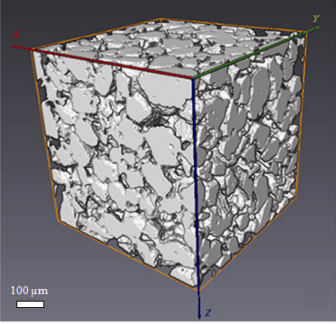{width="60%"}
:::

::: {.column width="48%"}
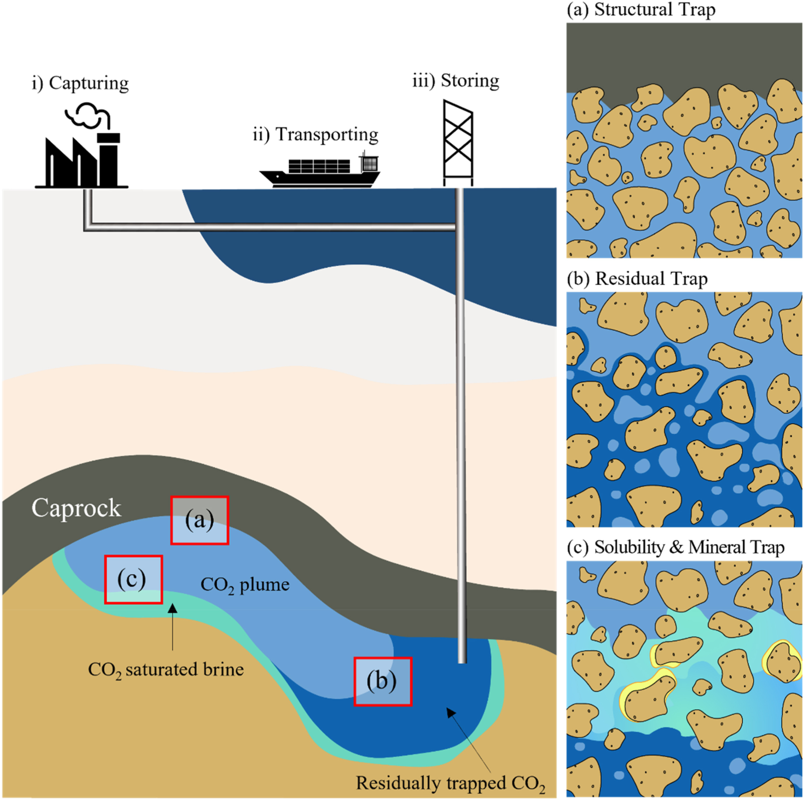{width="100%"}
:::
::::


## Fluid Dynamics {.smaller}

Difficulties with fluid simulations:

- Unknown subsurface properties.
- Unaccounted-for physics, even with known properties (FluidFlower experiment).

:::: {.columns}
::: {.column width="50%"}
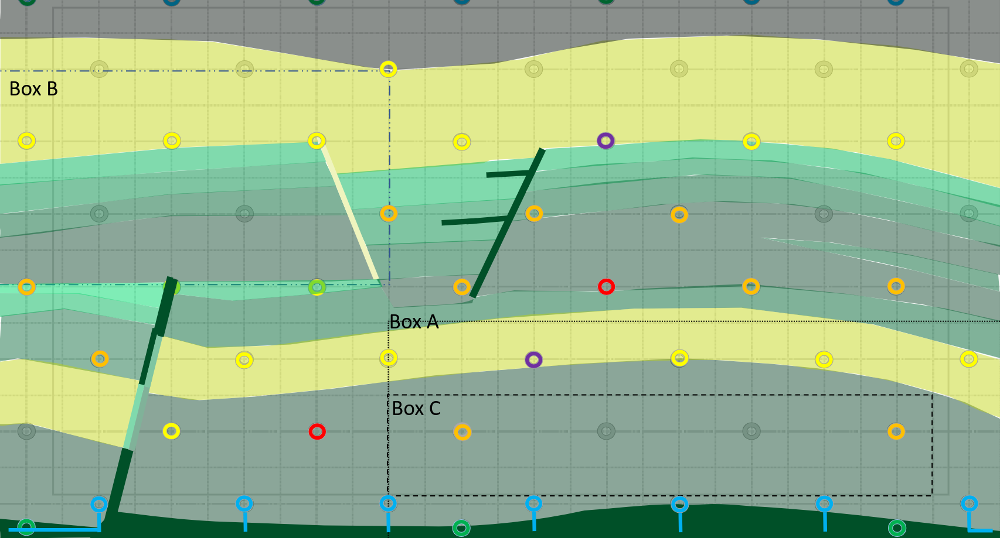{width="85%"}
:::

::: {.column width="50%"}
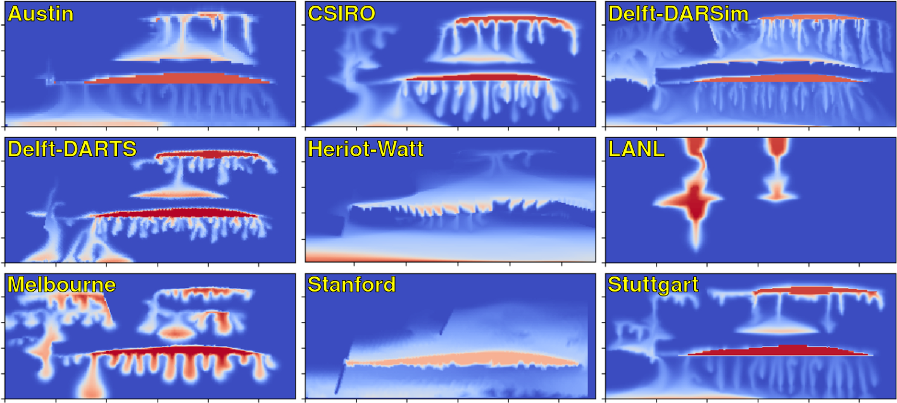{width="100%"}
:::
::::


## Challenges in Seismic CO~2~ Monitoring {.smaller}

Existing literature makes **one or more** of these limiting choices:

1. Uses **small physical systems** with unscalable DA algorithms
2. Does **not use CO~2~ flow dynamics**
3. Simulates seismic data **without the wave equation**
4. Uses **unrealistic survey designs**

. . .

**This work addresses all four** by applying the scalable **ensemble Kalman filter (EnKF)** to:

- A **high-dimensional** CO~2~ reservoir
- With **two-phase flow dynamics**
- And **time-lapse full waveform seismic data**
- Using a **realistic surface-seismic survey design**

## Seismic imaging

:::: {.columns}
::: {.column width="50%"}
Benefits of monitoring:

- Can check for leaks.
- Can optimize injection rate.
- Don't need to drill more wells.

\

Difficulties with monitoring:

- Unknown subsurface properties.
- Nonlinear, noisy.
:::

::: {.column width="50%"}
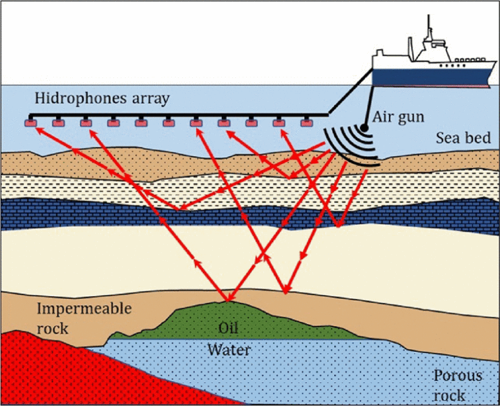{width="100%"}
:::
::::

---

## DA --- data assimilation{.smaller}

**Seismic + fluid dynamics should be better than either alone.**

\

Computational difficulties:

- Data is expensive (scarce) and high-dimensional.
- Requires quantified uncertainty, which can naively require much storage space.
    - Full waveform seismic data: $\sim 10^8$ DOFs $\sim$ 400 megabytes.
    - Grid for $10^{10}$ cubic meter reservoir: $\sim 10^7$ DOFs $\sim$ 80 megabytes.
    - $\implies$ Gaussian covariance matrix: $\sim 10^{15}$ DOFs $>$ 1000 terabytes.

\

- Nonlinearity: is more complex than Gaussian distribution.

---

## How can we do DA?{.smaller}

**Results from the field of weather forecasting (big, nonlinear DA).**


- Particle filters (ensemble of weighted particles)
    - Great for nonlinearity and expressing non-Gaussian data.
    - [Difficult for high-resolution data, but there is research progress.]{style="color: #a41010;"}

- Variational optimization
    - Great for nonlinearity.
    - [Expensive/inaccurate for estimating uncertainty.]{style="color: #a41010;"}


- **EnKF** (ensemble Kalman filter)
    - Successful for some nonlinear problems and expresses non-Gaussian data.
    - Easy to estimate uncertainty.
    - In operation for more than 15 years, usually combined with other methods.

---

## Pre-existing DA research for seismic-CO~2~

**No one does scalable DA with fluid dynamics and full waveform seismic.**

```{=html}
<table style="font-size: 0.6em; margin-top: 0.5em;">
<thead>
<tr>
  <th style="text-align:right;"></th>
  <th>DA algorithm</th>
  <th># of DOFs</th>
  <th>Fluid dynamics?</th>
  <th>Seismic data?</th>
  <th>Dynamic estimate?</th>
</tr>
</thead>
<tbody>
<tr>
  <td style="text-align:right;">Guzman et al. (2014)</td>
  <td>EnKF</td>
  <td style="color:#a41010;">?</td>
  <td>&check;</td>
  <td>InSAR</td>
  <td style="color:#a41010;">&times;</td>
</tr>
<tr style="border-top: 2px solid #888;">
  <td style="text-align:right;">Li et al. (2014)</td>
  <td>HiKF</td>
  <td>~10<sup>4</sup></td>
  <td style="color:#a41010;">&times;</td>
  <td style="color:#a41010;">times</td>
  <td>&check;</td>
</tr>
<tr>
  <td style="text-align:right;">Li et al. (2015)</td>
  <td>CSKF</td>
  <td style="color:#a41010;">~10<sup>3</sup></td>
  <td>&check;</td>
  <td style="color:#a41010;">times</td>
  <td>&check;</td>
</tr>
<tr>
  <td style="text-align:right;">Li et al. (2017)</td>
  <td>CSKF</td>
  <td style="color:#a41010;">~10<sup>3</sup></td>
  <td>&check;</td>
  <td style="color:#a41010;">well</td>
  <td>&check;</td>
</tr>
<tr style="border-top: 2px solid #888;">
  <td style="text-align:right;">Ma et al. (2019)</td>
  <td>EnKF</td>
  <td>~10<sup>4</sup></td>
  <td>&check;</td>
  <td style="color:#a41010;">fake</td>
  <td>&check;</td>
</tr>
<tr>
  <td style="text-align:right;">Alfonzo et al. (2020)</td>
  <td>ETKF</td>
  <td>~10<sup>4</sup></td>
  <td style="color:#a41010;">&times;</td>
  <td style="color:#a41010;">fake</td>
  <td>&check;</td>
</tr>
<tr>
  <td style="text-align:right;">Grana et al. (2021)</td>
  <td>EnKF</td>
  <td style="color:#a41010;">~10<sup>3</sup></td>
  <td>&check;</td>
  <td style="color:#a41010;">fake, EM</td>
  <td>&check;</td>
</tr>
<tr style="border-top: 2px solid #888;">
  <td style="text-align:right;">Eikrem et al. (2019)</td>
  <td style="color:#a41010;">IEKF</td>
  <td>~10<sup>4</sup></td>
  <td style="color:#a41010;">&times;</td>
  <td>&check;</td>
  <td style="color:#a41010;">&times;</td>
</tr>
<tr>
  <td style="text-align:right;">Huang et al. (2020)</td>
  <td>HiKF</td>
  <td>~10<sup>5</sup></td>
  <td style="color:#a45610;">first step</td>
  <td>&check;</td>
  <td>&check;</td>
</tr>
<tr>
  <td style="text-align:right;">Dupuy et al. (2021)</td>
  <td>Gibbs NA</td>
  <td style="color:#a41010;">79</td>
  <td style="color:#a41010;">&times;</td>
  <td>&check;</td>
  <td>&check;</td>
</tr>
<tr style="border-top: 2px solid #888; font-weight: bold;">
  <td style="text-align:right;">Bruer (2024)</td>
  <td>EnKF</td>
  <td>~10<sup>5</sup></td>
  <td>&check;</td>
  <td>&check;</td>
  <td>&check;</td>
</tr>
</tbody>
</table>
```

::: {style="font-size: 0.7em; text-align: center; margin-top: 0.5em;"}
Existing work ("et al." removed from every entry)
:::

---

## Pre-existing research for seismic-CO~2~: ML (machine learning)

**No one does scalable DA with fluid dynamics and full waveform seismic.**

```{=html}
<table style="font-size: 0.55em; margin-top: 0.5em;">
<thead>
<tr>
  <th style="text-align:right;"></th>
  <th>ML method</th>
  <th>DA algorithm</th>
  <th># of DOFs</th>
  <th>Seismic data?</th>
  <th>Dynamic estimate?</th>
</tr>
</thead>
<tbody>
<tr>
  <td style="text-align:right;">Tang et al. (2020)</td>
  <td>Surrogate</td>
  <td>RML</td>
  <td style="color:#a41010;">~10<sup>3</sup></td>
  <td style="color:#a41010;">well</td>
  <td style="color:#a41010;">&times;</td>
</tr>
<tr>
  <td style="text-align:right;">Tang et al. (2022a)</td>
  <td>Surrogate</td>
  <td>RS</td>
  <td>~10<sup>5</sup></td>
  <td>InSAR</td>
  <td style="color:#a41010;">&times;</td>
</tr>
<tr>
  <td style="text-align:right;">Tang et al. (2022b)</td>
  <td>Surrogate</td>
  <td>EnKS</td>
  <td>~10<sup>5</sup></td>
  <td>InSAR</td>
  <td style="color:#a41010;">&times;</td>
</tr>
<tr>
  <td style="text-align:right;">Seabra et al. (2024)</td>
  <td>Surrogate</td>
  <td>EnKS, RML</td>
  <td style="color:#a41010;">~10<sup>3</sup></td>
  <td style="color:#a41010;">well</td>
  <td style="color:#a41010;">&times;</td>
</tr>
<tr style="border-top: 2px solid #888;">
  <td style="text-align:right;">Tang et al. (2021)</td>
  <td>Flow surr.</td>
  <td>EnKS</td>
  <td>~10<sup>6</sup></td>
  <td style="color:#a41010;">fake</td>
  <td style="color:#a41010;">&times;</td>
</tr>
<tr>
  <td style="text-align:right;">Liu et al. (2023)</td>
  <td>Enc., BNN</td>
  <td>Variational</td>
  <td>~10<sup>6</sup></td>
  <td style="color:#a41010;">fake, EM</td>
  <td>&check;</td>
</tr>
<tr style="border-top: 2px solid #888;">
  <td style="text-align:right;">Yin et al. (2022)</td>
  <td>Flow surr.</td>
  <td>Variational</td>
  <td style="color:#a41010;">~10<sup>3</sup></td>
  <td>&check;</td>
  <td style="color:#a41010;">&times;</td>
</tr>
<tr style="border-top: 2px solid #888;">
  <td style="text-align:right;"><em>Gahlot (2024)</em></td>
  <td>CNF</td>
  <td>Transport map</td>
  <td>~10<sup>5</sup></td>
  <td>&check;</td>
  <td>&check;</td>
</tr>
<tr style="font-weight: bold;">
  <td style="text-align:right;">Bruer (2024)</td>
  <td>&times;</td>
  <td>EnKF</td>
  <td>~10<sup>5</sup></td>
  <td>&check;</td>
  <td>&check;</td>
</tr>
</tbody>
</table>
```

::: {style="font-size: 0.7em; text-align: center; margin-top: 0.5em;"}
Existing work ("et al." removed from every entry)
:::

---

# Technical background {.section-slide}

---

## Sequential DA: notation and problem statement{.smaller}

:::: {.columns}
::: {.column width="55%"}
**Notation**

- Hidden state: $x$ (CO~2~ saturation field +)
- Observation: $y$ (seismic data)
- Time: $t$
- Time index: $n$
- Random noise: $\eta_f$ and $\eta_h$
:::

::: {.column width="45%"}
**Problem statement**

For all time steps $n$,

- Given: $y^{1:n} = \{y^1, y^2, \ldots\,  y^{n}\}$
- Estimate: posterior distribution of $x^{n}$
:::
::::

\

$$
\text{(Fluid dynamics) Transition operator } f: \quad x^{n+1} = f(x^n, \eta_f;\; t_n, t_{n+1})
$$

$$
\text{(Seismic) Observation operator } h: \quad y^{n+1} = h(x^{n+1}, \eta_h;\; t_{n+1})
$$

---

## Sequential Data Assimilation {.smaller}

The goal is to estimate a hidden state $\boldsymbol{x}^n$ over time given noisy observations $\boldsymbol{y}^n$.

**Transition** and **observation** operators:

$$
\boldsymbol{x}^{n+1} = f(\boldsymbol{x}^n, \boldsymbol{\eta}_f;\; t_n, t_{n+1}), \qquad
\boldsymbol{y}^{n+1} = h(\boldsymbol{x}^{n+1}, \boldsymbol{\eta}_h;\; t_{n+1})
$$

. . .

Two repeated phases via Bayes' rule:

$$
\underbrace{p(\boldsymbol{x}^n \mid \boldsymbol{y}^{1:n-1})}_{\text{predict}} = \int p(\boldsymbol{x}^n \mid \boldsymbol{x}^{n-1})\, p(\boldsymbol{x}^{n-1} \mid \boldsymbol{y}^{1:n-1})\, d\boldsymbol{x}^{n-1}
$$

$$
\underbrace{p(\boldsymbol{x}^n \mid \boldsymbol{y}^{1:n})}_{\text{update}} = \frac{p(\boldsymbol{y}^n \mid \boldsymbol{x}^n)\, p(\boldsymbol{x}^n \mid \boldsymbol{y}^{1:n-1})}{p(\boldsymbol{y}^n \mid \boldsymbol{y}^{1:n-1})}
$$


## Generic Data Assimilation Loop {.smaller}

::: {.callout-tip}
## Algorithm: Generic DA loop
**Input:** prior distribution, data $\boldsymbol{y}^n$ at time $t_n$

1. **posterior** $\gets$ prior; set $t_{n-1} \gets 0$
2. **For** each $(\boldsymbol{y}^n, t_n)$ in observations:
   - **Predict:** prior $\gets$ Predict(posterior, $t_{n-1}$, $t_n$)
   - **Update:** posterior $\gets$ Update(prior, $\boldsymbol{y}^n$)
   - $t_{n-1} \gets t_n$
:::


## The Kalman Filter {.smaller}

Assumes **Gaussian** distributions with linear operators.

Given forecast distribution $p(\boldsymbol{x}) = \mathcal{N}(\boldsymbol{\mu}_f, \mathbf{B}_f)$, the **Kalman update** yields:

$$
\boldsymbol{\mu}_a = \boldsymbol{\mu}_f + \mathbf{K}(\boldsymbol{y} - h(\boldsymbol{\mu}_f))
$$
$$
\mathbf{B}_a = (\mathbf{I} - \mathbf{K}\mathbf{H})\,\mathbf{B}_f
$$

where the **Kalman gain** is:

$$
\mathbf{K} = \text{cov}(\boldsymbol{x}_f, \boldsymbol{y}_f)\;\text{cov}(\boldsymbol{y}_f)^{-1}
$$

where $\text{cov}(\boldsymbol{x}_f, \boldsymbol{y}_f) = \mathbb{E}\big[(\boldsymbol{x}_f - \boldsymbol{\mu}_f)(\boldsymbol{y}_f - \boldsymbol{\mu}_y)^T\big]$ is the cross-covariance and $\text{cov}(\boldsymbol{y}_f) = \text{cov}(\boldsymbol{y}_f, \boldsymbol{y}_f)$.

. . .

where $\boldsymbol{\mu}_f$ / $\boldsymbol{\mu}_a$ = forecast / analysis **mean**, $\mathbf{B}_f$ / $\mathbf{B}_a$ = forecast / analysis **covariance**, $\mathbf{H}$ = linearized observation operator, and subscripts $f$ = forecast (prior), $a$ = analysis (posterior).

**Problem:** For large state ($N_x \sim 10^5$) and observation ($N_y \sim 10^6$) vectors, storing $\mathbf{B}_f \in \mathbb{R}^{N_x \times N_x}$ requires $\sim 100$ GB!

## The Ensemble Kalman Filter (EnKF) {.smaller}

**Key idea:** Represent the prior by an ensemble of $N_e$ samples instead of storing the full covariance.

**Update each ensemble member:**
$$
\boldsymbol{x}_{a,i} = \boldsymbol{x}_{f,i} + \mathbf{K}\big(\boldsymbol{y} - \boldsymbol{y}_{f,i}\big), \quad i = 1, \ldots, N_e
$$

with simulated observations $\boldsymbol{y}_{f,i} = h(\boldsymbol{x}_{f,i}, \boldsymbol{\eta}_{h,i})$ and Kalman gain:

$$
\mathbf{K} = \mathbf{X}_f \mathbf{Y}_f^T \big(\mathbf{Y}_f \mathbf{Y}_f^T\big)^{-1}
$$

where $\mathbf{X}_f$ has columns $(\boldsymbol{x}_{f,i} - \boldsymbol{\mu}_f)/\sqrt{N_e - 1}$ and $\mathbf{Y}_f$ has columns $(\boldsymbol{y}_{f,i} - \boldsymbol{\mu}_y)/\sqrt{N_e - 1}$ (ensemble perturbation matrices).

. . .

**Computational advantage:**

| | Time | Storage |
|---|---|---|
| Standard KF | $O(N_x^3 + N_y^3)$ | $O(N_x^2 + N_y^2)$ |
| **EnKF** | $O(N_x N_e^2 + N_y N_e^3)$ | $O(N_x N_e + N_y N_e)$ |

: {tbl-colwidths="[30,35,35]"}


## Kalman vs ensemble Kalman

Drawbacks Kalman:

- Linear: requires linearizing $f$ and $h$ to update covariance matrix.
- Gaussian: expresses Gaussian distributions only.
- Covariance matrix: has large storage and compute requirements.

Benefits EnKF over KF:

- Linearizes the update step only.
- Expresses non-Gaussian distributions.
- Balances storage cost with accuracy.

---

## EnKF predict-update loop

**Easy to implement**

- Initialize ensemble using prior information $p(x^0)$.

- When data is observed:
    1. Apply transition operator to each ensemble member (nonlinear, parallel).
    2. Apply observation operator to each ensemble member (nonlinear, parallel).
    3. Apply EnKF update to each ensemble member (linear).

---

## EnKF as Optimization {.smaller}

The EnKF update can be viewed as solving $N_e$ linearized optimization problems:

$$
\min_{\boldsymbol{c}_i \in \mathbb{R}^{N_e}}\; \|\boldsymbol{y}_{a,i} - \boldsymbol{y}\|_{\mathbf{R}^{-1}}^2 + \|\boldsymbol{x}_{a,i} - \boldsymbol{x}_{f,i}\|_{\mathbf{B}_f^{-1}}^2
$$

with $\boldsymbol{x}_{a,i} = \boldsymbol{\mu}_f + \mathbf{X}_f \boldsymbol{c}_i$, $\boldsymbol{y}_{a,i} = \boldsymbol{\mu}_y + \mathbf{Y}_f \boldsymbol{c}_i$, and $\mathbf{R}$ the observation noise covariance.

. . .

This is analogous to **FWI-type optimization** --- minimize data misfit regularized by distance from the forecast.


## Two-Phase Flow Dynamics {.smaller}

The reservoir consists of **brine** and **supercritical CO~2~** in porous rock. Governing PDE:

$$
\frac{\partial(\phi \rho_i S_i)}{\partial t} - \nabla \cdot (\rho_i v_i) = \rho_i q_i
$$

$$
v_i = -\frac{k_{ri}}{\mu_i} K \nabla(P_i - \rho_i g Z)
$$

with **permeability tensor:**
$$
K = \begin{bmatrix} K_v & 0 \\ 0 & K_h \end{bmatrix}, \qquad K_v/K_h = 0.36
$$

where for fluid $i$: $\phi$ = porosity, $\rho_i$ = fluid density, $S_i$ = saturation, $v_i$ = velocity, $q_i$ = volume injection rate, $k_{ri}$ = relative permeability, $\mu_i$ = fluid viscosity, $K$ = permeability tensor ($K_h$ horizontal, $K_v$ vertical), $g$ = gravitational acceleration, $Z$ = depth.


## Transition density

**Transition operator:** 

$$\boldsymbol{S}^{n+1}, \boldsymbol{P}^{n+1} = \mathcal{M}(\boldsymbol{S}^n, \boldsymbol{P}^n, \boldsymbol{K}, \boldsymbol{\phi};\; t_n, t_{n+1})$$

where $\boldsymbol{S}^n$, $\boldsymbol{P}^n$ = spatially discretized CO~2~ saturation and pressure at time $t_n$, $\boldsymbol{K}$ = permeability field, $\boldsymbol{\phi}$ = porosity field, and $\mathcal{M}$ = nonlinear operator that numerically solves the two-phase flow PDE from $t_n$ to $t_{n+1}$.

Solved numerically with **JutulDarcy.jl** (implicit Euler, Newton's method, auto-diff).

## Relative Permeability Model {.smaller}

Modified **Brooks-Corey** model with residual saturation $r$:

$$
k_{ri} = \text{clamp}\!\Big(\frac{S_i - r}{1 - 2r},\; 0,\; 1\Big)^{\!2}
= \begin{cases}
1 & \text{if } S_i \ge 1 - r \\
0 & \text{if } S_i \le r \\
\displaystyle\frac{(S_i - r)^2}{(1-2r)^2} & \text{else}
\end{cases}
$$

- Residual saturation $r = 0.1$
- Ensures fluids are immobile below threshold
- Nonlinear coupling between saturation and flow velocity

## Fluid flow in CO~2~ reservoir{.smaller}

- Supercritical CO~2~ due to high temperature and pressure.
    - High density like a liquid $\sim 30\%$--$80\%$ as dense as water.
    - Low viscosity like a gas.
- Flow described by porosity and permeability fields.
- Flow is faster when saturation is higher.

:::: {.columns}
::: {.column width="50%"}
{width="50%"}
:::

::: {.column width="50%"}
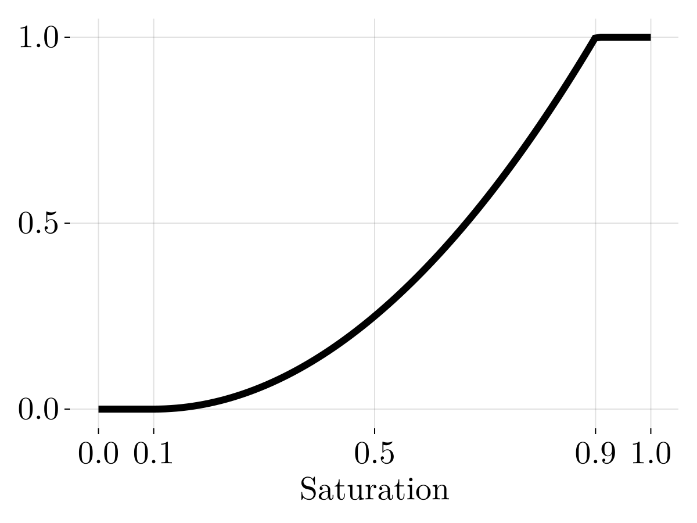{width="60%"}
:::
::::

---

## CO~2~ saturation field flow

::: {style="text-align: center;"}
Nonlinearity: slow flow at edges, fast flow inside plume.
:::

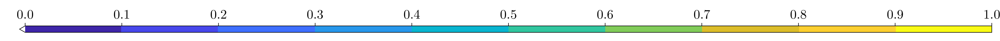{width="100%" fig-align="center"}

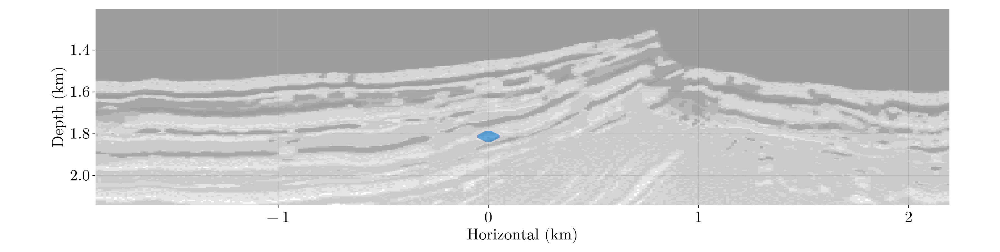{width="100%" fig-align="center"}

---

## Seismic Observation Operator {.smaller}

Active-source surface seismic governed by the **acoustic wave equation:**

$$
\frac{m}{\rho}\frac{\partial^2 \delta_p}{\partial t^2} - \nabla \cdot \!\left(\frac{1}{\rho}\nabla \delta_p\right) + w \frac{\partial \delta_p}{\partial t} = \frac{q}{\rho}
$$

where $m$ is the P-wave squared slowness and $\rho$ is density.

. . .

**Full waveform data:**
$$
\boldsymbol{d}(\boldsymbol{S};\, \boldsymbol{\eta}) = \mathcal{H}\big(\boldsymbol{m}(\boldsymbol{S}),\, \boldsymbol{\rho}(\boldsymbol{S})\big) + \boldsymbol{\eta}
$$

- $\boldsymbol{m}(\boldsymbol{S})$ and $\boldsymbol{\rho}(\boldsymbol{S})$ from **patchy-saturation rock physics model**
- CO~2~ decreases density and P-wave modulus
- Solved with **JUDI.jl / Devito** (8th order spatial FD)


## Rock Physics: Patchy-Saturation Model {.smaller}

Links CO~2~ saturation to seismic parameters:

**Density** (arithmetic average):
$$
\rho(S) = \rho_{wr} + S\,\phi\,(\rho_g - \rho_w)
$$

**P-wave modulus** (harmonic average):
$$
\lambda(S) = \Big[(1-S)\,\lambda_{wr}^{-1} + S\,\lambda_{gr}^{-1}\Big]^{-1}
$$

**Squared slowness** (quadratic in $S$):
$$
m(S) = \rho(S)/\lambda(S)
$$

where $\lambda_{gr}$ is obtained from **Gassmann's equation** for the CO~2~-saturated rock.


## RTM Imaging Operator {.smaller}

The observation operator constructs a **reverse-time migration (RTM) image:**

$$
h(\boldsymbol{x},\, \nu\boldsymbol{\eta}) = \mathbf{P}\,\mathbf{J}_0^T\Big(\mathcal{H}\big(m(\boldsymbol{S}),\, \rho(\boldsymbol{S})\big) + \nu\boldsymbol{\eta}\Big)
$$

- $\mathbf{J}_0 = \frac{d\mathcal{H}}{d\boldsymbol{m}_0}(\boldsymbol{m}_0, \boldsymbol{\rho}_0)$: Jacobian of wave operator $\mathcal{H}$ at smooth baseline model $(\boldsymbol{m}_0, \boldsymbol{\rho}_0)$
- $\mathbf{P}$: linear post-processor that mutes the water layer and scales the image as a function of depth
- $\nu$: noise scaling parameter controlling SNR $= -20\log\nu$ dB
- $\nu_B^*$: true noise magnitude for baseline survey

. . .

**Time-lapse image:**
$$
A(\boldsymbol{x}) = h(\boldsymbol{x},\, \nu\boldsymbol{\eta}) - h_B(\nu_B^*\boldsymbol{\eta}_B^*)
$$

Baseline subtraction reveals **changes** due to CO~2~ injection.

## Seismic observation overview

:::: {.columns}
::: {.column width="50%"}
**Lots of data!**

- Each seismic source outputs a wave.

- Each seismic receiver records a wave from each source.

- Data size is product of
    - \# of receivers,
    - \# of sources,
    - \# of waveform time steps.
:::

::: {.column width="50%"}
{width="100%"}
:::
::::

---

## Time-lapse --- pre-injection image{.smaller}


1. Baseline survey before injection: $d_B$.
2. Approximate subsurface seismic parameters smoothly as $m_0$: $d_0 = F(m_0)$.
3. Gradient of misfit $\|d_B - F(m_0)\|^2$ $\implies$ seismic image $A_B$.

:::: {.columns}
::: {.column width="85%"}
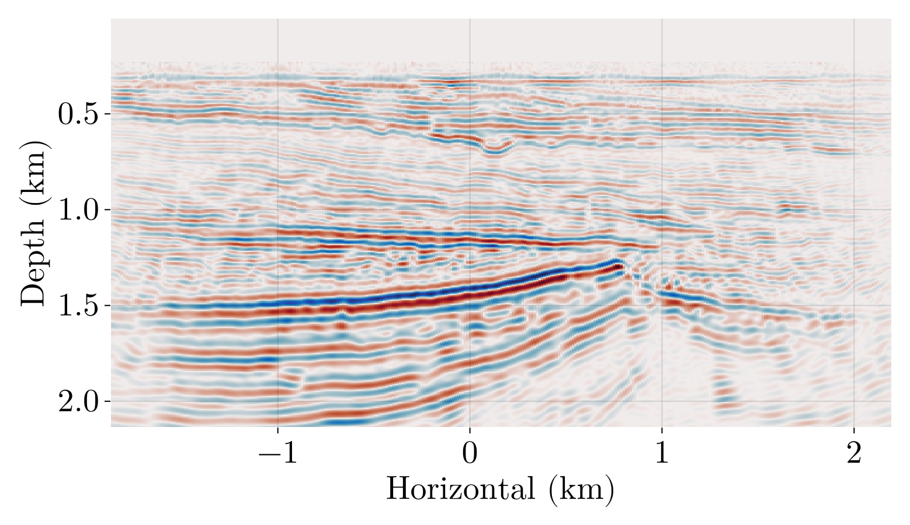{width="75%"}
:::
::: {.column width="10%"}
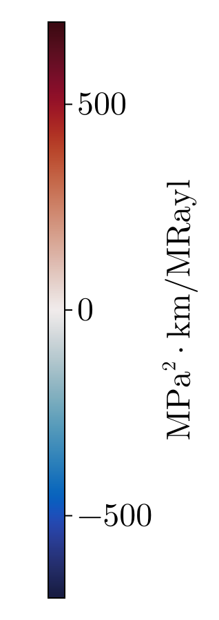{height="300px"}
:::
::::

---

## Time-lapse --- post-injection image{.smaller}

1. Survey after injecting for some time: $d$.
2. Difference in measurements: $d - d_B$ (difficult to interpret).
3. Gradient of misfit $\|d - F(m_0)\|^2$ $\implies$ seismic image $A$.

:::: {.columns}
::: {.column width="85%"}
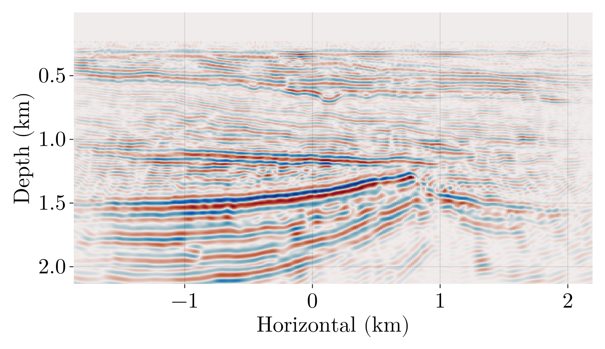{width="75%"}
:::
::: {.column width="10%"}
{height="300px"}
:::
::::

---

## Time-lapse --- difference image{.smaller}

:::: {.columns}
::: {.column width="85%"}
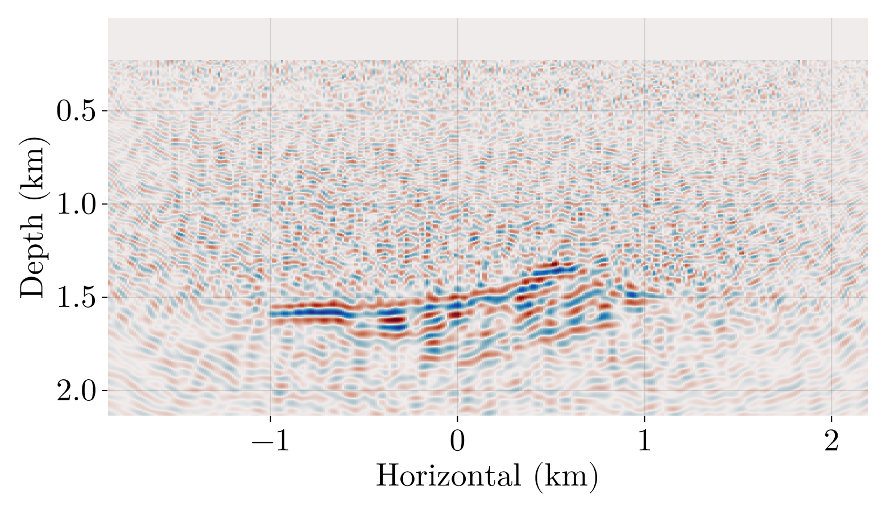{width="100%"}
:::
::: {.column width="10%"}
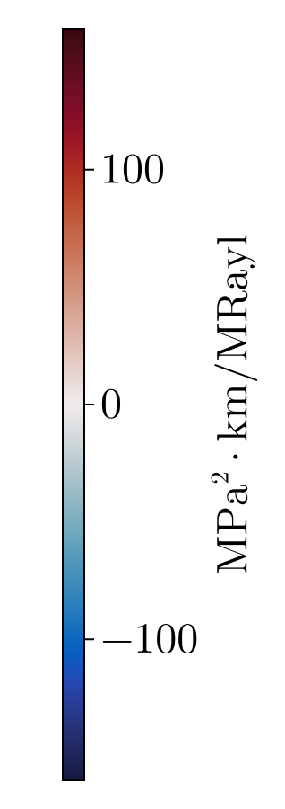{height="400px"}
:::
::::

---

## Example CO~2~ plume

:::: {.columns}
::: {.column width="85%"}
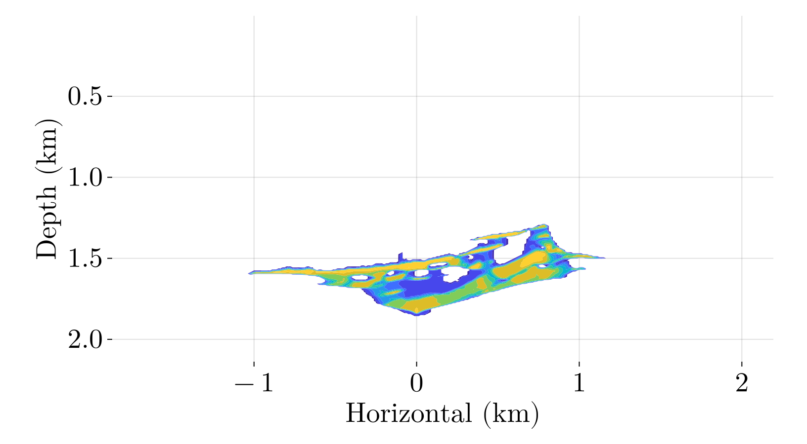{width="100%"}
:::
::: {.column width="10%"}
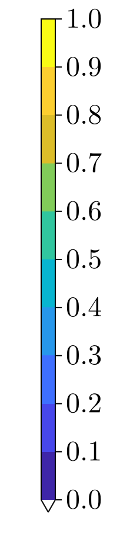{height="400px"}
:::
::::

## Workflow Diagram {.smaller}

```{mermaid}
%%| fig-width: 10
flowchart TB
    subgraph silico ["In Silico (simulation)"]
        A["Generate initial ensemble<br/>i = 1 to N_e with permeability estimates"] --> B
        B["S_i, P_i, K_i at time t_(n-1)<br/>conditioned on y^(1:n-1)"]
        B --> C["For each member, simulate<br/>flow to t_n and seismic survey"]
        C --> D["S_i, P_i, K_i, y_i at time t_n<br/>conditioned on y^(1:n-1)"]
        D --> E["Update ensemble based<br/>on survey at time t_n"]
        E --> F["S_i, P_i, K_i at time t_n<br/>conditioned on y^(1:n)"]
        F -->|"increment n"| B
    end
    subgraph situ ["In Situ (field)"]
        G["Set up injection site"] --> H
        H["Let time pass to t_n<br/>Conduct seismic survey"]
        H --> I["May use estimates for<br/>future injection decisions"]
        I -->|"increment n"| H
    end
    H -.->|"field survey y^n"| E
    F -.->|"estimates"| I

    style silico fill:#f0f4ff,stroke:#333
    style situ fill:#fff4f0,stroke:#333
```


# Part II --- Method & Results {background-color="#2c3e50"}

## Operations on ensemble members

![Adapted from [@bruer2025]](figs/scheme.png)


## EnKF State Vector for CO~2~ Monitoring {.smaller}

The state for ensemble member $i$:

$$
\boldsymbol{x}_i^n = (\boldsymbol{S}_i^n,\; \boldsymbol{P}_i^n,\; \boldsymbol{K}_i)
$$

**Transition:** Apply two-phase flow for each member independently:
$$
\boldsymbol{S}_i^{n+1},\, \boldsymbol{P}_i^{n+1} = \mathcal{M}(\boldsymbol{S}_i^n,\, \boldsymbol{P}_i^n,\, \boldsymbol{K}_i,\, \boldsymbol{\phi};\; t_n, t_{n+1})
$$

. . .

**Key design choices:**

- **No stochastic noise** ($\boldsymbol{\eta}_f$) in transition --- uncertainty comes from the unknown permeability
- Each member initialized with a **different permeability realization**
- Permeability sampled from velocity-permeability relation with elastic deformation of the velocity field


## Workflow: Digital Shadow {.smaller}

:::: {.columns}
::: {.column width="50%"}
**In silico (simulation)**

1. Generate initial ensemble \ ($N_e = 256$) with 
   different permeabilities and $S = 0$
2. Simulate two-phase flow to next survey time
3. Simulate seismic survey for each member
4. Compute RTM images
5. **EnKF update** using field survey data
6. Repeat from step 2
:::

::: {.column width="50%"}
**In situ (field)**

1. Set up CO~2~ injection site
2. Let time pass, conduct seismic survey
3. Send survey data to simulation
4. Receive updated estimates
5. Optimize injection parameters
6. Repeat from step 2
:::
::::

::: {.callout-important}
The simulated system takes information from the real system **without automatically affecting** it --- this is a **digital shadow**.
:::


## Workflow: Per-Member Pipeline{.smaller}

:::: {.columns}
::: {.column width="50%"}
Each ensemble member undergoes these steps independently:

1. **Flow model:** $\boldsymbol{S}_i, \boldsymbol{P}_i \gets \mathcal{M}(\boldsymbol{S}_i, \boldsymbol{P}_i, \boldsymbol{K}_i, \boldsymbol{\phi};\; t_{n-1}, t_n)$
2. **Rock physics:** $\boldsymbol{\lambda}_i = \lambda(\boldsymbol{S}_i)$, $\boldsymbol{\rho}_i = \rho(\boldsymbol{S}_i)$, $\boldsymbol{m}_i = \boldsymbol{\rho}_i/\boldsymbol{\lambda}_i$
3. **Seismic simulation:** $\boldsymbol{d}_i = \mathcal{H}(\boldsymbol{m}_i, \boldsymbol{\rho}_i) + \nu\boldsymbol{\eta}_i$
4. **processed RTM image:** $\boldsymbol{y}_i = \mathbf{P}\,\mathbf{J}_0^T \boldsymbol{d}_i$

:::

:::: {.columns}
::: {.column width="50%"}

::: {.r-stack}
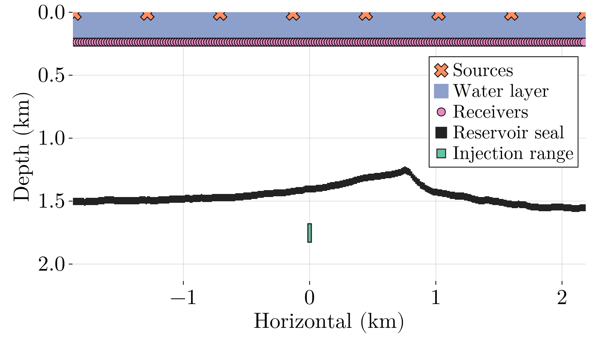{width="70%"}
:::
:::

::::
::::


## Comparison Methods {.smaller}

Three ensemble methods compared as optimizations:

$$
\text{NoObs:}\quad \boldsymbol{x}_{a,i} = \arg\min_{\boldsymbol{x}} \|\boldsymbol{x} - \boldsymbol{x}_{f,i}\|_{\mathbf{B}_f^{-1}}^2
$$

$$
\text{JustObs:}\quad \boldsymbol{x}_{a,i} = \arg\min_{\boldsymbol{x}} \|h(\boldsymbol{x}) - \boldsymbol{y}^n\|_{\mathbf{R}^{-1}}^2 + C(\boldsymbol{x})
$$

$$
\text{EnKF:}\quad \boldsymbol{x}_{a,i} = \arg\min_{\boldsymbol{x}} \|\hat{h}(\boldsymbol{x}) - \boldsymbol{y}^n\|_{\mathbf{R}^{-1}}^2 + \|\boldsymbol{x} - \boldsymbol{x}_{f,i}\|_{\mathbf{B}_f^{-1}}^2
$$

. . .

Recall  Kalman update  in terms of covariances, and the EnKF uses sample covariances $\widehat{\text{cov}}$:

\begin{align}
\mathbf{x}_{a,i} &= \mathbf{x}_{f,i} + \widehat{\text{cov}}(\mathbf{x}_f, \mathbf{y}_f)(\widehat{\text{cov}}(\mathbf{y}_f) + \mathbf{R})^{-1}(\mathbf{y} - \mathbf{y}_{f,i}).\label{eq:noise_tests_enkf2}
\end{align}

$\mathbf{R}$ 
 acts as a regularization in the inversion and is a non-singular approximation of the covariance of any observation noise not already represented in $\widehat{\text{cov}}(\mathbf{y}_f)$.

<!-- Our seismic data is represented as $\mathbf{y}_{f,i} = h(\mathbf{x}_{f,i}, \nu \mathbf{\eta}_i)$, where the norm of $\mathbf{\eta}_i$ is fixed and $\nu$ determines the signal-to-noise ratio (SNR), expressed as $-20 \log \nu$ dB.
If the noise covariance is known precisely, $\widehat{\cov}(\mathbf{y}_f)$ should be computed without noise as $\widehat{\cov}(h(\mathbf{x}_f, 0))$, and $R$ should fully represent the noise covariance. -->


## 

| Method | Uses dynamics? | Uses observations? | Solution |
|--------|:-:|:-:|------|
| NoObs | Yes | No | $\boldsymbol{x}_{a,i} = \boldsymbol{x}_{f,i}$ (trivial) |
| JustObs | No | Yes | Same for all members |
| **EnKF** | **Yes** | **Yes** | **Member-specific** |

: {tbl-colwidths="[18,18,18,46]"}


## Test Scenario: Compass Model {.smaller}

:::: {.columns}
::: {.column width="55%"}

:::
::: {.column width="45%"}
**Domain & survey parameters:**

- 4.05 km $\times$ 2.125 km on a 325 $\times$ 341 grid
- Cell size: 12.5 m $\times$ 6.25 m
- 5-year injection, surveys every year
- 8 sources, 200 receivers
- SNR = 8 dB
- $N_e = 256$ ensemble members
- Based on 2D slice of **Compass model** (North Sea)
:::
::::


## Seismic Field Parameters

:::: {.columns}
::: {.column width="50%"}
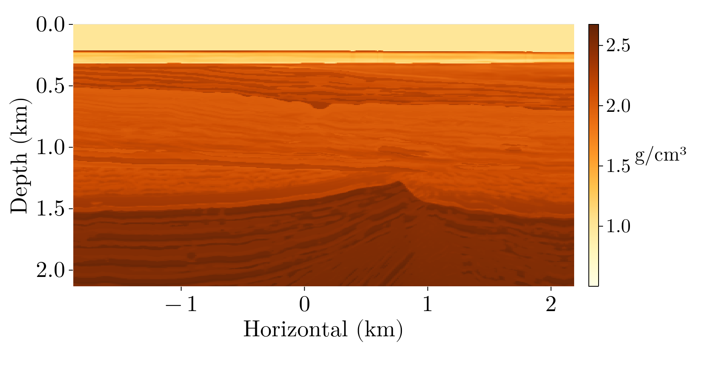
:::
::: {.column width="50%"}
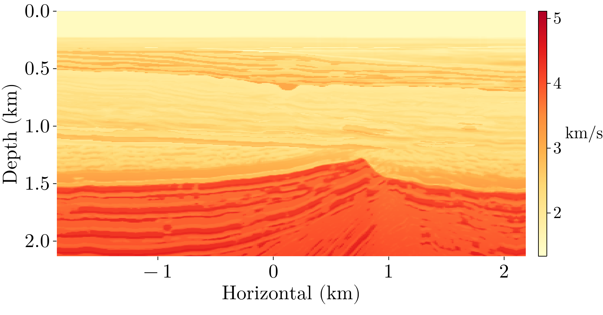
:::
::::

Derived from a 2D slice of the Compass model, capturing geological complexity of the North Sea subsurface.


## Permeability Ensemble {.smaller}

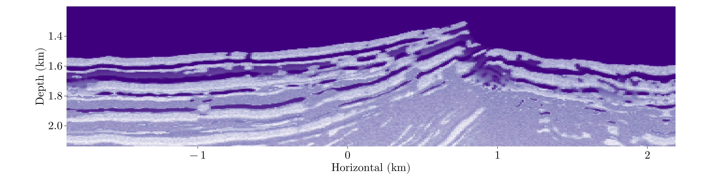{width="75%" fig-align="center"}


. . .

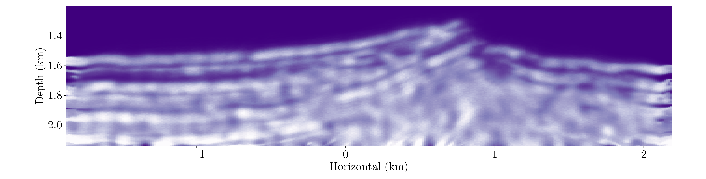{width="75%" fig-align="center"}


## Ground-Truth CO~2~ Plume Evolution {.smaller}

:::: {.columns}
::: {.column width="50%"}
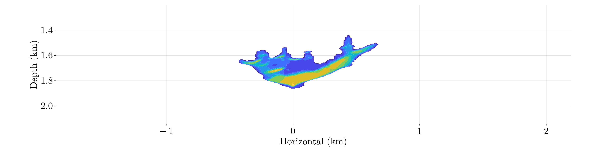
:::
::: {.column width="50%"}
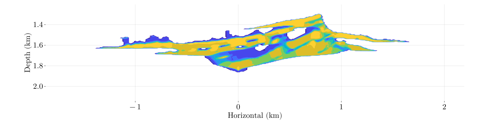
:::
::::

:::: {.columns}
::: {.column width="50%"}
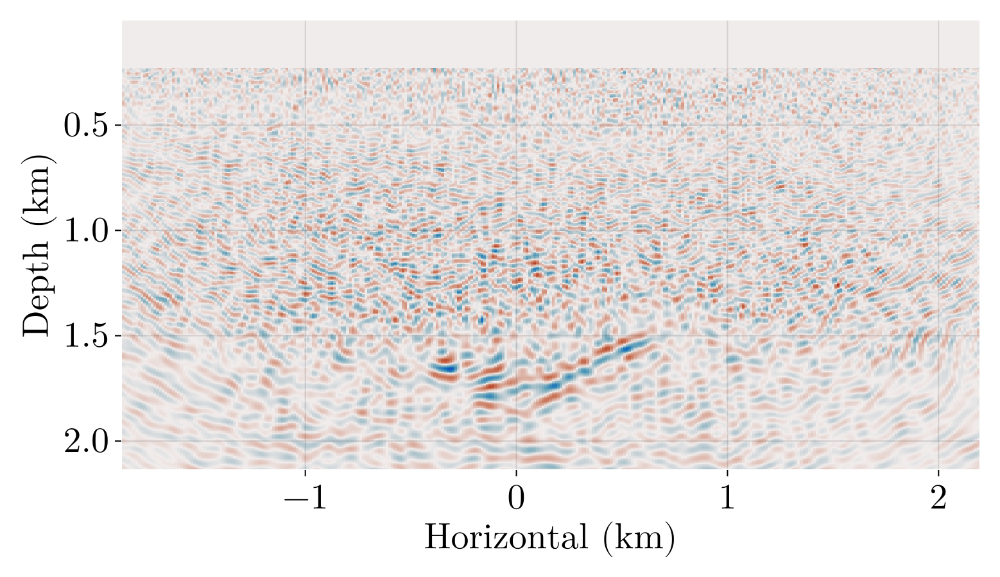{width="90%"}
:::
::: {.column width="50%"}
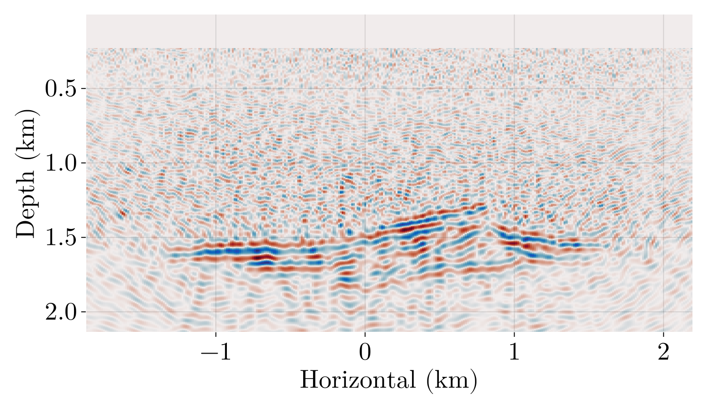{width="90%"}
:::
::::


## Results: EnKF vs. Baselines --- Plume Estimates {.smaller}

{width="70%"}

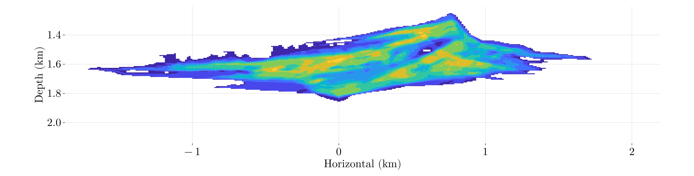{width="70%"}

## {.smaller}

{width="70%"}

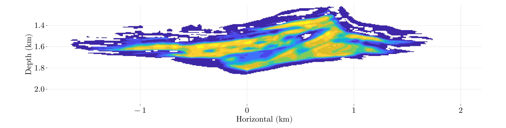{width="70%"}

## Results: Error Fields at Year 5 {.smaller}

<!-- {width="70%"} -->

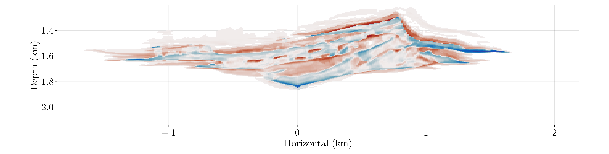{width="70%"}

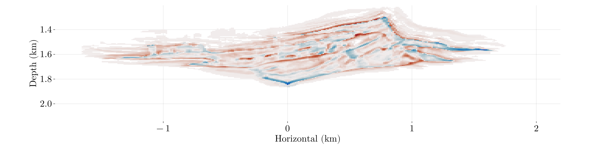{width="70%"}

<!-- EnKF analysis achieves **significantly sharper** plume estimates with reduced error in the plume interior. -->


## Results: Error Over Time {.smaller}

:::: {.columns}
::: {.column width="55%"}
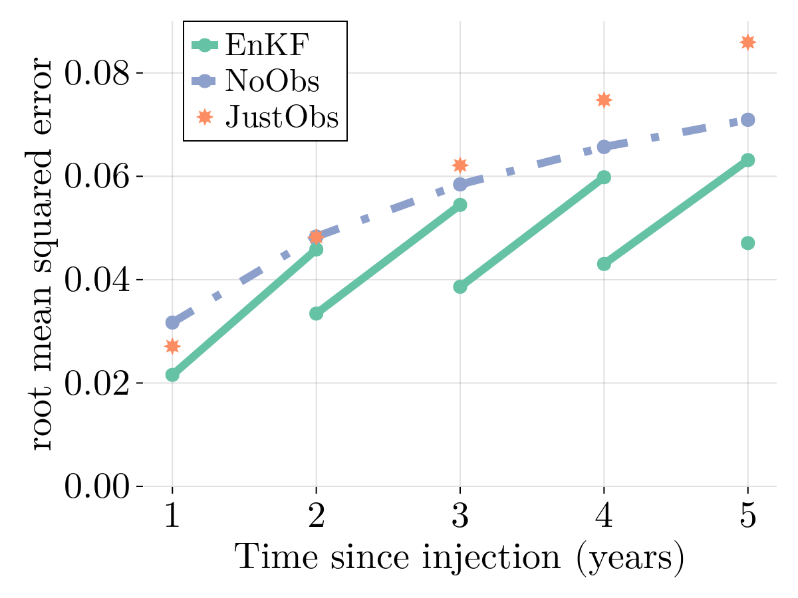
:::
::: {.column width="45%"}
**Key observations:**

- EnKF consistently achieves **lower error** than both baselines
- NoObs error grows steadily due to permeability uncertainty
- JustObs (even noise-free!) performs worse --- dynamics are more informative than observations alone
- **Sharp drops** at each yearly survey show the value of data assimilation
- Error growth between surveys shows limits of forecasting with uncertain permeability
:::
::::


<!-- ## Noise Parameter Tests {.smaller}

The EnKF update with explicit noise parameters:

$$
\boldsymbol{x}_{a,i} = \boldsymbol{x}_{f,i} + \widehat{\text{cov}}\big(\boldsymbol{x}_f,\, h(\boldsymbol{x}_f, \underline{\nu}\boldsymbol{\eta})\big)\Big(\widehat{\text{cov}}\big(h(\boldsymbol{x}_f, \underline{\alpha\nu}\boldsymbol{\eta})\big) + \underline{\nu^2\beta}^2\mathbf{I}\Big)^{-1}\big[h(\boldsymbol{x}^*, \underline{\nu^*}\boldsymbol{\eta}^*) - h(\boldsymbol{x}_{f,i}, \underline{\nu}\boldsymbol{\eta}_i)\big]
$$

**Four parameters tested:**

| Parameter | Role |
|---|---|
| $\beta$ | Regularization magnitude |
| $\alpha \in \{0,1\}$ | Include noise in sample covariance? |
| $\nu$ | Simulated noise level |
| $\nu^*$ | True observation noise level |

: {tbl-colwidths="[20,80]"}


## Regularization Tests {.smaller}

:::: {.columns}
::: {.column width="50%"}

:::
::: {.column width="50%"}

:::
::::

. . .

**Takeaway:** With $\alpha = 1$ (simulated noise included), a **wide range** of $\beta$ values achieves equivalent results. With $\alpha = 0$, performance is **much more sensitive** to $\beta$.

$\Rightarrow$ **Recommend** $\alpha = 1$ to avoid sensitivity to regularization choice.


## Simulated Noise Tests {.smaller}

:::: {.columns}
::: {.column width="55%"}

:::
::: {.column width="45%"}
**Findings:**

- **Low estimated SNR** $\Rightarrow$ approaches NoObs (ignores observations)
- **Very high estimated SNR** $\Rightarrow$ overfits noisy data
- Optimal: **overestimate SNR by 5--10 dB** (equivalent to covariance inflation)
- The optimum shifts toward $\gamma^*$ over time as more observations reduce prior dependence
:::
::::


## True Noise Tests {.smaller}

:::: {.columns}
::: {.column width="55%"}

:::
::: {.column width="45%"}
**Findings:**

- Low SNR (high noise) $\Rightarrow$ error approaches NoObs
- Very high SNR $\Rightarrow$ error *increases* at later time steps
- Explanation: numerical simulation error dominates when noise is too small
- Not a problem in practice --- real seismic noise always dominates floating-point errors
:::
::::
 -->

## EnKF Plume Tracking Over Time {.smaller}

:::: {.columns}
::: {.column width="50%"}

**EnKF mean saturation**

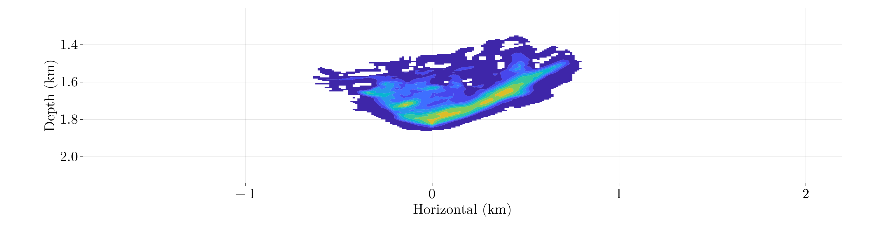{width="80%"}

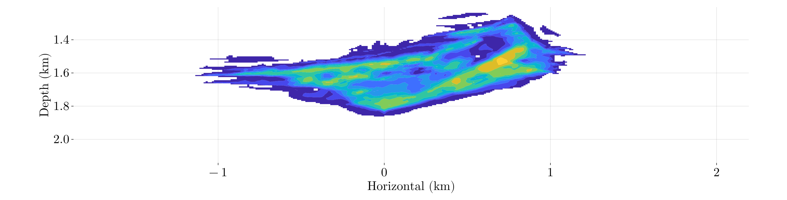{width="80%"}

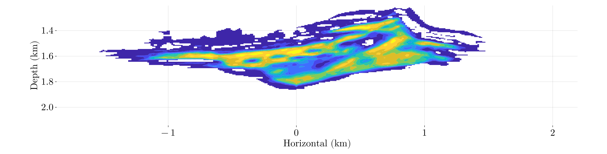{width="80%"}

:::
::: {.column width="50%"}

**Error**

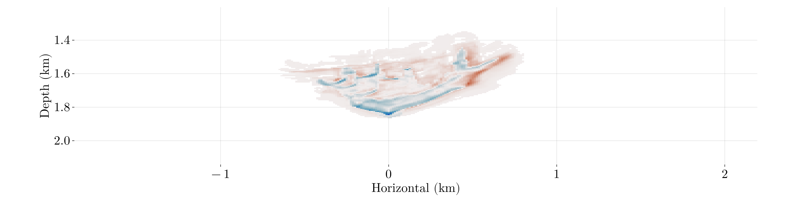{width="80%"}

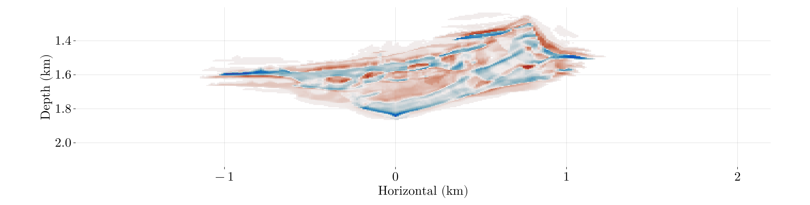{width="80%"}

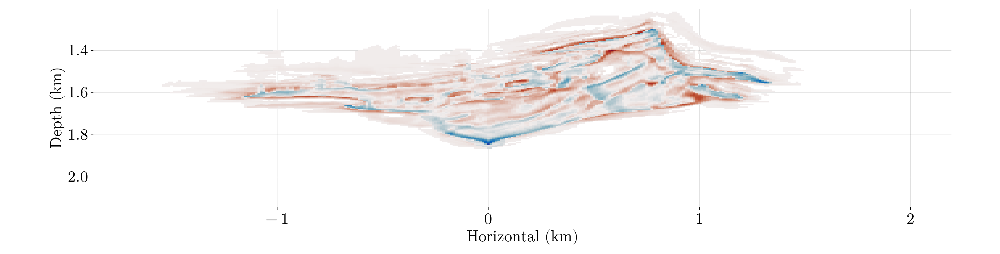{width="80%"}

:::
::::

## Scalability Considerations {.smaller}

:::: {.columns}
::: {.column width="60%"}

**Current 2D experiment:**

- State vector: $\sim 10^5$ DOF
- Observation vector: $\sim 10^6$ DOF
- 256 ensemble members

**Scaling to 3D ($\sim 10^{10}\,\text{m}^3$):**

- State: $\sim 10^7$ DOF
- Standard KF: $> 1$ TB storage
- **EnKF scales linearly** with DOF
- Ensemble size independent of grid size
- Transition + observation trivially parallelizable
:::
::: {.column width="40%"}
::: {.callout-note}
## Cost perspective
The computational cost of the EnKF update is **negligible** compared to simulating transition and observation. And simulations are far cheaper than conducting a seismic survey.
:::
:::
::::


## Conclusions {.smaller}

1. **EnKF + full waveform data + CO~2~ dynamics** achieves lower error than either physics-only or observation-only baselines

2. The EnKF provides a **scalable** framework for seismic CO~2~ monitoring as a **digital shadow**

3. **Limitations addressed transparently:** immiscible fluids, Born approximation, instrumental noise only, homogeneous porosity


## Future Work {.smaller}

- **Update permeability** (not just saturation) during assimilation
  - Currently the dominant source of forecast error

- Use **nonlinear seismic observations** (move beyond Born approximation)

- Include **heterogeneous porosity** and **capillary pressure**

- Account for **environmental noise** (non-Gaussian, spatially correlated)

- Explore **ML-based DA** with full waveform data (conditional normalizing flows)

- Scale to **3D field-scale** reservoirs

::: {.callout-tip}
## Ongoing work
See Gahlot et al. (2024) for preliminary results combining ML-based DA with full-waveform seismic data and CO~2~ fluid dynamics using conditional normalizing flows.
:::


## References {.smaller}

::: {#refs}
:::


## {background-color="#2c3e50"}

:::: {.columns}
::: {.column width="100%"}

### Thank You

**Key takeaway:** The ensemble Kalman filter is a promising, scalable approach for building digital shadows of subsurface CO~2~ reservoirs monitored with time-lapse seismic data.

:::
::::
