## {#title-custom .center background-color="white"}

:::{style="display: flex; justify-content: center; align-items: center; gap: 2.5em; margin-bottom: 1em;"}
{height=100}
{height=100}
:::

### Simulation-Based Inference {style="margin-bottom: 0.1em;"}
#### a tutorial {style="color: #555; font-weight: normal;"}

**Felix J. Herrmann**

School of Computational Science and Engineering --- Georgia Institute of Technology

Slides build on @louppe2023aissai, @deistler2025practical, and @arruda2025diffusion

## Why SBI? The Digital Twin Perspective

:::: {.columns}
::: {.column width="50%"}

- Digital twins rely on **forward simulators**: physics-based models mapping parameters $\btheta$ to observables $\bx$
- Core challenge: the [inverse problem]{.alert}---given observations $\xo$, what are the plausible parameters $\btheta$?
- SBI sits at the intersection of:
  - Uncertainty quantification
  - Inverse problems
  - Bayesian inference

:::
::: {.column width="50%"}

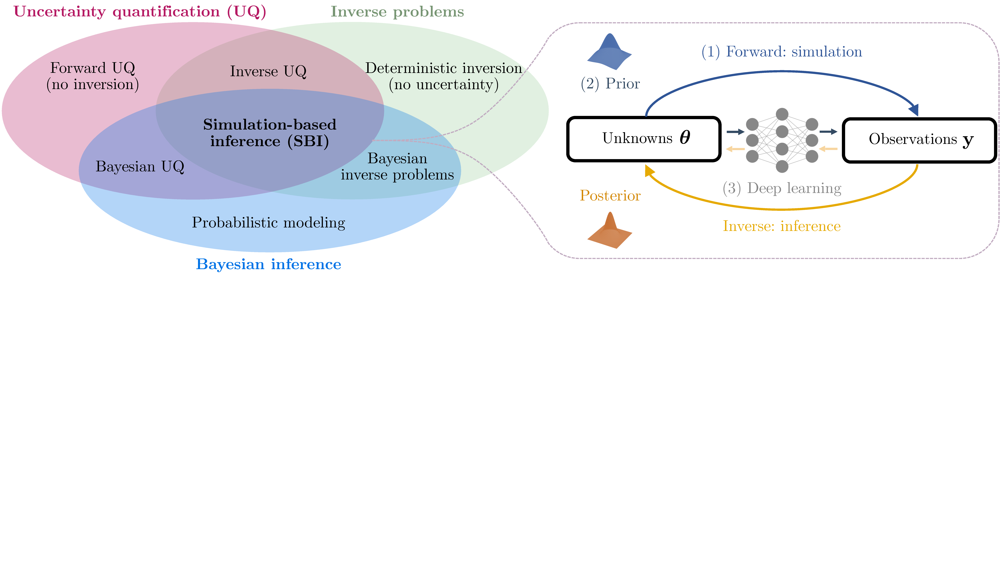{width="100%"}

:::
::::

## SBI for Bayesian Data Assimilation

SBI provides **amortized prior-to-posterior mappings** that naturally integrate into sequential Bayesian data assimilation workflows:

- **Recursive filtering**: At each assimilation step, the current state estimate (prior) is updated via incoming observations to yield a posterior. SBI learns this mapping *offline* from simulated ensembles, then applies it *online* at negligible cost per step.
- **Nonlinear ensemble filtering via couplings**: @spantini2022coupling generalize the Ensemble Kalman Filter to nonlinear settings using *transport maps* that couple prior and posterior ensembles. SBI-trained networks can serve as such transport maps.
- **Application: CO$_2$ storage monitoring**: @gahlot2024shadow combine SBI with ensemble Bayesian filtering to build an *uncertainty-aware Digital Shadow* for underground CO$_2$ storage, recursively assimilating time-lapse seismic and well data.

::: {.callout-tip}
SBI enables **scalable, amortized Bayesian updates** for high-dimensional, nonlinear dynamical systems where traditional filtering (EnKF, particle filters) struggle.
:::

## An Introductory Example: The Ball Throw

:::: {.columns}
::: {.column width="50%"}

Consider a simple simulator: a ball is thrown at angle $\btheta$ and lands at distance $\bx$ [@deistler2025practical].

- **Stochastic simulator**: even at the same angle $\btheta$, tailwind and measurement noise cause the ball to reach different distances $\bx$
- **Bayesian inference**: given an observed distance $\xo = 13\text{m}$, what angles $\btheta$ could have produced it?
- The **posterior** $p(\btheta \mid \xo)$ can be bimodal---a low angle with strong tailwind *or* a high angle with no wind can produce the same distance
- **Key idea of SBI**: estimate the posterior from simulated pairs $\{(\btheta_i, \bx_i)\}$ drawn from the joint $p(\btheta, \bx)$, *without* evaluating the likelihood

:::
::: {.column width="50%"}

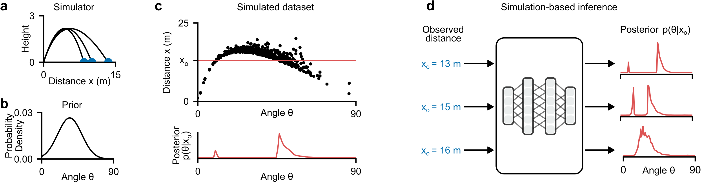{width="100%"}

:::
::::

## Uncertainty{.smaller}

:::: {.columns}
::: {.column width="50%"}

**Why quantify uncertainty?**

- Point estimates are not enough---we need to know *how confident* we are
- Decisions under uncertainty require calibrated probabilistic predictions
- Critical for safety, design, and scientific discovery

**Two fundamental types**:

- [**Aleatoric uncertainty**]{.alert} (irreducible): inherent stochasticity in the data-generating process (measurement noise, natural variability). Cannot be reduced with more data.
- [**Epistemic uncertainty**]{.alert} (reducible): uncertainty due to limited knowledge---finite data, incomplete models, unknown parameters. Can be reduced with more observations or better models.

:::
::: {.column width="48%"}

**In the SBI context**:

- The simulator captures **aleatoric** uncertainty via its stochastic execution: $\bx = G(\btheta, \bzeta)$ with random $\bzeta$
- The **posterior** $p(\btheta \mid \xo)$ captures **epistemic** uncertainty: which parameters are consistent with the observed data?
- SBI aims to recover the *full posterior*---not just a point estimate---giving access to both uncertainty types

::: {.callout-note}
A well-calibrated posterior should be *neither overconfident nor underconfident*---this is exactly what SBI diagnostics will verify.
:::

:::
::::

## Amortized Neural Posterior Estimation

The ball-throw example illustrates the core SBI idea [@deistler2025practical]:

1. **Simulate**: sample $N$ pairs $(\btheta_i, \bx_i) \sim p(\btheta, \bx)$ from the joint
2. **Train**: fit an inference network $q_\phi(\btheta \mid \bx)$ to predict the distribution of $\btheta$ given $\bx$
3. **Infer**: evaluate $q_\phi(\btheta \mid \xo)$ for *any* new observation $\xo$ --- in milliseconds

::: {.callout-important}
**What the network learns**: Unlike a point estimator that predicts a single $\hat{\btheta}$, the inference network learns to output a full *probability distribution* over $\btheta$ conditioned on each input $\bx$. It captures multi-modality, correlations, and uncertainty.
:::

**Amortization**: Once trained, the *same* network can be applied to *any* new observation without retraining or additional simulations. This is fundamentally different from classical methods (MCMC, ABC) that must restart inference for each new $\xo$.

## The Forward Model / Simulator

A simulator is a (possibly stochastic) program that generates synthetic data:

$$\btheta \sim p(\btheta), \qquad \bx \sim p(\bx \mid \btheta) \quad\text{or equivalently}\quad \bx = \texttt{Sim}(\btheta, \texttt{rng})$$

Running the simulator with fixed $\btheta$ and varying noise $\bzeta$ is equivalent to sampling from an *implicit likelihood* [@radev2023jana; @cranmer2020frontier]:

$$\bx \sim p(\bx \mid \btheta) \;\Longleftrightarrow\; \bx = G(\btheta, \bzeta) \quad\text{with}\quad \bzeta \sim p(\bzeta)$$

In principle, this likelihood can be obtained by marginalizing the joint $p(\bzeta, \bx \mid \btheta)$ over all possible execution trajectories of the simulation program, but this is typically **intractable** [@radev2023jana]. The posterior follows from the joint:

$$p(\btheta \mid \bx) \propto p(\btheta)\!\int_{\Xi} p(\bzeta, \bx \mid \btheta)\,d\bzeta$$

which is **singly intractable** (one integral over the noise space $\Xi$). 

## Cont'd {.smaller}

The prior predictive distribution (marginal likelihood):

$$p(\bx) = \int_{\Theta}\!\int_{\Xi} p(\btheta)\,p(\bzeta, \bx \mid \btheta)\,d\bzeta\,d\btheta$$

is [**doubly intractable**]{.alert}---both integrals are difficult to approximate [@radev2023jana].

::: {.callout-important}
The likelihood $p(\bx \mid \btheta)$ is **intractable**---we can *sample* from it but cannot *evaluate* it.
:::

## Likelihood-Based vs. Simulation-Based Models

|  | **Likelihood-Based** | **Simulation-Based** |
|---|---|---|
| **Joint model** $p(\btheta, \bx)$ | $\btheta \sim p(\btheta),\; \bx \sim p(\bx \mid \btheta)$ | $\btheta \sim p(\btheta),\; \bx = \texttt{Sim}(\btheta, \texttt{rng})$ |
| **Prior** $p(\btheta)$ | Can be sampled **and** evaluated | Can be sampled, *optionally* evaluated |
| **Data model** $p(\bx \mid \btheta)$ | Can be sampled **and** evaluated | Can be sampled but [**not evaluated**]{.alert} |
| **Posterior** $p(\btheta \mid \bx)$ | (Usually) intractable | [**Doubly intractable**]{.alert} |

: {tbl-colwidths="[25,37,37]"}

*"Doubly intractable"* = neither the likelihood nor the normalizing constant is available.

::: aside
Table adapted from @arruda2025diffusion, Table 1.
:::

## Bayesian Inference: The Goal

**Bayes' rule**:

$$p(\btheta \mid \xo) = \frac{p(\xo \mid \btheta)\, p(\btheta)}{p(\xo)}$$

- **Prior** $p(\btheta)$: domain knowledge before observing data
- **Likelihood** $p(\xo \mid \btheta)$: how well parameters explain observations
- **Evidence** $p(\xo) = \int p(\xo \mid \btheta)\,p(\btheta)\,d\btheta$: normalizing constant (intractable)
- **Posterior** $p(\btheta \mid \xo)$: updated belief after data

The posterior provides a **complete description** of parameter uncertainty: it captures not just the best estimate, but all plausible parameter configurations, their dependencies, and multi-modality.

## Why Is This Hard?

1. **Evidence integral**: Computing $p(\xo) = \int p(\xo \mid \btheta)\,p(\btheta)\,d\btheta$ requires integrating over the *entire* parameter space---intractable in high dimensions.

2. **Intractable likelihood**: For simulation-based models, even evaluating $p(\xo \mid \btheta)$ for a *single* $\btheta$ is impossible.

3. **Classical methods fail**: Conjugate priors, standard variational inference, or MCMC with known likelihoods do not apply.

::: {.callout-note}
This motivates **likelihood-free** / **simulation-based** inference.
:::

## Approximate Bayesian Computation (ABC)

:::: {.columns}
::: {.column width="50%"}

**Algorithm**:

1. Sample $\btheta_i \sim p(\btheta)$
2. Simulate $\bx_i \sim p(\bx \mid \btheta_i)$
3. Accept $\btheta_i$ if $d(\bx_i, \xo) < \epsilon$

[**Issues:**]{.alert}

- How to choose summary statistics $\bx'$?
- How to choose tolerance $\epsilon$? Distance $d$?
- No tractable posterior density
- Must re-run simulations for every new observation or changed prior (*no amortization*)
- Scales very poorly with $\dim(\bx)$

:::
::: {.column width="47%"}

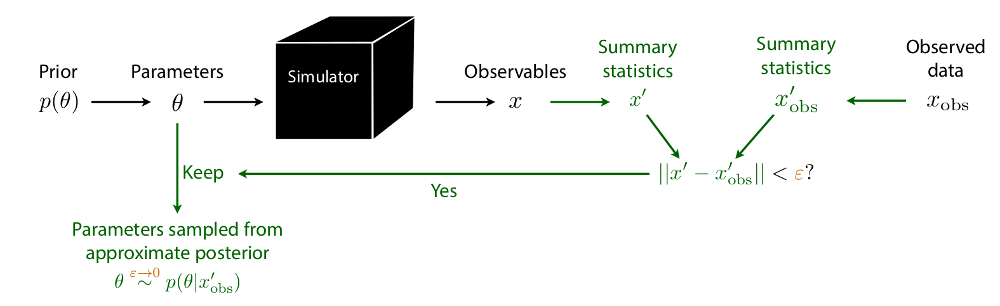{width="100%"}

:::
::::

## MCMC Limitations & Problem Archetypes

:::: {.columns}
::: {.column width="48%"}

**MCMC for simulators:**

- Requires likelihood evaluations at every step---[unavailable]{.alert}
- Even with surrogates: sequential sampling, cannot parallelize
- Slow convergence in high dimensions
- Difficult tuning (step size, chains, warmup)

::: {.callout-warning}
For expensive, nonlinear forward models with high-dim parameters/data, ABC and MCMC become impractical.
:::

:::
::: {.column width="50%"}

**Problem archetypes** [@arruda2025diffusion, Table 2]

| Budget | $\dim(\btheta)$ | $\dim(\bx)$ | Example |
|---|---|---|---|
| High | Low | Low | SBI benchmarks |
| Low | Low | Low | $N$-body sims |
| High | Low | High | Single-molecule |
| Low | Low | High | Galaxy sims |
| High | High | Low | 2D Darcy flow |
| Low | High | Low | Groundwater |
| High | High | High | Bayesian NNs |
| Low | High | High | Ultrasound |

:::
::::

## SBI: The Big Picture

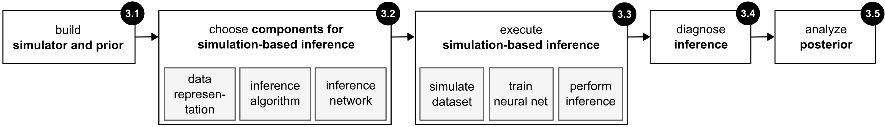{width="75%" fig-align="center"}

**Five-step workflow** [@deistler2025practical]:

1. Define the problem (simulator + prior)
2. Choose SBI components (data representation, method, network)
3. Execute SBI (simulate, train, infer)
4. Posterior diagnostics (well-specification, coverage)
5. Analyze the posterior

All simulations done **offline & in parallel**; training decoupled from simulation; inference (after training) is **fast**.

## Step 1: Defining the Problem

**The simulator**:

- Maps $\btheta \to \bx$ via the likelihood $p(\bx \mid \btheta)$
- Must be able to generate forward samples: $\bx \sim p(\bx \mid \btheta)$
- Can be a "black box"---no likelihood evaluations or gradients needed

**The prior** $p(\btheta)$:

- Reflects scientific knowledge and constraints
- Only needs to be *samplable* (not necessarily evaluable)
- Width affects computational cost: broad prior $\Rightarrow$ more simulations needed
- Unlike classical Bayesian methods: no need for conjugate priors

::: {.callout-warning}
**Critical pitfall:** Model misspecification---when $\xo$ falls outside the range of what the model (simulator + prior) can generate. SBI can produce *spurious posteriors* in this case.
:::

## Step 2: Choosing SBI Components

**Data representation**:

- Raw data $\bx$ (high-dimensional)
- Summary statistics $\mathcal{S}(\bx)$: hand-crafted features
- Embedding networks $\mathcal{S}_\lambda$: learned representations (CNNs, RNNs, Transformers)

**Three core inference methods**:

| Method | Target | Output | Inference | i.i.d. data |
|---|---|---|---|---|
| NPE | Posterior $p(\btheta \mid \bx)$ | Direct samples | Fast (ms) | Difficult |
| NLE | Likelihood $p(\bx \mid \btheta)$ | Requires MCMC/VI | Slow (sec--min) | Efficient |
| NRE | Ratio $p(\bx \mid \btheta)/p(\bx)$ | Requires MCMC/VI | Slow (sec--min) | Efficient |

**Network choices**: normalizing flows [@papamakarios2021normalizing], diffusion models [@song2021score], flow matching [@lipman2023flow; @wildberger2023flow]. Details in next Lecture.

## Neural Posterior Estimation (NPE) via KL Divergence

**Goal**: Learn $q_\phi(\btheta \mid \bx) \approx p(\btheta \mid \bx)$

Minimize the expected forward  KL divergence:

$$\begin{aligned}
&\min_{q_\phi} \; \E_{p(\bx)}\Big[\KL\big(p(\btheta \mid \bx)\,\|\,q_\phi(\btheta \mid \bx)\big)\Big] \\[4pt]
&= \min_{q_\phi}\; \E_{p(\bx)}\,\E_{p(\btheta \mid \bx)}\left[\log \frac{p(\btheta \mid \bx)}{q_\phi(\btheta \mid \bx)}\right] \\[4pt]
&= \max_{q_\phi}\; \E_{p(\bx,\btheta)}\big[\log q_\phi(\btheta \mid \bx)\big] + \text{const.}
\end{aligned}$$

**Training loss**:

$$\boxed{\mathcal{L}(\phi) = \E_{(\btheta,\bx)\sim p(\btheta,\bx)}\big[-\log q_\phi(\btheta \mid \bx)\big]}$$

::: {.callout-tip}
This is maximum likelihood under the joint $p(\bx,\btheta)$! We only need **samples from the joint**---exactly what the simulator provides.
:::

## Sampling and Neural Density Estimation

**Generating simulations** (Step 3 of the workflow):

$$\text{For } i = 1,\ldots,N:\quad \btheta_i \sim p(\btheta), \quad \bx_i \sim p(\bx \mid \btheta_i)$$

$$\text{Dataset: } \{(\btheta_i, \bx_i)\}_{i=1}^N \sim p(\btheta, \bx)$$

**Training**: Minimize $\mathcal{L}(\phi)$ with standard deep learning (SGD, early stopping, checkpointing).

**At inference time** (for NPE):

- Given observation $\xo$, directly sample $\btheta \sim q_\phi(\btheta \mid \xo)$
- [No MCMC needed]{.alert}
- Inference in **milliseconds**

## The Power of Amortized Inference{.smaller}

**Amortization**: Train once on the full prior, apply to *any* observation without retraining.

**Cost structure**:

- **Fixed cost** (once): $N$ simulations + neural network training
- **Per-observation cost**: single forward pass (NPE) = milliseconds

**Compare to non-amortized methods**:

- Traditional MCMC/ABC: each new observation requires independent, expensive inference
- Sequential SBI (SNPE): fewer simulations but loses amortization

**Applications enabled**:

- Real-time analysis (e.g., LIGO gravitational waves)
- High-throughput inference across many observations
- Experimental design and active learning
- [Critical for diagnostics]{.alert}: coverage checks require 1000s of posterior evaluations---only tractable with amortization

## Non-amortized inference{.smaller}

**Non-amortized (observation-specific) inference** optimizes $q_\phi$ for a *single* $\xo$ using the **reverse KL**:

$$\min_{q_\phi}\;\KL\big(q_\phi(\btheta)\,\|\,p(\btheta \mid \xo)\big) = \min_{q_\phi}\;\E_{q_\phi(\btheta)}\!\left[\log \frac{q_\phi(\btheta)}{p(\btheta \mid \xo)}\right]$$

:::: {.columns}
::: {.column width="48%"}

**Amortized** (forward KL):

- **Mass-covering**: $q_\phi$ covers all modes of $p$
- Trained once, applied to any $\xo$
- Enables coverage diagnostics (needs 1000s of evaluations)
- May suffer from an **amortization gap**: approximation quality trades off against generalization across all $\bx$

:::
::: {.column width="48%"}

**Non-amortized** (reverse KL):

- **Mode-seeking**: $q_\phi$ concentrates on dominant mode(s)
- Must be re-optimized for *every* new $\xo$
- Can be more accurate for a *specific* observation
- No amortization gap, but no reuse across observations
- Coverage diagnostics become prohibitively expensive

:::
::::

::: {.callout-tip}
The **amortization gap** is the price paid for generalization: an amortized posterior $q_\phi(\btheta \mid \bx)$ that works well across *all* $\bx$ may be slightly worse for any *particular* $\xo$ than a posterior optimized specifically for that $\xo$.
:::

## Coverage diagnostics

How do we know whether a learned posterior $q_\phi(\btheta \mid \bx)$ is **trustworthy**?

**Coverage diagnostics** test whether the posterior's stated uncertainty matches reality:

- Draw test pairs $(\btheta^*, \bx) \sim p(\btheta, \bx)$ with *known* ground-truth parameters
- For each pair, check: does $\btheta^*$ fall within the posterior's credible regions at the expected rate?
- A well-calibrated posterior at the $\alpha$-level should contain $\btheta^*$ exactly $\alpha \times 100\%$ of the time

[**Why expensive:**]{.alert} Each test requires a full posterior evaluation. Reliable calibration checks need $10^3$--$10^4$ test pairs. Without **amortization**, each test pair demands a separate MCMC run---making diagnostics prohibitively costly. With amortized NPE, all $10^4$ posteriors are obtained in seconds.

::: {.callout-note}
Coverage diagnostics are treated in detail later in this lecture. The key point: **amortization is not just convenient---it is essential for validation**.
:::

## Summary Statistics: Why and How{.smaller}

Simulators often produce **high-dimensional outputs** $\bx \in \R^d$ ($d \gg 1$), e.g., large images, long time series, or volumetric fields. Dimensionality reduction via **summary statistics** $\mathcal{S}: \R^d \to \R^r$ ($r \ll d$) can help:

- **Isolate informative components** while discarding noise
- **Eliminate redundant features** and reduce computational cost
- **Combat model misspecification**: extract features the model *can* capture while ignoring those it cannot

**Goal**: The summary statistic should preserve information about $\btheta$:

$$p(\btheta \mid \mathcal{S}(\bx)) \approx p(\btheta \mid \bx)$$

A *sufficient statistic* achieves equality, but for complex simulators sufficient statistics are generally unknown.

**Approaches**: hand-crafted domain features (e.g., autocorrelation, power spectra), physics-based summaries [e.g., migrated images in geophysics; @orozco2024velocity], or learned summaries via embedding networks.

## Physics-based *summary statistics*

Parameter-to-observation can be complex and depends on acquisition geometry

![Physics-based summary statistics compress high-dimensional data while preserving information about model parameters [@orozco2023adjoint]](figures/Physic-based-sum-stat.png){width="85%" fig-align="center"}

## *Summary statistics* with adjoints {.smaller}

<!-- :::: {.columns}
::: {.column width="50%"} -->
**Observations:** $\by$ 

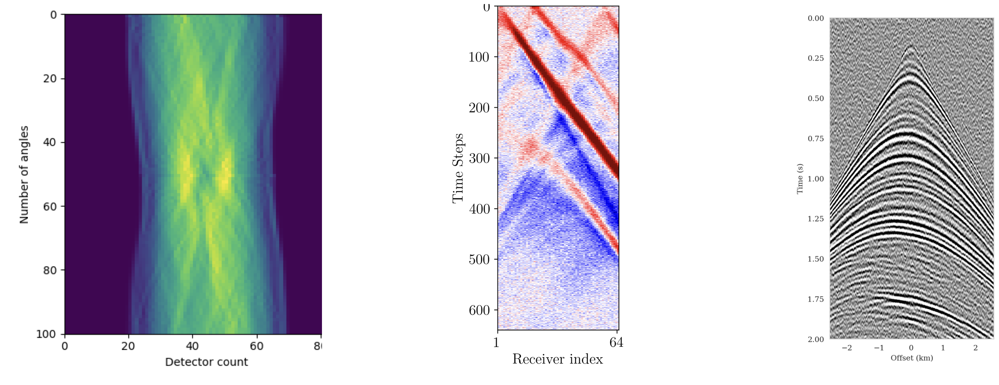{width="50%" fig-align="center"}

<!-- :::
::: {.column width="50%"} -->

**Summary:** $\bar{\by}$ 

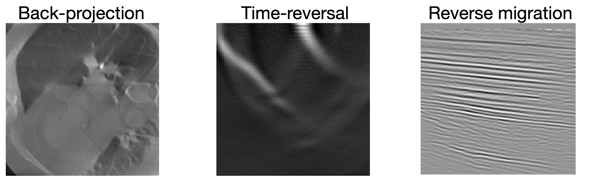{width="50%" fig-align="center"}

<!-- :::
:::: -->

<!-- Forward model maps parameters to observations
Adjoint operator compresses observations into parameter-informative summaries -->

Adjoint-based summary statistics leverage the physics of the forward model to compute informative data representations at low cost [@orozco2023adjoint].

## Embedding Networks for High-Dimensional Data{.smaller}

Embedding networks are **feed-forward neural networks** that learn to compress high-dimensional data into informative low-dimensional summaries. Unlike invertible or generative networks, they are standard multi-layer architectures optimized purely for compression.

:::: {.columns}
::: {.column width="55%"}

- An **embedding network** $\mathcal{S}_\lambda$ compresses the raw data $\bx$ into a low-dimensional representation before it is passed to the inference network $q_\phi$
- The embedding network is trained *jointly* with the inference network using the same loss $\mathcal{L}(\phi, \lambda)$---no separate feature engineering needed
- Architecture depends on data structure:
  - **CNNs** for images
  - **RNNs / Transformers** for time series
  - **MLPs / ResNets** for unstructured data
  - **Set Transformers** for exchangeable (i.i.d.) observations

:::
::: {.column width="43%"}

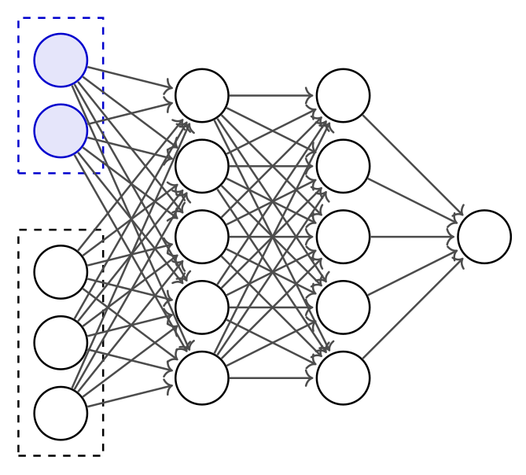{width="100%"}

:::
::::

::: {.callout-warning}
Training large embedding networks requires many simulations. Powerful architectures (e.g., Transformers) may be impractical with limited simulation budgets.
:::

## NPE with Normalizing Flows and Learned Summaries{.smaller}

:::: {.columns}
::: {.column width="55%"}

**Normalizing flows** define $q_\phi(\btheta \mid \bx)$ through a chain of $K$ **invertible** transformations:

- Base distribution: $\bz_0 \sim p_0(\bz) = \mathcal{N}(\mathbf{0}, \mathbf{I})$
- Forward pass: $\bz_k = f_k(\bz_{k-1};\, \bx)$ for $k = 1, \ldots, K$
- Output: $\btheta = \bz_K$

**Training objective** (change of variables):
$$\log q_\phi(\btheta \mid \bx) = \log p_0(\bz_0) - \sum_{k=1}^K \log\left|\det \frac{\partial f_k}{\partial \bz_{k-1}}\right|$$

**End-to-end with learned summaries**: Replace raw data $\bx$ with $\mathcal{S}_\lambda(\bx)$:
$$\mathcal{L}(\phi, \lambda) = \mathbb{E}_{(\btheta,\bx)\sim p(\btheta,\bx)}\big[-\log q_\phi(\btheta \mid \mathcal{S}_\lambda(\bx))\big]$$

The embedding network $\mathcal{S}_\lambda$ (feed-forward) and the normalizing flow $q_\phi$ (invertible) are trained **jointly**.

**Sampling** (fast, feed-forward): compute $\mathbf{s} = \mathcal{S}_\lambda(\xo)$, draw $\bz_0 \sim \mathcal{N}(\mathbf{0}, \mathbf{I})$, apply $\btheta = f_K \circ \cdots \circ f_1(\bz_0;\, \mathbf{s})$. No MCMC needed.

:::
::: {.column width="43%"}

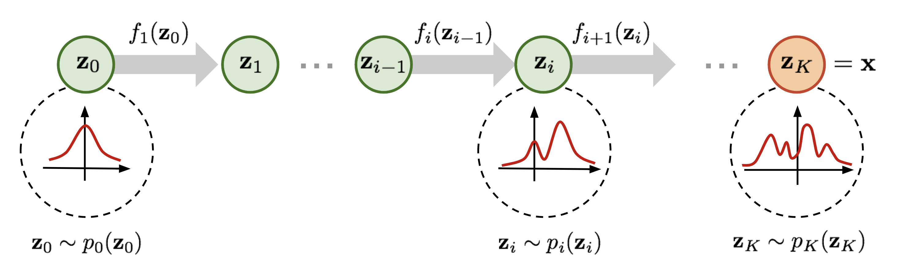{width="100%"}

:::
::::

## Well-Specified Models: A Critical Requirement{.smaller}

:::: {.columns}
::: {.column width="50%"}

**Definition**: A model is *well-specified* if $\xo$ could have been generated by the simulator:

$$\exists\;\btheta^* \text{ such that } p(\btheta^*, \xo) > 0$$

i.e., $\xo$ falls within the support of simulated data.

[**Consequences of misspecification:**]{.alert}

- Neural networks extrapolate erratically outside training distribution
- SBI produces **spurious posteriors**---unreliable and uninterpretable

**Detection strategies**:

1. **Prior predictive check**: Do simulations cover the range of $\xo$?
2. **Out-of-distribution detection**: Train unconditional density $p(\bx)$, check likelihood of $\xo$
3. **OOD in latent space**: Detect anomalies in embedding network representations

Both checks can be performed **before** training any inference network.

:::
::: {.column width="48%"}

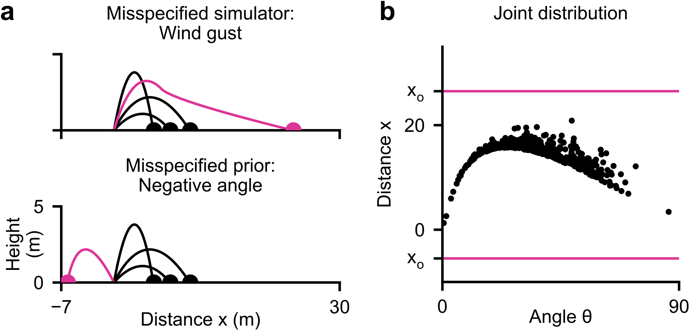{width="100%"}

:::
::::

## Posterior Predictive Checks (PPCs)

**Procedure**:

1. Sample $\btheta_i \sim q_\phi(\btheta \mid \xo)$ for $i = 1,\ldots,N$
2. Simulate posterior predictives: $\tilde{\bx}_i \sim p(\bx \mid \btheta_i)$
3. Compare distribution of $\{\tilde{\bx}_i\}$ to $\xo$

:::: {.columns}
::: {.column width="48%"}

[**Good**]{style="color: #228B22;"}: Posterior predictives resemble $\xo$

[**Bad**]{style="color: #CC3333;"}: Systematic differences $\Rightarrow$ problems

:::
::: {.column width="48%"}

[**Limitations:**]{.alert}

- Necessary but *not sufficient*
- Qualitative, not quantitative
- Can be "gamed" by a collapsed posterior

:::
::::

**Challenges for large problems**:

- High-dimensional $\bx$ makes comparison difficult
- Computational cost of re-simulating can be significant
- Need domain-specific comparison metrics

## Coverage Diagnostics: Overview{.smaller}

:::: {.columns}
::: {.column width="58%"}

**Goal**: Verify that uncertainty estimates are statistically *calibrated*.

**Two families of tests** [@hermans2022crisis; @talts2018validating]:

- **Global coverage checks**: assess calibration *on average* across many observations. Computationally cheaper but errors can average out.
- **Local coverage checks**: assess calibration for *specific* observations. More powerful but much more expensive.

All coverage methods require a **calibration set** of $N$ pairs $(\btheta^*, \bx) \sim p(\btheta, \bx)$ plus inference for each pair.

:::
::: {.column width="40%"}

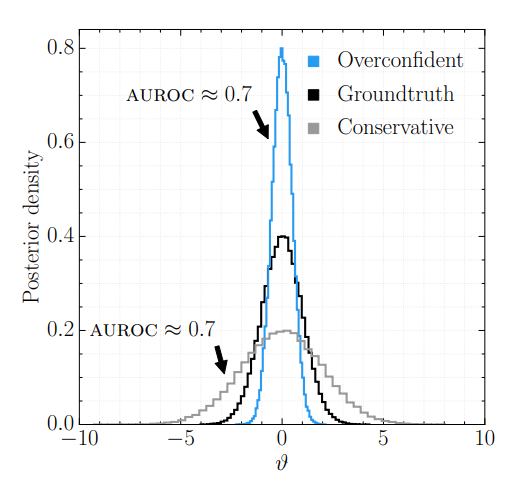{width="70%"}

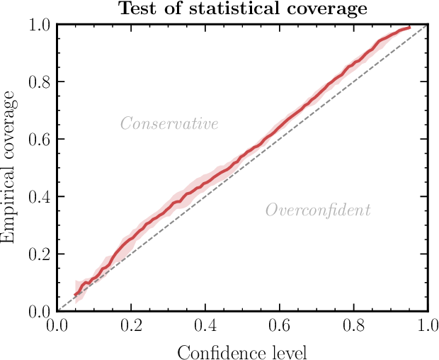{width="70%"}

:::
::::

**Failure modes**: Below diagonal $\to$ overconfident; Above $\to$ underconfident; Curved $\to$ biased.

## Simulation-Based Calibration (SBC){.smaller}

**SBC** [@talts2018validating] checks whether the posterior marginals are correctly calibrated:

**Algorithm**:

1. For $i = 1, \ldots, N$: sample $\btheta^*_i \sim p(\btheta)$, simulate $\bx_i \sim p(\bx \mid \btheta^*_i)$
2. For each $(\btheta^*_i, \bx_i)$: draw $L$ posterior samples $\{\btheta^{(1)}, \ldots, \btheta^{(L)}\} \sim q_\phi(\btheta \mid \bx_i)$
3. For each parameter dimension $j$: compute the **rank** of $\theta^*_{i,j}$ among the $L$ posterior samples
4. The **rank histogram** (histogram of ranks across all $N$ test pairs) should be **uniform**

**Interpreting rank histograms**:

- **Uniform** $\to$ well-calibrated
- **U-shaped** $\to$ overconfident (posterior too narrow)
- **Inverse U-shaped** $\to$ underconfident (posterior too broad)
- **Skewed left/right** $\to$ systematic bias

**Computational cost**: Requires $N \times L$ posterior samples. With amortized NPE this takes seconds; with NLE/NRE each of the $N$ test cases needs a separate MCMC run.

## Expected Coverage and TARP{.smaller}

**Expected Coverage** [HPD = Highest Posterior Density; @hermans2022crisis]:

- For each test pair $(\btheta^*, \bx)$: compute the smallest HPD region of $q_\phi(\btheta \mid \bx)$ that contains $\btheta^*$
- Plot the fraction of test cases where $\btheta^*$ falls within the $k\%$ HPD region, for $k = 0, \ldots, 100$
- A well-calibrated posterior yields a P-P plot on the **diagonal**
- Checks the **joint** posterior (catches correlation errors that SBC misses), but cannot pinpoint *which* parameter is miscalibrated

**TARP** [Tests of Accuracy with Random Points; @lemos2023sampling]:

- Constructs credible regions using **randomly positioned reference points** instead of HPD contours
- Advantage: works with generative models that do **not** provide density evaluation (e.g., diffusion models, GANs)
- Yields a similar P-P plot as expected coverage

::: {.callout-note}
All global diagnostics require $10^3$--$10^4$ calibration simulations. **Amortization is essential**---without it, each calibration pair requires a full MCMC run.
:::

## Marginal vs. Conditional Calibration{.smaller}

Coverage diagnostics (SBC, Expected Coverage, TARP) and uncertainty-vs-error analysis test **different aspects** of calibration:

:::: {.columns}
::: {.column width="50%"}

**Coverage plots are *marginal* diagnostics**

- For each nominal credible level $\alpha$, check: does a fraction $\alpha$ of test samples have $\btheta^* \in C_\alpha(\bx)$?
- Perfect calibration $=$ diagonal in the P-P plot
- This **averages over all observations** $\bx$
- A posterior can be overconfident in some regions and underconfident in others---these errors **cancel in the marginal average**
- [Marginal calibration is necessary but not sufficient]{.alert}

:::
::: {.column width="50%"}

**Uncertainty vs. error is a *conditional* diagnostic**

- For each observation $\bx$, check: does the predicted posterior spread $\sigma(\bx) = \sqrt{\text{Var}_q[\btheta \mid \bx]}$ predict the realized error $|\btheta^* - \mathbb{E}_q[\btheta \mid \bx]|$?
- Tests calibration **locally**, for each observation
- Catches failures invisible to marginal diagnostics

**Formally**: Conditional calibration requires
$$\text{Var}_q[\btheta \mid \bx] = \mathbb{E}\!\left[(\btheta - \mathbb{E}_q[\btheta \mid \bx])^2 \,\big|\, \bx\right] \quad \forall\; \bx$$

Marginalizing over $\bx$ gives correct coverage, but correct coverage does **not** guarantee this holds pointwise.

:::
::::

## Implications for Diagnostics in Practice{.smaller}

:::: {.columns}
::: {.column width="50%"}

**Hierarchy of calibration**

| Diagnostic | Type | What it tests |
|---|---|---|
| SBC rank histograms | Marginal | Per-parameter marginals |
| Expected Coverage / TARP | Marginal | Joint posterior (global) |
| Uncertainty vs. error | Conditional | Local calibration per $\bx$ |

[Conditional calibration $\Rightarrow$ marginal calibration, but **not** vice versa.]{.alert}

**Example of marginal-but-not-conditional calibration**: A posterior $q(\btheta \mid \bx)$ that is too narrow for noisy observations and too wide for clean observations can still lie on the diagonal *on average*.

:::
::: {.column width="50%"}

**Practical recommendations**

1. **Always run SBC or TARP** as a first check---they are cheap with amortized posteriors
2. **Complement with uncertainty-vs-error plots** to detect local miscalibration
3. For **high-dimensional** problems (imaging), use pixelwise diagnostics:
   - $z$-scores flag pixels where error $> 2\times$ uncertainty
   - UCE bins pixels by error magnitude and checks whether uncertainty tracks error
4. **Data residual checks** (posterior predictive) work without ground truth but are necessary, not sufficient

:::
::::

::: {.callout-tip}
Coverage diagnostics tell you whether your posterior is *globally* trustworthy. Uncertainty-vs-error analysis tells you whether it is *locally* trustworthy. Use both.
:::

## Quantitative UQ Assessment: Beyond Standard Diagnostics{.smaller}

For **high-dimensional** inference problems (e.g., imaging), standard SBC/TARP diagnostics are impractical because parameter spaces have millions of dimensions. Alternative UQ metrics exist that assess uncertainty **pixelwise** [@orozco2024velocity]:

**1. $z$-score (error vs. uncertainty warning)**:

$$z\text{-score} = \frac{|\bx^* - \bx_{\text{mean}}|}{\bx_{\text{std}}}$$

Pixels where error $> 2\times$ uncertainty are flagged. A low percentage of flagged pixels indicates good UQ.

**2. Uncertainty Calibration Error (UCE)**: Bins pixels by error magnitude and checks whether uncertainty tracks error. Lower UCE = better calibrated.

**3. Posterior coverage percentage**: Fraction of pixels where the ground truth falls within the $[1\%, 99\%]$ percentile range of posterior samples.

**4. Data residual check**: Pass posterior samples through the forward operator and check fit to observed data---does *not* require ground truth.

::: {.callout-warning}
Metrics 1--3 require access to **ground truth**, limiting them to synthetic validation. Metric 4 (data residual) works on field data but is necessary, not sufficient.
:::

## Example: Seismic Velocity Model Building with SBI

:::: {.columns}
::: {.column width="50%"}

@orozco2024velocity apply SBI with conditional diffusion networks to **seismic velocity model building**:

- **Forward model**: acoustic wave equation ($\bx =  \text{velocity model}, \bx_o =  \text{seismic data}$)
- **Summary statistics**: physics-based --- subsurface-offset Common Image Gathers (CIGs) compress waveform data while preserving subsurface information
- **Training**: ~800 paired simulations (velocity model + CIGs)
- **Inference**: posterior samples in seconds per sample (after one-time 14h GPU training)
- **Amortized**: same trained network applied to many test observations

:::
::: {.column width="50%"}

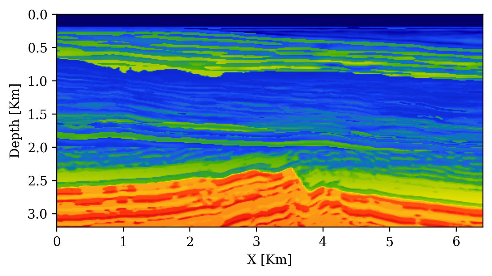{width="48%"}
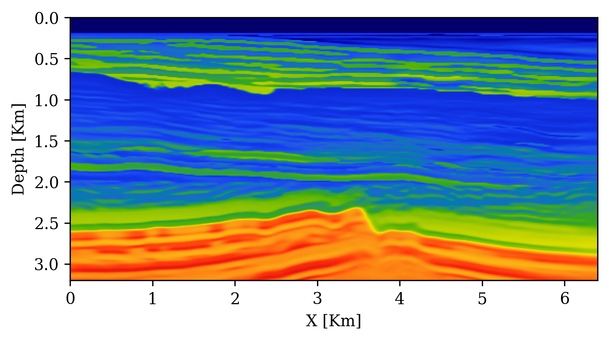{width="48%"}

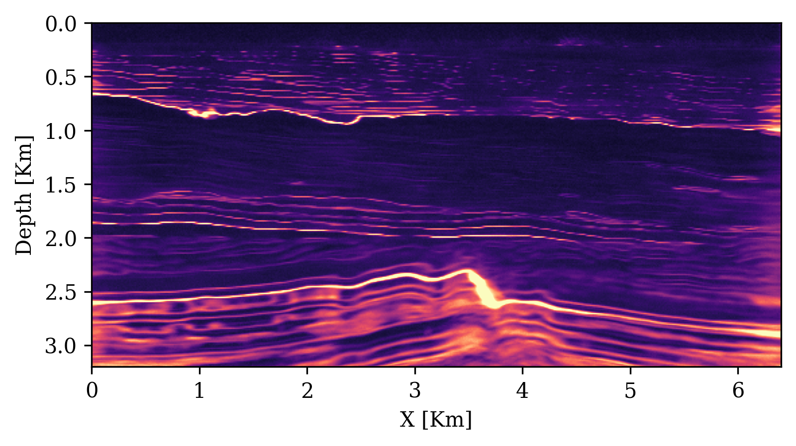{width="48%"}
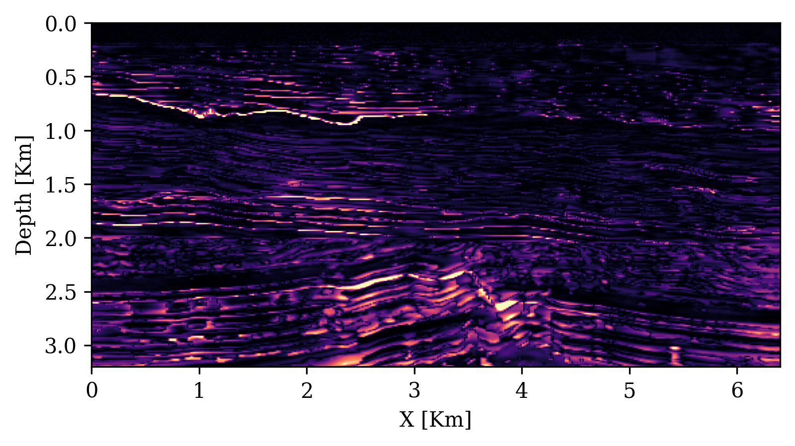{width="48%"}

:::
::::

## UQ Metrics for Seismic Imaging

:::: {.columns}
::: {.column width="50%"}

**Calibration** (UCE): the error-uncertainty correlation should follow the diagonal. CIGs improve calibration over RTMs.

{width="48%"}
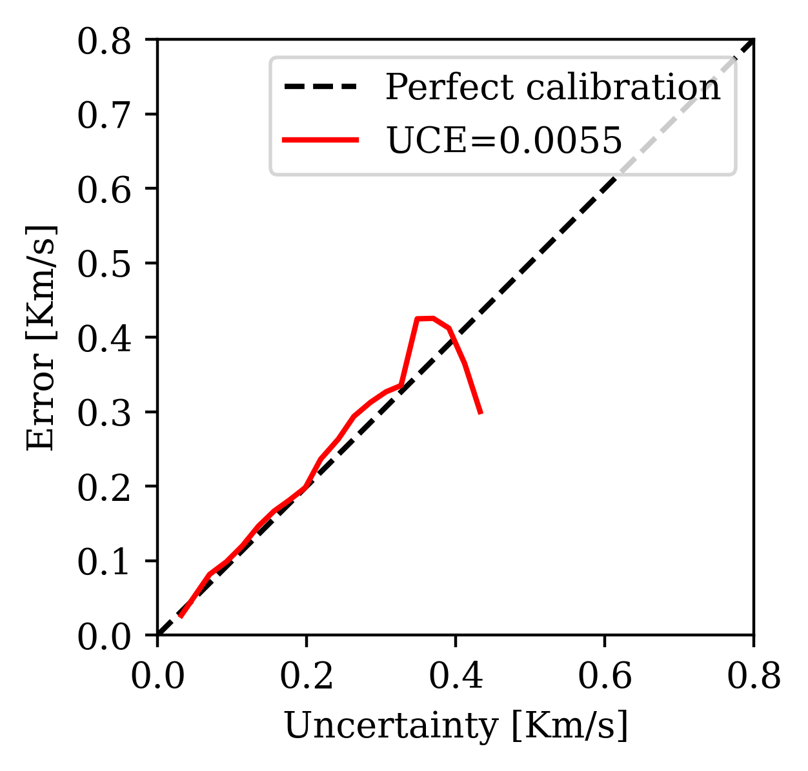{width="48%"}

:::
::: {.column width="50%"}

**Posterior coverage traces**: posterior samples (colored) should bracket the ground truth (black). Coverage with CIGs: 90.6% vs. RTMs: 82.1%.

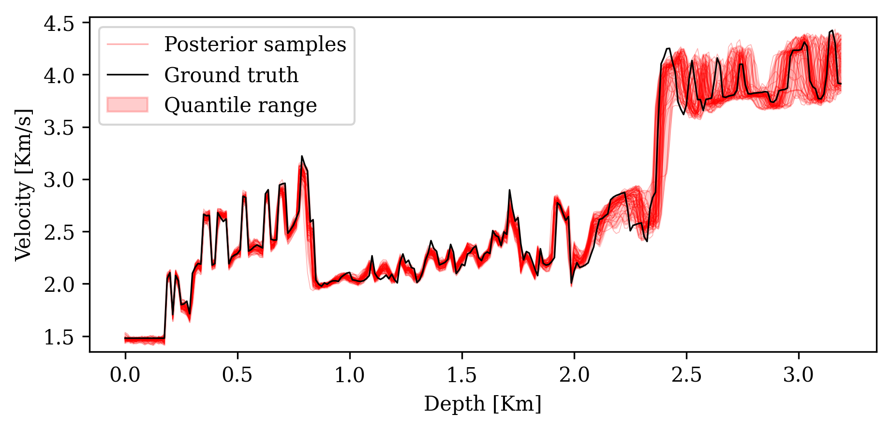{width="48%"}
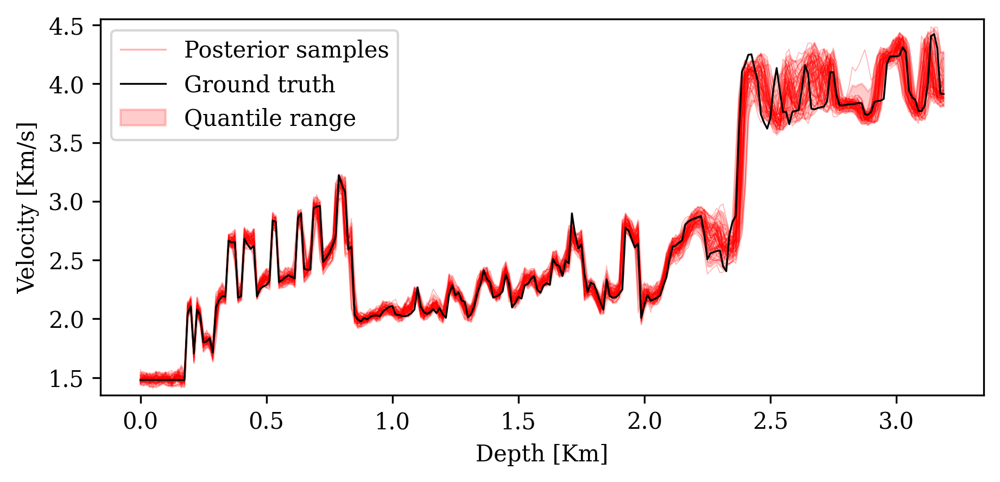{width="48%"}

:::
::::

::: aside
Figures from @orozco2024velocity. CIGs = Common Image Gathers; RTMs = Reverse-Time Migrations. CIGs provide richer physics-based summaries that improve both image quality and uncertainty calibration.
:::

## Analyzing the Posterior{.smaller}

**Visualization**:

- 1D/2D marginal posteriors $p(\theta_i \mid \xo)$; corner plots showing parameter relationships

**Marginal moments** (cheap via Monte Carlo):

$$\E_{p(\btheta \mid \xo)}[f(\btheta)] = \int p(\btheta \mid \xo)\,f(\btheta)\,d\btheta \;\approx\; \frac{1}{N}\sum_{i=1}^N f(\btheta_i)$$

**Conditional moments**---reveal parameter co-tuning:

$$\E_{p(\theta_i \mid \btheta_{/i},\xo)}[f(\theta_i)] = \int p(\theta_i \mid \btheta_{/i},\xo)\,f(\theta_i)\,d\theta_i$$

**MAP estimation**: $\hat{\btheta}_{\text{MAP}} = \arg\max_{\btheta} \log q_\phi(\btheta \mid \xo)$ via gradient optimization.

**Bayesian decision theory**---choose action $a$ minimizing expected cost:

$$\ell(\xo, a) = \int p(\btheta \mid \xo)\,c(\btheta, a)\,d\btheta$$

**Sensitivity analysis**: Which data features constrain which parameters?

## Summary

:::: {.columns}
::: {.column width="48%"}

[**SBI strengths:**]{style="color: #228B22;"}

- Works with any black-box simulator (no likelihood needed)
- Fully parallelizable simulation generation
- Amortized inference: rapid posterior evaluation after training
- Handles high-dimensional observations via embedding networks
- Universal applicability across scientific domains

:::
::: {.column width="48%"}

[**Challenges:**]{style="color: #CC3333;"}

- Approximate---requires careful validation with diagnostics
- Can require many simulations
- Sensitive to model misspecification
- Improving simulation-efficiency, accuracy, and robustness are active research directions

**Recommended starting point:**
NPE + normalizing flows + full diagnostic pipeline

:::
::::

## Code and Resources

**Software**:

- `sbi` Python toolbox [@boelts2024sbi]: <https://github.com/sbi-dev/sbi>
- Documentation: <https://sbi.readthedocs.io>

**Practical guide code** (reproduces all examples from @deistler2025practical):

- <https://github.com/sbi-dev/sbi-practical-guide>

**SBI applications database** (interactive explorer of real-world applications):

- <https://simulation-based-inference.org>
- Interactive explorer: <https://sbi-applications-explorer.streamlit.app>

## Next Lecture: Neural Density Estimators

Today we treated $q_\phi$ as a **black box**. Next time we **open the box**.

**Topics for Lecture 2**:

- **Normalizing flows**: change of variables, invertible transformations
$$\log p(\bx) = \log p(\bz_0) - \sum_{k=1}^K \log|\det J_{f_k}(\bz_{k-1})|$$
- **Score-based diffusion models**: forward/reverse processes, denoising score matching
$$d\bz_t = f(t)\,\bz_t\,dt + g(t)\,dW_t$$
- **Flow matching**: simpler training objectives, continuous-time normalizing flows
- Design choices: VP vs. VE schedules, parameterizations, samplers
- Compositional scoring for hierarchical models

<!-- **References**:

- Deistler et al. (2025). *Simulation-Based Inference: A Practical Guide*. arXiv:2508.12939
- Arruda et al. (2025). *Diffusion Models in SBI: A Tutorial Review*. arXiv:2512.20685
- Orozco et al. (2024). *ML-enabled velocity model building with UQ*. arXiv:2411.06651
- Cranmer, Brehmer, Louppe (2020). *The frontier of SBI*. PNAS. -->

## References {.smaller}

::: {#refs}
:::

---

:::{style="text-align: center; font-size: 0.6em; color: #888; margin-top: 2em;"}
This lecture was prepared with the assistance of Claude (Anthropic) and validated by Felix J. Herrmann.

This work is licensed under a [Creative Commons Attribution-NonCommercial-ShareAlike 4.0 International License](https://creativecommons.org/licenses/by-nc-sa/4.0/).

:::
