## {#title-custom .center background-color="white"}

:::{style="display: flex; justify-content: center; align-items: center; gap: 2.5em; margin-bottom: 1em;"}
{height=100}
{height=100}
:::

### Flow Matching & Score-Based Diffusion {style="margin-bottom: 0.1em;"}
#### a tutorial {style="color: #555; font-weight: normal;"}

**Felix J. Herrmann**

School of Computational Science and Engineering --- Georgia Institute of Technology

Slides build on @holderrieth2025introduction --- [Course website](https://diffusion.csail.mit.edu/2026/index.html)

## Outline {.smaller}

1. **Motivation**: From discrete to continuous normalizing flows
2. **Generative modeling as sampling**
3. **Flow models**: ODEs, vector fields, and flows
4. **Diffusion models**: SDEs and stochastic sampling
5. **Probability paths**: Conditional and marginal
6. **Vector fields**: Conditional and marginal
7. **Score functions**: Conditional and marginal
8. **Training flow matching**
9. **Training score matching**
10. **Reparameterization & unified view**

::: {.notes}
This lecture compresses material from 3 MIT lectures into one. We follow the MIT notes by Holderrieth & Erives closely.
:::

---

## Motivation: Why Continuous Flows? {.smaller}

**Discrete normalizing flows** [@normalizing_flow; @nice; @realnvp]:

- Model $p(x) = p(z) \left|\det \frac{\partial f^{-1}}{\partial x}\right|$ via a chain of invertible transformations $f = f_K \circ \cdots \circ f_1$
- Each layer must be **invertible** with a **tractable Jacobian determinant**
- This severely constrains architecture choices

. . .

**Key limitations:**

- **End-to-end automatic differentiation** through the entire chain is expensive
- Training requires backprop through all $K$ layers simultaneously
- Architectural constraints limit expressiveness

. . .

**Continuous normalizing flows** [@chen2018neural]: Replace the discrete chain with an ODE

- Parameterize a **vector field** $u_t^\theta(x)$ instead of invertible layers
- **No Jacobian constraint** on the network architecture
- Training can be done via **regression** (flow matching) -- analogous to layer-by-layer training
- Much simpler and more scalable!

# Part I: Generative Modeling as Sampling

## Generative AI: Images and Video {.smaller}

We represent the objects we want to generate as **vectors** $z \in \mathbb{R}^d$:

| Modality | Representation | Dimensions |
|----------|---------------|------------|
| **Image** | $z \in \mathbb{R}^{H \times W \times 3}$ | e.g., $256 \times 256 \times 3 \approx 200\text{K}$ |
| **Video** | $z \in \mathbb{R}^{T \times H \times W \times 3}$ | e.g., $16 \times 256 \times 256 \times 3 \approx 3.1\text{M}$ |

. . .

State-of-the-art generative models for images/videos are **flow and diffusion models**:

- *Stable Diffusion 3* [@sd3] -- image generation via **flow matching**
- *Meta Movie Gen* [@moviegen] -- video generation via **flow matching**
- *AlphaFold3* -- protein structure via **diffusion**

::: {.callout-note}
## Objects as Vectors
Throughout this lecture, we identify the objects being generated as vectors $z \in \mathbb{R}^d$.
:::

---

## Generation as Sampling {.smaller}

> *"Creating noise from data is easy; creating data from noise is generative modeling."*
> --- Song et al. [@song2020score]

There is no single "best" image of a dog. Rather, there is a **data distribution** $p_\text{data}$ giving higher likelihood to better images.

::: {.callout-important}
## Generative Model
A **generative model** is a machine learning model that generates samples $z \sim p_\text{data}$ given a **dataset** $z_1, \ldots, z_N \sim p_\text{data}$.
:::

. . .

**Conditional generation**: sample from $z \sim p_\text{data}(\cdot \mid y)$ where $y$ is a conditioning variable (e.g., text prompt).

---

## From Noise to Data {.smaller}

Assume access to a simple **initial distribution** $p_\text{init}$ (e.g., $p_\text{init} = \mathcal{N}(0, I_d)$).

**Goal**: Transform samples $x \sim p_\text{init}$ into samples from $p_\text{data}$.

. . .

:::: {.columns}
::: {.column width="50%"}
**Initial distribution** $p_\text{init}$

- Simple (e.g., Gaussian)
- Easy to sample from

:::
::: {.column width="50%"}
**Data distribution** $p_\text{data}$

- Complex, unknown density
- We only have samples $z_1, \ldots, z_N$
:::
::::

. . .

::: {.callout-tip}
## Summary
1. Objects = vectors $z \in \mathbb{R}^d$
2. Generation = sampling from $p_\text{data}$
3. **Goal**: train a model to transform $p_\text{init} \to p_\text{data}$
:::

## Generative Models {.smaller}

A **generative model** converts samples from an initial distribution into samples from the data distribution:

$$x \sim p_\text{init} \;\xrightarrow{\text{Generative Model}}\; z \sim p_\text{data}$$

. . .

:::: {.columns}
::: {.column width="35%"}
**Initial distribution** $p_\text{init}$

Default: $\mathcal{N}(0, I_d)$

- Simple, known density
- Easy to sample
:::
::: {.column width="30%" .center}
$$\Longrightarrow$$

**Generative Model**

(parameterized by $\theta$)
:::
::: {.column width="35%"}
**Data distribution** $p_\text{data}$

- Complex, unknown
- Only have samples $z_1, \ldots, z_N$
:::
::::

. . .

**How?** Flow and diffusion models use **differential equations** to transport $p_\text{init} \to p_\text{data}$.

# Part II: Flow Models

## Ordinary Differential Equations {.smaller}

A **trajectory** maps time to space: $X: [0,1] \to \mathbb{R}^d, \quad t \mapsto X_t$

A **vector field** prescribes velocities: $u: \mathbb{R}^d \times [0,1] \to \mathbb{R}^d, \quad (x,t) \mapsto u_t(x)$

. . .

An **ODE** requires the trajectory to follow the vector field: 

$$\begin{align}\frac{\mathrm{d}}{\mathrm{d}t} X_t &= u_t(X_t)  \qquad\quad \blacktriangleright \text{ODE}\\
X_0 &= x_0 \qquad\qquad\quad \blacktriangleright \text{initial condition}\end{align}$$

The solution is the **flow** $\psi_t$: $\quad X_t = \psi_t(X_0)$

. . .

::: {.callout-note}
**Vector fields** define **ODEs** whose solutions are **flows**.
:::

::: aside
See interactive ODE trajectory visualization at [mariogemoll.com/flow-matching](https://mariogemoll.com/flow-matching)
:::

---

## The Flow: Warping Space {.smaller}

:::: {.columns}
::: {.column width="33%"}
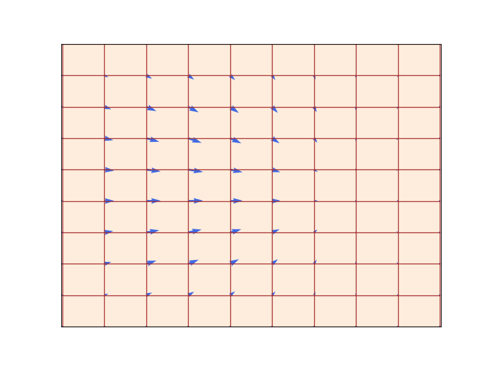{width="100%"}
:::
::: {.column width="33%"}
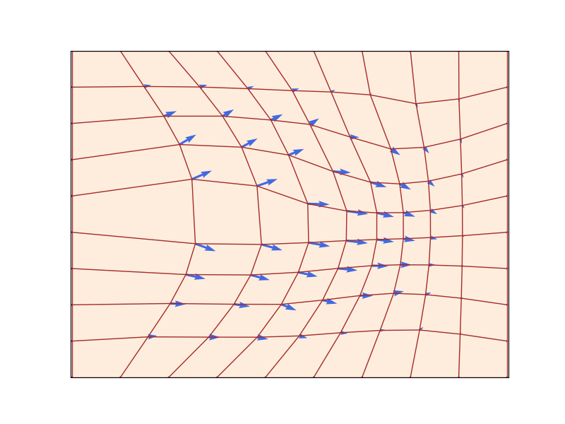{width="100%"}
:::
::: {.column width="33%"}
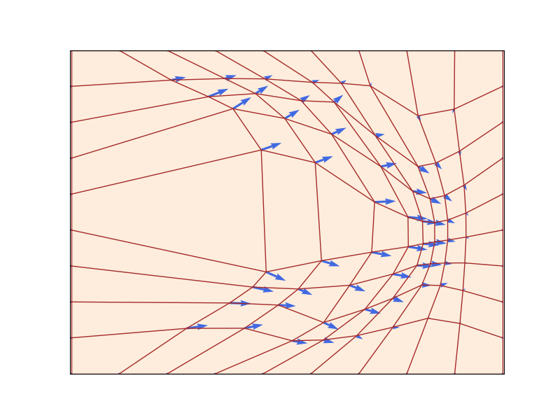{width="100%"}
:::
::::

A flow $\psi_t: \mathbb{R}^d \to \mathbb{R}^d$ (red grid) defined by a velocity field $u_t$ (blue arrows) that prescribes instantaneous movements ($d=2$). A flow is a diffeomorphism that "warps" space. Figure from @lipman2024flow.

**Existence & uniqueness**: If $u_t$ is continuously differentiable with bounded derivative, the ODE has a **unique** flow $\psi_t$ that is a **diffeomorphism** [@perko2013differential].

---

## Simulating ODEs: Euler's Method {.smaller}

In general, we cannot compute $\psi_t$ explicitly. We use **numerical methods**.

**Euler method**: Initialize $X_0 = x_0$, step size $h = 1/n$, then update:

$$X_{t+h} = X_t + h\, u_t(X_t) \qquad (t = 0, h, 2h, \ldots, 1-h)$$

. . .

Simple but effective. More sophisticated methods (Heun) also available [@iserles2009first].

---

## Flow Models {.smaller}

A **flow model** uses an ODE to transform $p_\text{init} \to p_\text{data}$:

$$\begin{align}X_0 &\sim p_\text{init} \qquad\qquad\quad\;\; \blacktriangleright \text{random initialization}\\
\frac{\mathrm{d}}{\mathrm{d}t} X_t &= u_t^\theta(X_t) \qquad \qquad\;\blacktriangleright \text{ODE with neural network } u_t^\theta\end{align}$$

. . .

**Goal**: Make the endpoint $X_1 \sim p_\text{data}$, i.e., $\psi_1^\theta(X_0) \sim p_\text{data}$.

::: {.callout-warning}
The neural network parameterizes the **vector field**, not the flow. To compute the flow, we must **simulate** the ODE.
:::

---

## Algorithm 1: Sampling from a Flow Model {.smaller}

::: {.callout-note}
## Sampling from a Flow Model (Euler method)
**Input**: Neural network vector field $u_t^\theta$, number of steps $n$

1. Set $t = 0$, step size $h = 1/n$
2. Draw $X_0 \sim p_\text{init}$
3. **For** $i = 1, \ldots, n-1$:
   - $X_{t+h} = X_t + h\, u_t^\theta(X_t)$
   - $t \leftarrow t + h$
4. **Return** $X_1$
:::

# Part III: Diffusion Models

## Stochastic Processes and SDEs {.smaller}

A **stochastic process** $(X_t)_{0 \le t \le 1}$ has random trajectories: simulating twice may yield different outcomes.

**Brownian motion** $W_t$: a continuous random walk with $W_0 = 0$, normal increments $W_t - W_s \sim \mathcal{N}(0, (t-s)I_d)$, and independent increments.

. . .

**From ODEs to SDEs**: Add stochastic dynamics driven by Brownian motion:

$$\begin{align}\mathrm{d}X_t &= u_t(X_t)\,\mathrm{d}t + \sigma_t\,\mathrm{d}W_t \qquad \blacktriangleright \text{ SDE}\\
X_0 &= x_0 \qquad\qquad\qquad\qquad\quad \blacktriangleright \text{ initial condition}\end{align}$$

where $\sigma_t \geq 0$ is the **diffusion coefficient**. An ODE is an SDE with $\sigma_t = 0$.

---

## Ornstein-Uhlenbeck Processes {.smaller}

{width="85%" fig-align="center"}

---

## Diffusion Models {.smaller}

A **diffusion model** parameterizes an SDE with neural network $u_t^\theta$:

$$\begin{align}\mathrm{d}X_t &= u_t^\theta(X_t)\,\mathrm{d}t + \sigma_t\,\mathrm{d}W_t \qquad \blacktriangleright \text{ SDE}\\
X_0 & \sim p_\text{init} \qquad\qquad\qquad\qquad\;\; \blacktriangleright \text{ random initialization}\end{align}$$

**Goal**: $X_1 \sim p_\text{data}$. A diffusion model with $\sigma_t = 0$ is a **flow model**.

---

## Algorithm 2: Sampling from a Diffusion Model {.smaller}

::: {.callout-note}
## Sampling from a Diffusion Model (Euler-Maruyama method)
**Input**: Neural network $u_t^\theta$, steps $n$, diffusion coefficient $\sigma_t$

1. Set $t = 0$, step size $h = 1/n$
2. Draw $X_0 \sim p_\text{init}$
3. **For** $i = 1, \ldots, n-1$:
   - Draw $\epsilon \sim \mathcal{N}(0, I_d)$
   - $X_{t+h} = X_t + h\, u_t^\theta(X_t) + \sigma_t \sqrt{h}\, \epsilon$
   - $t \leftarrow t + h$
4. **Return** $X_1$
:::

---

## The Training Problem {.smaller}

We need to train $u_t^\theta$ by minimizing a loss:

$$\mathcal{L}(\theta) = \|u_t^\theta(x) - \underbrace{u_t^\text{target}(x)}_{\text{training target}}\|^2$$

. . .

**Two-step approach**:

1. **Find the training target** $u_t^\text{target}$: a vector field whose ODE/SDE converts $p_\text{init}$ into $p_\text{data}$
2. **Train** $u_t^\theta$ to approximate $u_t^\text{target}$

. . .

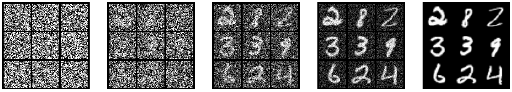{width="85%" fig-align="center"}

# Part IV: Constructing the Training Target

<!-- ## Probability Paths: Noise to Data {.smaller}

{width="85%" fig-align="center"}

--- -->

## Conditional Probability Path {.smaller}

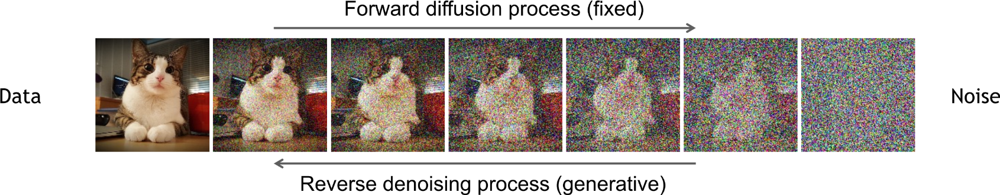{width="70%" fig-align="center"}

A **conditional probability path** $p_t(x \mid z)$ is a family of distributions over $\mathbb{R}^d$ such that:

$$p_0(\cdot \mid z) = p_\text{init}, \qquad p_1(\cdot \mid z) = \delta_z \qquad \forall z \in \mathbb{R}^d$$

It gradually converts a **single data point** $z$ into $p_\text{init}$.

## Marginal Probability Path {.smaller}

Every conditional path $p_t(x \mid z)$ induces a **marginal probability path**:

$$\begin{align}\text{Sample: } z &\sim p_\text{data}, \; x \sim p_t(\cdot \mid z) \;\qquad\;\;\qquad\qquad\blacktriangleright\text{sampling from marginal path}\\
p_t(x) &= \int p_t(x \mid z)\, p_\text{data}(z)\, \mathrm{d}z \qquad\qquad\quad\;\; \blacktriangleright\text{density of marginal path}\end{align}$$

. . .

The marginal path **interpolates** between noise and data:

$$p_0 = p_\text{init} \qquad \text{and} \qquad p_1 = p_\text{data}$$

::: {.callout-warning}
We do **not** know the density $p_t(x)$ because the integral is **intractable**. But we can **sample** from it.
:::

---

## Gaussian Conditional Probability Path {.smaller}

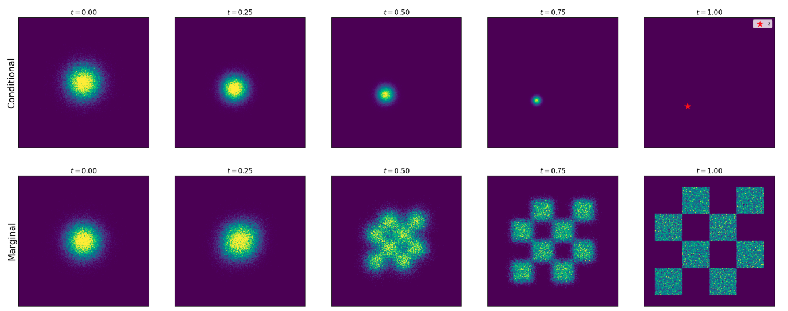{width="85%" fig-align="center"}

$$p_t(\cdot \mid z) = \mathcal{N}(\alpha_t z, \beta_t^2 I_d)$$

where $\alpha_t, \beta_t$ are **noise schedulers**: monotonic with $\alpha_0 = \beta_1 = 0$, $\alpha_1 = \beta_0 = 1$.

Sampling from the marginal path: $\;z \sim p_\text{data},\; \epsilon \sim \mathcal{N}(0, I_d) \;\Rightarrow\; x = \alpha_t z + \beta_t \epsilon \sim p_t$

# Part V: Conditional and Marginal Vector Fields

## The Marginalization Trick {.smaller}

::: {.callout-tip}
## Theorem (Marginalization Trick) [@lipman2022flow]
For each $z \in \mathbb{R}^d$, let $u_t^\text{target}(\cdot \mid z)$ be a **conditional vector field** such that:

$$X_0 \sim p_\text{init}, \quad \frac{\mathrm{d}}{\mathrm{d}t} X_t = u_t^\text{target}(X_t \mid z) \;\Rightarrow\; X_t \sim p_t(\cdot \mid z)$$

Then the **marginal vector field**:

$$u_t^\text{target}(x) = \int u_t^\text{target}(x \mid z) \frac{p_t(x \mid z)\, p_\text{data}(z)}{p_t(x)}\, \mathrm{d}z$$

follows the **marginal** probability path: $X_0 \sim p_\text{init}, \; \frac{\mathrm{d}}{\mathrm{d}t} X_t = u_t^\text{target}(X_t) \;\Rightarrow\; X_t \sim p_t$.

In particular, $X_1 \sim p_\text{data}$. So, "$u_t^\text{target}$ converts $p_\text{init}$ into data $p_\text{data}$" [@holderrieth2025introduction].
:::

---

## Conditional Vector Field for Gaussian Paths {.smaller}

For $p_t(\cdot \mid z) = \mathcal{N}(\alpha_t z, \beta_t^2 I_d)$, the **conditional Gaussian vector field** is:

$$u_t^\text{target}(x \mid z) = \left(\dot{\alpha}_t - \frac{\dot{\beta}_t}{\beta_t}\alpha_t\right)z + \frac{\dot{\beta}_t}{\beta_t}x$$

with conditional flow $\psi_t^\text{target}(x \mid z) = \alpha_t z + \beta_t x$ and $\dot{\;}$ denoting temporal derivative.

<!-- . . .

**Proof sketch**: If $X_0 \sim \mathcal{N}(0, I_d)$, then $X_t = \psi_t^\text{target}(X_0 \mid z) = \alpha_t z + \beta_t X_0 \sim \mathcal{N}(\alpha_t z, \beta_t^2 I_d)$.

Extract $u_t^\text{target}$ by differentiating the flow w.r.t. $t$ and substituting. -->

---

## Conditional vs Marginal ODE {.smaller}

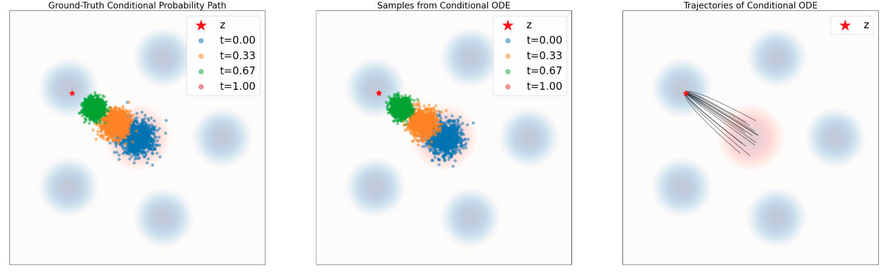{width="65%" fig-align="center"}

{width="65%" fig-align="center"}

---

## Marginal Probability Path and Marginal Vector Field {.smaller}

|  | **Conditional** | **Marginal** |
|--|----------------|-------------|
| **Prob. path** | $p_t(x \mid z)$: interpolates $p_\text{init}$ and $\delta_z$ | $p_t(x) = \int p_t(x\mid z) p_\text{data}(z)\,\mathrm{d}z$: interpolates $p_\text{init}$ and $p_\text{data}$ |
| **Vector field** | $u_t^\text{target}(x \mid z)$: ODE follows cond. path | $u_t^\text{target}(x) = \int u_t^\text{target}(x\mid z) \frac{p_t(x\mid z) p_\text{data}(z)}{p_t(x)}\,\mathrm{d}z$: ODE follows marginal path |

<!-- ## Summary: Conditional vs Marginal {.smaller}

|  | **Conditional** | **Marginal** |
|--|----------------|-------------|
| **Prob. path** | $p_t(x \mid z)$: interpolates $p_\text{init}$ and $\delta_z$ | $p_t(x) = \int p_t(x\mid z) p_\text{data}(z)\,\mathrm{d}z$: interpolates $p_\text{init}$ and $p_\text{data}$ |
| **Vector field** | $u_t^\text{target}(x \mid z)$: ODE follows cond. path | $u_t^\text{target}(x) = \int u_t^\text{target}(x\mid z) \frac{p_t(x\mid z) p_\text{data}(z)}{p_t(x)}\,\mathrm{d}z$: ODE follows marginal path |
| **Score** | $\nabla \log p_t(x \mid z)$ | $\nabla \log p_t(x) = \int \nabla \log p_t(x\mid z) \frac{p_t(x\mid z) p_\text{data}(z)}{p_t(x)}\,\mathrm{d}z$ |
| **Gaussian** | $\mathcal{N}(\alpha_t z, \beta_t^2 I_d)$ | Intractable density, but can sample |

--- -->

## The Continuity Equation {.smaller}

::: {.callout-tip}
## Theorem (Continuity Equation)
For a flow model with vector field $u_t^\text{target}$ and $X_0 \sim p_\text{init}$:

$$X_t \sim p_t \;\;\forall t \quad\Longleftrightarrow\quad \partial_t p_t(x) = -\mathrm{div}(p_t\, u_t^\text{target})(x)$$

where $\mathrm{div}(v_t)(x) = \sum_{i=1}^d \frac{\partial}{\partial x_i} v_t(x)$.
:::

. . .

**Interpretation**: The change of probability mass at $x$ equals the **net inflow** of mass carried by the vector field. Probability mass is conserved -- like fluid flow!

---

## The Fokker-Planck Equation {.smaller}

The continuity equation generalizes to SDEs via the **Fokker-Planck equation**:

::: {.callout-tip}
## Theorem (Fokker-Planck Equation)
For the SDE $\;\mathrm{d}X_t = u_t(X_t)\,\mathrm{d}t + \sigma_t\,\mathrm{d}W_t$ with $X_0 \sim p_\text{init}$:

$$X_t \sim p_t \;\;\forall t \quad\Longleftrightarrow\quad \partial_t p_t(x) = -\mathrm{div}(p_t\, u_t)(x) + \frac{\sigma_t^2}{2}\Delta p_t(x)$$

where $\Delta p_t(x) = \sum_{i=1}^d \frac{\partial^2}{\partial x_i^2} p_t(x)$ is the **Laplacian**.
:::

. . .

- For $\sigma_t = 0$: recovers the **continuity equation**
- The Laplacian term $\Delta p_t$ is the same as in the **heat equation** -- diffusion disperses probability mass

# Part VI: Conditional and Marginal Score Functions

---

## SDE Extension Trick {.smaller}

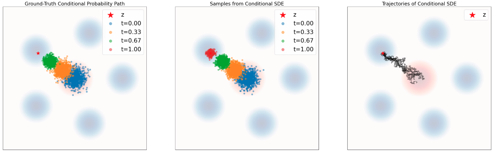{width="65%" fig-align="center"}

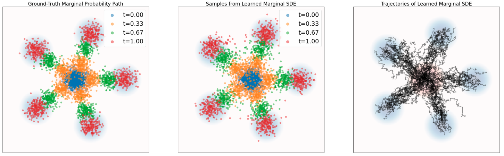{width="65%" fig-align="center"}

---

## SDE Extension {.smaller}

::: {.callout-tip}
## Theorem (SDE Extension Trick) [@albergo2023stochastic]
Given $u_t^\text{target}(x)$ and $\nabla \log p_t(x)$, for any diffusion coefficient $\sigma_t \geq 0$:

$$X_0 \sim p_\text{init}, \quad \mathrm{d}X_t = \left[u_t^\text{target}(X_t) + \frac{\sigma_t^2}{2}\nabla \log p_t(X_t)\right]\mathrm{d}t + \sigma_t\,\mathrm{d}W_t$$

$$\Rightarrow X_t \sim p_t \quad (0 \leq t \leq 1)$$

In particular, $X_1 \sim p_\text{data}$.
:::

. . .

The same identity holds if we replace $p_t(x)$ and $u_t^\text{target}(x)$ with $p_t(x \mid z)$ and $u_t^\text{target}(x \mid z)$.

---

## Conditional Path, Vector Field, and Score {.smaller}

| | **Notation** | **Key Property** | **Gaussian Example** |
|---|---|---|---|
| **Prob. Path** | $p_t(x \mid z)$ | Interpolates $p_\text{init}$ and $\delta_z$ | $\mathcal{N}(\alpha_t z, \beta_t^2 I_d)$ |
| **Vector Field** | $u_t^\text{target}(x \mid z)$ | ODE follows cond. path | $(\dot{\alpha}_t - \frac{\dot{\beta}_t}{\beta_t}\alpha_t)z + \frac{\dot{\beta}_t}{\beta_t}x$ |
| **Score** | $\nabla \log p_t(x \mid z)$ | Gradient of log-likelihood | $-\frac{x - \alpha_t z}{\beta_t^2}$ |

for noise schedules $\alpha_t,\beta_t\in \mathbb{R}$ continuously differentiable, monotonic, and $\alpha_0=\beta_0=0$ and $\alpha_1=\beta_1=1$

---

## Marginal Path, Vector Field, and Score {.smaller}

| | **Notation** | **Key Property** | **Formula** |
|---|---|---|---|
| **Prob. Path** | $p_t(x)$ | Interpolates $p_\text{init}$ and $p_\text{data}$ | $\int p_t(x \mid z) p_\text{data}(z)\,\mathrm{d}z$ |
| **Vector Field** | $u_t^\text{target}(x)$ | ODE follows marginal path | $\int u_t^\text{target}(x\mid z) \frac{p_t(x\mid z) p_\text{data}(z)}{p_t(x)}\,\mathrm{d}z$ |
| **Score** | $\nabla \log p_t(x)$ | Can extend ODE to SDE | $\int \nabla \log p_t(x\mid z) \frac{p_t(x\mid z) p_\text{data}(z)}{p_t(x)}\,\mathrm{d}z$ |

. . .

We can learn the marginal vector field by approximating the conditional Vector Field for many different data points $z$.

---

## Score Functions {.smaller}

The **marginal score function** $\nabla \log p_t(x)$ can be expressed via **conditional scores**:

$$\nabla \log p_t(x) = \int \nabla \log p_t(x \mid z) \frac{p_t(x \mid z)\, p_\text{data}(z)}{p_t(x)}\,\mathrm{d}z$$

. . .

For the **Gaussian path** $p_t(x \mid z) = \mathcal{N}(\alpha_t z, \beta_t^2 I_d)$:

$$\nabla \log p_t(x \mid z) = -\frac{x - \alpha_t z}{\beta_t^2}$$

The conditional score is a **linear function** of $x$ -- a unique feature of Gaussians.

---

## Score-Based Sampling: Langevin Dynamics {.smaller}

:::: {.columns}
::: {.column width="55%"}
**Langevin dynamics** is a special case where $p_t = p$ is static and $u_t^\text{target} = 0$:

$$\mathrm{d}X_t = \frac{\sigma_t^2}{2}\nabla \log p(X_t)\,\mathrm{d}t + \sigma_t\,\mathrm{d}W_t$$

The distribution $p$ is a **stationary distribution**: $X_0 \sim p \;\Rightarrow\; X_t \sim p\;\;(t \geq 0)$.

Under mild conditions, $X_t \to p$ regardless of initialization.

This is the basis of **molecular dynamics** simulations and MCMC methods.
:::
::: {.column width="45%"}
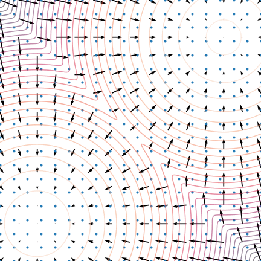{width="100%"}
:::
::::

---

## Langevin Dynamics: Convergence {.smaller}

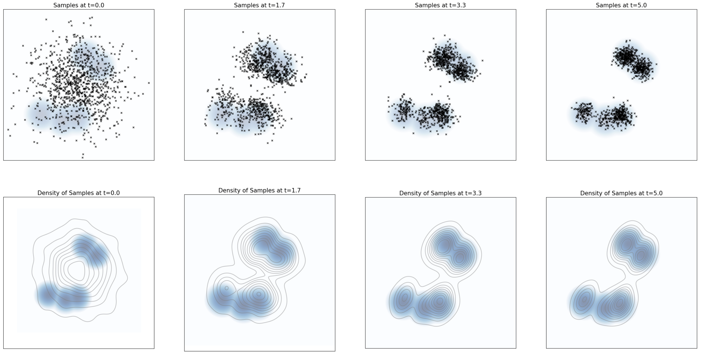{width="85%" fig-align="center"}

---

## Score Estimation: Pitfalls {.smaller}

:::: {.columns}
::: {.column width="50%"}
Estimating the score $\nabla \log p(x)$ in **low-density regions** is inaccurate because few data points are available there.

**Solution**: Perturb data with **multiple noise levels** to fill in low-density regions [@song2019generative].
:::
::: {.column width="50%"}
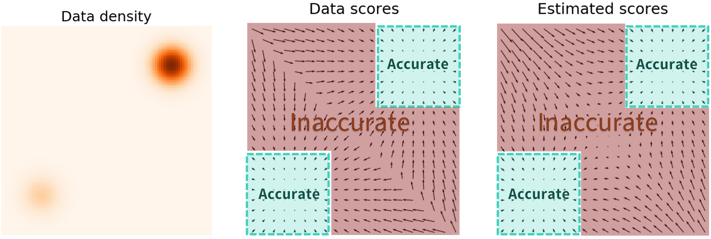{width="100%"}
:::
::::

---

## Annealed Langevin Dynamics {.smaller}

:::: {.columns}
::: {.column width="50%"}
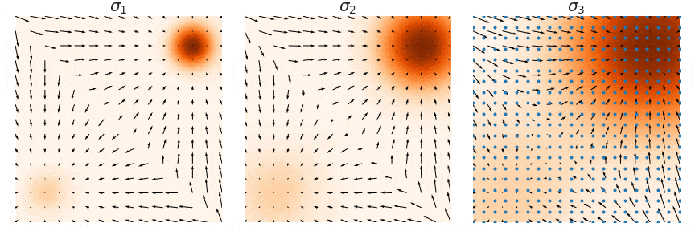{width="100%"}
:::
::: {.column width="50%"}
Train score networks at **multiple noise levels** and use **annealed Langevin dynamics**: start with high noise, gradually decrease.

This gives accurate score estimates throughout the space and enables high-quality sampling.
:::
::::

---

## Forward Diffusion & Denoising {.smaller}

:::: {.columns}
::: {.column width="50%"}
**Perturbing** data with increasing noise (VP schedule):

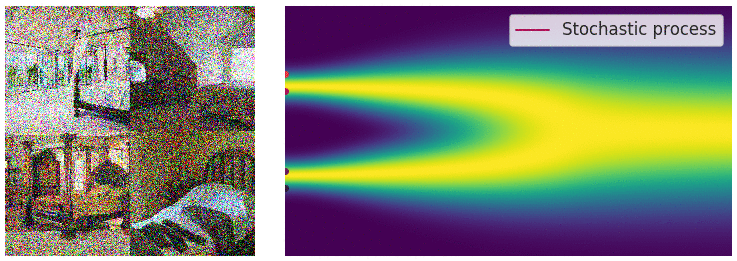{width="100%"}
:::
::: {.column width="50%"}
**Denoising** -- reversing the diffusion process:

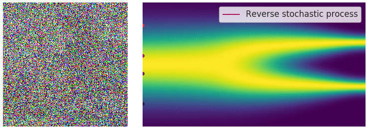{width="100%"}
:::
::::

# Part VII: Training Flow Matching

## Flow Matching Loss {.smaller}

We want to find $\theta$ so that $u_t^\theta \approx u_t^\text{target}$.

The **flow matching loss** (marginal):

$$\mathcal{L}_\text{FM}(\theta) = \mathbb{E}_{t \sim \text{Unif}, x \sim p_t}\left[\|u_t^\theta(x) - u_t^\text{target}(x)\|^2\right]$$

. . .

$$= \mathbb{E}_{t \sim \text{Unif}, z \sim p_\text{data}, x \sim p_t(\cdot \mid z)}\left[\|u_t^\theta(x) - u_t^\text{target}(x)\|^2\right]$$

**Problem**: We **cannot compute** $u_t^\text{target}(x)$ because the integral in its definition is **intractable**.

---

## Conditional Flow Matching Loss {.smaller}

The **conditional** vector field $u_t^\text{target}(x \mid z)$ **is** tractable! Define the **conditional flow matching (CFM) loss**:

$$\mathcal{L}_\text{CFM}(\theta) = \mathbb{E}_{t \sim \text{Unif}, z \sim p_\text{data}, x \sim p_t(\cdot \mid z)}\left[\|u_t^\theta(x) - u_t^\text{target}(x \mid z)\|^2\right]$$

**Note:** $u_t^\text{target}(x \mid z)$ is used instead of $u_t^\text{target}(x)$
. . .

> What sense does it make to regress against the **conditional** vector field if it's the **marginal** vector field we care about?
>
> As it turns out, by *explicitly* regressing against the tractable, conditional vector field, we are *implicitly* regressing against the intractable, marginal vector field [@holderrieth2025introduction]. 

---

## Key Theorem: CFM = FM (up to constant) {.smaller}

::: {.callout-tip}
## Theorem [@lipman2022flow]
$$\mathcal{L}_\text{FM}(\theta) = \mathcal{L}_\text{CFM}(\theta) + C$$

where $C$ is independent of $\theta$. Therefore:

$$\nabla_\theta \mathcal{L}_\text{FM}(\theta) = \nabla_\theta \mathcal{L}_\text{CFM}(\theta)$$

Minimizing $\mathcal{L}_\text{CFM}$ with SGD is **equivalent** to minimizing $\mathcal{L}_\text{FM}$.
:::

**Proof idea**: Expand $\|u_t^\theta - u_t^\text{target}\|^2$, use linearity of expectation, and apply the marginalization trick to swap conditional ↔ marginal in the cross-term.

---

## Flow Matching for Gaussian Paths {.smaller}

::: {.callout-tip}
## Theorem (Gaussian CFM Loss)
For Gaussian $p_t(\cdot \mid z) = \mathcal{N}(\alpha_t z, \beta_t^2 I_d)$, with $x_t = \alpha_t z + \beta_t \epsilon$ for $\epsilon \sim \mathcal{N}(0, I_d)$:

$$\mathcal{L}_\text{CFM}(\theta) = \mathbb{E}_{t, z \sim p_\text{data}, \epsilon \sim \mathcal{N}(0, I_d)}\left[\|u_t^\theta(\alpha_t z + \beta_t \epsilon) - (\dot{\alpha}_t z + \dot{\beta}_t \epsilon)\|^2\right]$$
:::

. . .

**CondOT path** ($\alpha_t = t, \beta_t = 1-t$): $\quad\dot{\alpha}_t = 1, \dot{\beta}_t = -1$

$$\mathcal{L}_\text{CFM}(\theta) = \mathbb{E}_{t, z, \epsilon}\left[\|u_t^\theta(tz + (1-t)\epsilon) - (z - \epsilon)\|^2\right]$$

This is what *Stable Diffusion 3* and *Meta Movie Gen Video* use!

---

## Visualizing Flow Matching Training {.smaller}

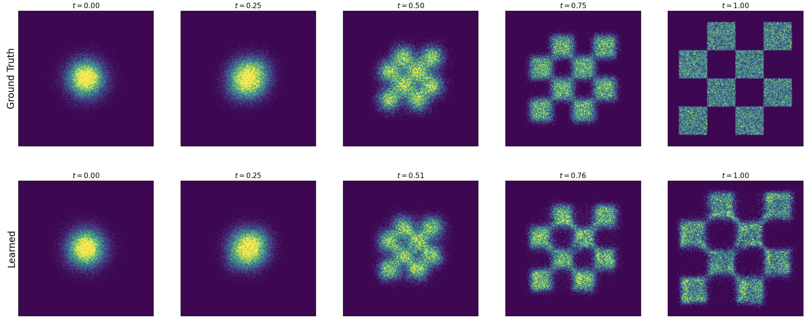{width="85%" fig-align="center"}

---

## Algorithm 3: Flow Matching Training {.smaller}

::: {.callout-note}
## Flow Matching Training (Gaussian CondOT path $p_t(x\mid z) = \mathcal{N}(tz, (1-t)^2 I_d)$)
**Input**: Dataset $z \sim p_\text{data}$, neural network $u_t^\theta$

**For** each mini-batch:

1. Sample data $z$ from dataset
2. Sample $t \sim \text{Unif}_{[0,1]}$
3. Sample $\epsilon \sim \mathcal{N}(0, I_d)$
4. Set $x = tz + (1-t)\epsilon$
5. Compute loss: $\mathcal{L}(\theta) = \|u_t^\theta(x) - (z - \epsilon)\|^2$
   - General: $\mathcal{L}(\theta) = \|u_t^\theta(x) - u_t^\text{target}(x \mid z)\|^2$
6. Update $\theta$ via gradient descent on $\mathcal{L}(\theta)$
:::

---

## CondOT Path: Linear Interpolation {.smaller}

For the **straight-line schedule** $\alpha_t = t$, $\beta_t = 1-t$:

$$x_t = tz + (1-t)\epsilon \qquad \blacktriangleright \text{ linear interpolation of noise and data}$$

$$u_t^\text{target}(x \mid z) = z - \epsilon \qquad \blacktriangleright \text{ velocity = difference of data and noise}$$

. . .

**Intuition**: The conditional velocity field points from noise $\epsilon$ to data $z$ at constant speed.

This is the **rectified flow** [@liu2022flow] / **CondOT** formulation.

---

## The Big Picture: Flow Matching {.smaller}

$$\underbrace{z \sim p_\text{data}}_{\text{sample data}}, \quad \underbrace{\epsilon \sim \mathcal{N}(0,I_d)}_{\text{sample noise}}, \quad \underbrace{t \sim \text{Unif}_{[0,1]}}_{\text{sample time}}$$

$$\underbrace{x_t = \alpha_t z + \beta_t \epsilon}_{\text{noised sample}}, \quad \underbrace{u_t^\text{target}(x_t \mid z) = \dot{\alpha}_t z + \dot{\beta}_t \epsilon}_{\text{target velocity}}$$

$$\underbrace{\mathcal{L}_\text{CFM}(\theta) = \|u_t^\theta(x_t) - u_t^\text{target}(x_t \mid z)\|^2}_{\text{regression loss (MSE)}}$$

. . .

**After training**: simulate $\mathrm{d}X_t = u_t^\theta(X_t)\,\mathrm{d}t$ from $X_0 \sim p_\text{init}$ to get $X_1 \sim p_\text{data}$.

---

# Part VIII: Training Score Matching

---

## Extending to SDEs {.smaller}

We can extend the target ODE to an SDE with the **same marginal distribution**:

$$\mathrm{d}X_t = \left[u_t^\text{target}(X_t) + \frac{\sigma_t^2}{2}\nabla \log p_t(X_t)\right]\mathrm{d}t + \sigma_t\,\mathrm{d}W_t$$
$$X_0 \sim p_\text{init} \quad\Rightarrow\quad X_t \sim p_t \;\;(0 \leq t \leq 1)$$

. . .

The **marginal score** $\nabla \log p_t(x)$ is also intractable, like $u_t^\text{target}$:

$$\nabla \log p_t(x) = \int \nabla \log p_t(x \mid z)\,\frac{p_t(x\mid z)\,p_\text{data}(z)}{p_t(x)}\,\mathrm{d}z$$

---

## Score Matching Loss {.smaller}

Introduce a **score network** $s_t^\theta: \mathbb{R}^d \times [0,1] \to \mathbb{R}^d$ to approximate $\nabla \log p_t$.

**Score matching** vs **conditional score matching**:

$$\mathcal{L}_\text{SM}(\theta) = \mathbb{E}_{t, z, x \sim p_t(\cdot \mid z)}\left[\|s_t^\theta(x) - \nabla \log p_t(x)\|^2\right] \qquad \blacktriangleright \text{ intractable}$$

$$\mathcal{L}_\text{CSM}(\theta) = \mathbb{E}_{t, z, x \sim p_t(\cdot \mid z)}\left[\|s_t^\theta(x) - \nabla \log p_t(x \mid z)\|^2\right] \quad \blacktriangleright \text{ tractable!}$$

. . .

As before: $\mathcal{L}_\text{SM}(\theta) = \mathcal{L}_\text{CSM}(\theta) + C$, so they have the **same gradient**.

---

## Score Matching for Gaussian Paths {.smaller}

For $p_t(x \mid z) = \mathcal{N}(\alpha_t z, \beta_t^2 I_d)$:

$$\nabla \log p_t(x \mid z) = -\frac{x - \alpha_t z}{\beta_t^2} = -\frac{\epsilon}{\beta_t}$$

The conditional score matching loss becomes:

$$\mathcal{L}_\text{CSM}(\theta) = \mathbb{E}_{t, z, \epsilon}\left[\left\|s_t^\theta(\alpha_t z + \beta_t \epsilon) + \frac{\epsilon}{\beta_t}\right\|^2\right]$$

. . .

The network learns to **predict the noise** used to corrupt data -- hence **denoising** score matching [@ho2020denoising].

---

## Denoising Diffusion Models (DDPM) {.smaller}

The loss $\|s_t^\theta(x_t) + \epsilon/\beta_t\|^2$ is **numerically unstable** for $\beta_t \approx 0$ (low noise).

**Solution** [@ho2020denoising]: Reparameterize $s_t^\theta$ into a **noise predictor** $\epsilon_t^\theta$:

$$-\beta_t\, s_t^\theta(x) = \epsilon_t^\theta(x)$$

$$\Rightarrow \quad \mathcal{L}_\text{DDPM}(\theta) = \mathbb{E}_{t, z, \epsilon}\left[\|\epsilon_t^\theta(\alpha_t z + \beta_t \epsilon) - \epsilon\|^2\right]$$

. . .

**What the network does**: Predict the noise $\epsilon$ that was used to corrupt data point $z$.

This is the formulation used by the original **Denoising Diffusion Probabilistic Models** (DDPM) [@ho2020denoising].

---

## Algorithm 4: Score Matching Training {.smaller}

::: {.callout-note}
## Score Matching Training (Gaussian probability path)
**Input**: Dataset $z \sim p_\text{data}$, score network $s_t^\theta$ (or noise predictor $\epsilon_t^\theta$)

**For** each mini-batch:

1. Sample data $z$ from dataset
2. Sample $t \sim \text{Unif}_{[0,1]}$
3. Sample $\epsilon \sim \mathcal{N}(0, I_d)$
4. Set $x_t = \alpha_t z + \beta_t \epsilon$
5. Compute loss:
   - $\mathcal{L}(\theta) = \|s_t^\theta(x_t) + \epsilon/\beta_t\|^2$
   - Alternative: $\mathcal{L}(\theta) = \|\epsilon_t^\theta(x_t) - \epsilon\|^2$ (noise prediction)
6. Update $\theta$ via gradient descent
:::

# Part IX: Unifying Flow and Score Matching

## Deterministic vs Stochastic Sampling {.smaller}

| | **Flow Model (ODE)** | **Diffusion Model (SDE)** |
|---|---|---|
| **Dynamics** | $\mathrm{d}X_t = u_t^\theta(X_t)\,\mathrm{d}t$ | $\mathrm{d}X_t = [u_t^\theta + \frac{\sigma_t^2}{2}s_t^\theta]\,\mathrm{d}t + \sigma_t\,\mathrm{d}W_t$ |
| **Randomness** | Only in $X_0 \sim p_\text{init}$ | In $X_0$ and Brownian motion |
| **Training** | Flow matching | Score matching (or flow matching) |
| **Sampling** | Deterministic | Stochastic |

. . .

In theory, all $\sigma_t$ give $X_1 \sim p_\text{data}$. In practice, the optimal $\sigma_t$ depends on training/simulation errors and is found empirically [@karras2022elucidating; @ma2024sit].

**Good news**: ODE sampling often gives the best results. SDE sampling is an option, not a must!

---

## Reparameterization: Velocity ↔ Score {.smaller}

For **Gaussian probability paths**, the conditional vector field and score are **linear functions** with different coefficients:

$$u_t^\text{target}(x \mid z) = \left(\dot{\alpha}_t - \frac{\dot{\beta}_t}{\beta_t}\alpha_t\right)z + \frac{\dot{\beta}_t}{\beta_t}x$$

$$\nabla \log p_t(x \mid z) = -\frac{x - \alpha_t z}{\beta_t^2}$$

. . .

**Conversion formula** (extends to marginals):

$$u_t^\theta(x) = \left(\beta_t^2\frac{\dot{\alpha}_t}{\alpha_t} - \dot{\beta}_t\beta_t\right)s_t^\theta(x) + \frac{\dot{\alpha}_t}{\alpha_t}x$$

$$s_t^\theta(x) = \frac{\alpha_t\, u_t^\theta(x) - \dot{\alpha}_t\, x}{\beta_t^2 \dot{\alpha}_t - \alpha_t \dot{\beta}_t \beta_t}$$

---

## Unified Training: No Need for Both {.smaller}

::: {.callout-important}
## Key Result
For Gaussian probability paths, there is **no need to separately train** both $u_t^\theta$ and $s_t^\theta$. Knowledge of one is sufficient to compute the other via the conversion formula.

We can choose whether to use **flow matching** or **score matching** to train -- the result is equivalent.
:::

. . .

**Stochastic sampling** from a trained score network $s_t^\theta$:

$$\mathrm{d}X_t = \left[\left(\beta_t^2\frac{\dot{\alpha}_t}{\alpha_t} - \dot{\beta}_t\beta_t + \frac{\sigma_t^2}{2}\right)s_t^\theta(X_t) + \frac{\dot{\alpha}_t}{\alpha_t}X_t\right]\mathrm{d}t + \sigma_t\,\mathrm{d}W_t$$

---

## Algorithm 6: Unified Sampling {.smaller}

::: {.callout-note}
## Sampling from a Trained Model (Gaussian path)
**Input**: Trained network ($u_t^\theta$ or $s_t^\theta$), steps $n$, diffusion coefficient $\sigma_t$

1. Draw $X_0 \sim p_\text{init} = \mathcal{N}(0, I_d)$
2. Convert between $u_t^\theta \leftrightarrow s_t^\theta$ if needed via conversion formula
3. Set $h = 1/n$
4. **For** $t = 0, h, 2h, \ldots, 1-h$:
   - Draw $\epsilon \sim \mathcal{N}(0, I_d)$
   - $X_{t+h} = X_t + h\left[u_t^\theta(X_t) + \frac{\sigma_t^2}{2}s_t^\theta(X_t)\right] + \sigma_t\sqrt{h}\,\epsilon$
5. **Return** $X_1$

- $\sigma_t = 0$: **deterministic** (flow / probability flow ODE)
- $\sigma_t > 0$: **stochastic** (diffusion / SDE sampling)
:::

---

## Score Field Comparison {.smaller}

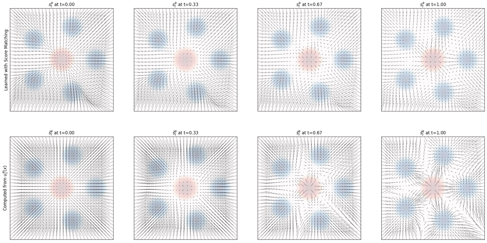{width="80%" fig-align="center"}

# Part X: Architecture & Practical Considerations

## Neural Network Architecture {.smaller}

:::: {.columns}
::: {.column width="50%"}
The neural network $u_t^\theta(x \mid y)$ must accept:

- $x \in \mathbb{R}^d$ (noised input)
- $t \in [0,1]$ (time)
- $y \in \mathcal{Y}$ (conditioning)

Common architectures:

- **U-Net** for images (convolutional)
- **Diffusion Transformer (DiT)** -- attention-based
:::
::: {.column width="50%"}
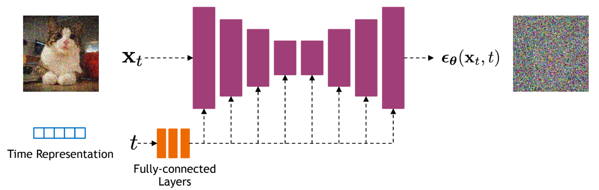{width="100%"}
:::
::::

---

## Summary {.smaller}

::: {.callout-tip}
## What We Learned

1. **Generative modeling = sampling**: transform $p_\text{init} \to p_\text{data}$ via ODE/SDE
2. **Flow models**: deterministic ODE $\mathrm{d}X_t = u_t^\theta(X_t)\,\mathrm{d}t$
3. **Diffusion models**: stochastic SDE adding $\sigma_t\,\mathrm{d}W_t$
4. **Probability paths**: conditional $p_t(x \mid z)$ ↔ marginal $p_t(x)$ via marginalization
5. **Training**: Regress against **conditional** vector field/score (tractable) to implicitly learn the **marginal** (intractable)
6. **Flow matching** ↔ **Score matching**: equivalent for Gaussian paths
7. **Sampling**: Choose $\sigma_t = 0$ (ODE) or $\sigma_t > 0$ (SDE)
:::

. . .

> *"Creating noise from data is easy; creating data from noise is generative modeling."*

---

## References {.smaller}

::: {#refs}
:::
