## {#title-custom .center background-color="white"}

:::{style="display: flex; justify-content: center; align-items: center; gap: 2.5em; margin-bottom: 1em;"}
{height=100}
{height=100}
:::

### An Uncertainty-Aware Digital Shadow for Underground CO~2~ Storage Monitoring {style="margin-bottom: 0.1em;"}

**Felix J. Herrmann**

Computational Science and Engineering --- Georgia Institute of Technology

::: {.callout-note}
This slide deck is derived from @gahlot2025gji.
:::

# Outline 

1. **Motivation** -- Why Geological Carbon Storage needs Digital Twins
2. **Problem Formulation** -- Nonlinear state dynamics, observations & Bayesian filtering
3. **Methodology** -- Lifecycle of the Digital Shadow
   - Forecast, Training & Analysis steps
   - Summary statistics & Conditional Normalizing Flows
   - Linear vs. nonlinear prior-to-posterior mappings
4. **Algorithms** -- Neural data assimilation
5. **Setup & Validation** -- *In silico* case study
6. **Multimodal Case Study** -- Seismic, wells & combined
7. **Results & Discussion**
8. **Conclusions & Future Work**

::: {.aside}
Figures adapted from @gahlot2025gji unless otherwise noted.
:::

# Part I: Motivation {background-color="#2c3e50"}

## The Need for Geological Carbon Storage

::: {.columns}
::: {.column width="60%"}

- Global warming requires **net-negative CO~2~ emission technologies** [@bui2018carbon; @metz2005ipcc]
- IPCC: contain atmospheric warming to $<2°\text{C}$ by 2100 [@ipcc2018global]
- Need to remove **tens of gigatonnes** of CO~2~ per year [@masson2018global]
- **Geological Carbon Storage (GCS)**: inject supercritical CO~2~ into deep geological formations
  - Depleted oil/gas reservoirs
  - Deep saline aquifers
  - Coal seams
- Can mitigate up to **20%** of total CO~2~ emission problem [@Ketzer2012]
- Requires scalable monitoring to ensure **Conformance** and **Containment** [@ringrose2020store; @ringrose2023storage]

:::
::: {.column width="40%"}
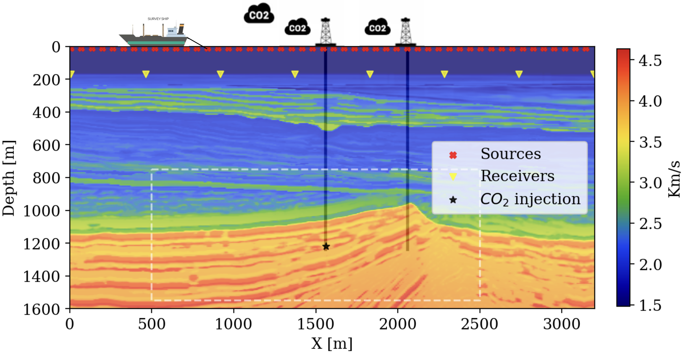{width="100%"}
:::
:::

## The Challenge: Unknown Subsurface Properties 

::: {.columns}
::: {.column width="50%"}
- Fluid-flow properties (permeability) are **poorly known**
- Displacement of brine by supercritical CO~2~ is **intricate**
- Different permeability realizations $\rightarrow$ **vastly different plume outcomes**
  - Left: plume stays within storage complex
  - Right: plume **breaches containment** due to unknown high-permeability streak
- Both realizations consistent with baseline seismic survey!
:::
::: {.column width="50%"}
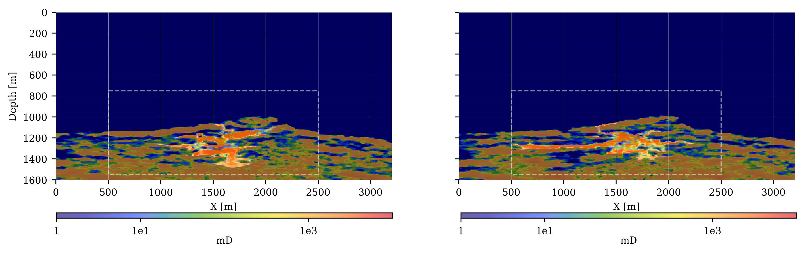{width="100%"}
:::
:::

::: {.callout-important}
We cannot rely on reservoir simulations alone -- we need **data assimilation** with time-lapse monitoring data!
:::

## Digital Twin for Enhanced Oil Recovery



## From Digital Shadows to Digital Twins 

:::: {.columns}
::: {.column width="55%"}

**IBM's definition of a Digital Twin:**

> A digital twin is a virtual representation of an object or system designed to *reflect a physical object accurately*. It spans the object's *lifecycle*, is *updated from real-time data* and uses *simulation, machine learning* and reasoning to help make decisions.

**Digital Shadow** [@asch2022toolbox]:

- Captures temporal evolution of CO~2~ plume via **unidirectional** data integration
- Combines: reservoir simulation + wave-equation inversion + ensemble Bayesian filtering + neural posterior density estimation
- **Foundation** for future Digital Twin with control, reasoning & decision-making

:::
::: {.column width="45%"}

**Key innovations over standard EnKF:**

1. Stochastic treatment of permeability $\boldsymbol{\kappa}$
2. No Gaussian/linearity assumptions
3. Learned **nonlinear** prior-to-posterior mapping
4. Integration of **multimodal** time-lapse data

:::
::::

# Part II: Problem Formulation {background-color="#2c3e50"}

## State Dynamics Model 

The time-varying state $\mathbf{x}_k = \bigl(\mathbf{x}_k[S_{\text{CO}_2}],\, \mathbf{x}_k[\delta p]\bigr)$ evolves as:

$$
\mathbf{x}_{k} = \mathcal{M}_k\bigl(\mathbf{x}_{k-1}, \boldsymbol{\kappa}_k\bigr),\quad \boldsymbol{\kappa}_k\sim p(\boldsymbol{\kappa}) \quad \text{for}\quad k=1\cdots K
$$ {#eq-dynamics}

where:

| Symbol | Meaning |
|--------|---------|
| $\mathcal{M}_k$ | Dynamics operator (multiphase flow simulator) |
| $\mathbf{x}_k[S_{\text{CO}_2}]$ | CO~2~ saturation at timestep $k$ |
| $\mathbf{x}_k[\delta p]$ | Pressure perturbation at timestep $k$ |
| $\boldsymbol{\kappa}$ | Permeability field -- **stochastic nuisance parameter** |
| $p(\boldsymbol{\kappa})$ | Prior distribution from baseline seismic (via WISE) |

::: {.callout-note}
The permeability $\boldsymbol{\kappa}$ is drawn **anew** at each timestep, reflecting our **epistemic uncertainty** about reservoir properties.
:::

## Observation Model 

Multimodal time-lapse observations:

$$
\mathbf{y}_k = \mathcal{H}_k(\mathbf{x}_k,\boldsymbol{\epsilon}_k, \mathbf{\bar{m}}_k),\quad \boldsymbol{\epsilon}_k \sim p(\boldsymbol{\epsilon}) \quad\text{for}\quad k=1,2,\cdots,K
$$ {#eq-obs}

**Two types of observations:**

::: {.columns}
::: {.column width="50%"}
**1. Well measurements** (direct)

- Saturation $S_{\text{CO}_2}$ at well locations
- Pressure perturbation $\delta p$ at well locations
- Sparse but accurate
:::
::: {.column width="50%"}
**2. Surface seismic** (indirect)

- Active-source seismic surveys
- Processed via reverse-time migration (RTM)
- Broad spatial coverage
- Subject to noise $\boldsymbol{\epsilon}_k$
:::
:::

::: {.fragment}
The observation operator $\mathcal{H}_k$ is **nonlinear**, **ill-posed**, and computationally expensive.
:::

## Nonlinear Bayesian Filtering 

The goal: recursively compute $p(\mathbf{x}_k\mid \mathbf{y}_{1:k})$.

**Three steps** [@asch2022toolbox]:

::: {.incremental}
1. **Initialization:** Choose prior $p(\mathbf{x}_0)$

2. **Prediction** (Chapman-Kolmogorov):
$$
p(\mathbf{x}_k\mid \mathbf{y}_{1:k-1}) = \mathbb{E}_{\mathbf{x}_{k-1}\sim p(\mathbf{x}_{k-1}\mid\mathbf{y}_{1:k-1})}\bigl[p(\mathbf{x}_{k}\mid\mathbf{x}_{k-1})\bigr]
$$

3. **Analysis** (Bayes' rule):
$$
p(\mathbf{x}_{k}|\mathbf{y}_{1:k}) \propto p(\mathbf{y}_{k}|\mathbf{x}_{k})\, p(\mathbf{x}_{k}|\mathbf{y}_{1:k-1})
$$
:::

::: {.fragment}
**Challenges:** No analytical solution for nonlinear, non-Gaussian dynamics + nuisance parameters + high-dimensional state + expensive operators.
:::

## Why Not Standard EnKF? 

**Ensemble Kalman Filter** propagates $M$ particles:

$$
\widehat{\mathbf{x}}^{(m)}_k = \mathbf{x}^{(m)}_k - \mathbb{C}\text{ov}_{\mathbf{x}_k, \mathbf{y}_k}\,\mathbb{C}\text{ov}^{-1}_{\mathbf{y}_k, \mathbf{y}_k}\bigl(\mathbf{y}_k^{(m)}-\mathbf{y}_k^{\text{obs}}\bigr)
$$

**Limitations:**

- **Linear** correction $\rightarrow$ introduces bias for nonlinear problems
- Accuracy **plateaus** with increasing ensemble size [@spantini2022coupling]
- Cannot handle non-Gaussian statistics
- Unclear how to handle nuisance parameters ($\boldsymbol{\kappa}$)

::: {.fragment}
**Our approach:** Replace the linear mapping with a **learned nonlinear** prior-to-posterior mapping using Conditional Normalizing Flows (CNFs).
:::

# Part III: Methodology {background-color="#2c3e50"}

## Lifecycle of the Digital Shadow

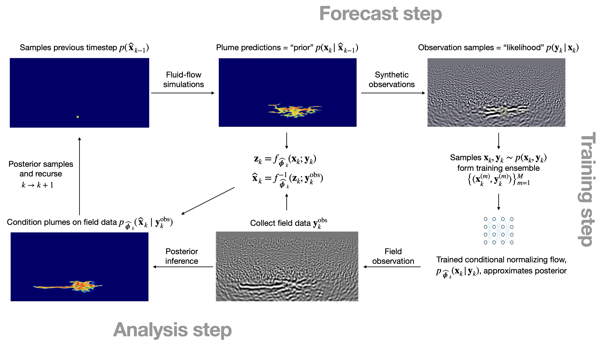{width="85%"}

## Lifecycle -- Step by Step 

At each timestep $k$, the Digital Shadow cycles through:

::: {.columns}
::: {.column width="50%"}

**1. Forecast Step**

- Time-advance posterior samples from $k{-}1$:
$$
\mathbf{x}_k^{(m)} \sim p(\mathbf{x}_k \mid \widehat{\mathbf{x}}_{k-1}^{(m)})
$$
- Simulate observations:
$$
\mathbf{y}_k^{(m)} \sim p(\mathbf{y}_k \mid \mathbf{x}_k^{(m)})
$$
- Produces training ensemble $\{(\mathbf{x}_k^{(m)}, \mathbf{y}_k^{(m)})\}_{m=1}^M$
:::
::: {.column width="50%"}

**2. Training Step**

- Train CNF $f_{\boldsymbol{\phi}}$ on ensemble pairs

**3. Analysis Step**

- Condition on field data $\mathbf{y}_k^{\text{obs}}$
- Map prior samples to posterior:
$$
\mathbf{x}_k^{(m)} \mapsto \widehat{\mathbf{x}}_k^{(m)} \sim p(\widehat{\mathbf{x}}_k \mid \mathbf{y}_{1:k}^{\text{obs}})
$$

:::
:::

::: {.callout-tip}
The $\widehat{\quad}$ symbol distinguishes **analyzed** states (conditioned on field data) from **predicted** (digital) states.
:::

## Imaging-Based Summary Statistics 

**Challenge:** Raw seismic data is high-dimensional, non-uniform, and the mapping to CO~2~ states is complex.

**Solution:** Physics-based summary statistics via **Reverse-Time Migration (RTM)** [@orozco2023adjoint]:

$$
\mathbf{y}_k = \Bigl(\mathbf{J}_{\mathcal{F}[\mathbf{v}]}\Bigr|_{\widetilde{\mathbf{v}}_k}\Bigr)_{\text{ic}}^{\top} \Bigl(\mathcal{F}[\mathbf{\bar{m}}_k]-\mathbf{d}_k\Bigr)
$$

where:

- $\mathcal{F}[\mathbf{m}]$: nonlinear forward wave operator
- $\mathbf{J}_{\mathcal{F}}$: Jacobian with inverse-scattering imaging condition
- $\widetilde{\mathbf{v}}_k$: smoothed migration-velocity model
- $\mathbf{d}_k = \mathcal{F}[\mathbf{m}_k] + \boldsymbol{\epsilon}_k$: noisy shot records

::: {.fragment}
**Key insight:** RTM preserves information from shot records [@jalsing2018massive; @orozco2023adjoint] while mapping to a **uniform image domain** where the relation to the CO~2~ plume is simpler.
:::

## Rock Physics & Reference Models 

**Patchy saturation model** [@avseth2010quantitative] maps CO~2~ saturation to seismic properties:
$$
\mathbf{m}_k = \mathcal{R}(\mathbf{m}_0, \mathbf{x}_k),\quad k=1\cdots K
$$

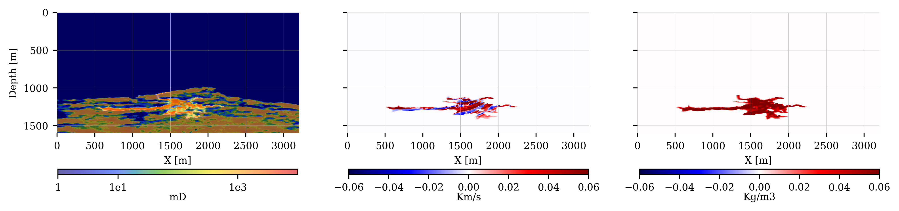{width="70%"}

**Reference model** for each timestep uses ensemble average:
$$
\mathbf{\bar{m}}_k = \mathcal{R}(\mathbf{m}_0, \mathbf{\bar{x}}_k) \quad\text{where}\quad \mathbf{\bar{x}}_k = \frac{1}{M}\sum_{m=1}^M \mathbf{x}_k^{(m)}
$$

## Training the CNF 

**Objective:** Train CNF to approximate the posterior by minimizing the forward KL divergence:

$$
\widehat{\boldsymbol{\phi}}_k = \arg\min_{\boldsymbol{\phi}} \frac{1}{M}\sum_{m=1}^M \left(\frac{1}{2}\bigl\|f_{\boldsymbol{\phi}}(\mathbf{x}_k^{(m)};\mathbf{y}_k^{(m)})\bigr\|_2^2 - \log\bigl|\det\bigl(\mathbf{J}^{(m)}_{f_{\boldsymbol{\phi}}}\bigr)\bigr|\right)
$$ {#eq-loss-CNF}

::: {.columns}
::: {.column width="50%"}

**How it works:**

- CNF $f_{\boldsymbol{\phi}}$: invertible neural network
- Maps state $\mathbf{x}$ to latent $\mathbf{z}$ conditioned on $\mathbf{y}$
- Latent space $\rightarrow$ standard Gaussian
- **Amortized** over ensemble: generalizes over pairs at a given timestep
- Trained via **Simulation-Based Inference** (SBI) [@cranmer2020frontier]

:::
::: {.column width="50%"}

**Key property -- marginalization:**

- Permeability $\boldsymbol{\kappa}$ varies across ensemble members
- Training on these diverse samples $\rightarrow$ posterior **marginalizes** over $\boldsymbol{\kappa}$
- Uncertainty from unknown permeability is **built into** the posterior

:::
:::

## Derivation of the Training Loss 

Starting from the KL divergence between true and approximate posterior [@radev2020bayesflow; @cranmer2020frontier]:

$$
\widehat{\boldsymbol{\phi}} = \arg\min_{\boldsymbol{\phi}} \mathbb{E}_{p(\mathbf{y})}\bigl[\mathbb{KL}\bigl(p(\mathbf{x}\mid \mathbf{y})\,\|\,p_{\boldsymbol{\phi}}(\mathbf{x}\mid \mathbf{y})\bigr)\bigr]
$$

::: {.incremental}
- Expand KL and drop terms independent of $\boldsymbol{\phi}$:
$$= \arg\max_{\boldsymbol{\phi}} \mathbb{E}_{p(\mathbf{x},\mathbf{y})}\bigl[\log p_{\boldsymbol{\phi}}(\mathbf{x}\mid\mathbf{y})\bigr]$$

- Apply change-of-variables $p_{\boldsymbol{\phi}}(\mathbf{x}\mid\mathbf{y}) = p\bigl(\mathbf{z}=f_{\boldsymbol{\phi}}(\mathbf{x};\mathbf{y})\bigr)\bigl|\det(\mathbf{J}_{f_{\boldsymbol{\phi}}})\bigr|$:
$$= \arg\max_{\boldsymbol{\phi}} \mathbb{E}_{p(\mathbf{x},\mathbf{y})}\Bigl[\log p\bigl(f_{\boldsymbol{\phi}}(\mathbf{x};\mathbf{y})\bigr) + \log\bigl|\det(\mathbf{J}_{f_{\boldsymbol{\phi}}})\bigr|\Bigr]$$

- With $p(\mathbf{z}) = \mathcal{N}(0,\mathbf{I})$ and Monte Carlo approximation $\rightarrow$ training loss in @eq-loss-CNF
:::

## Posterior Sampling 

After training, samples from the posterior can be drawn:

$$
\widehat{\mathbf{x}}_k^{(m)} = f^{-1}_{\widehat{\boldsymbol{\phi}}_k}(\mathbf{z}_k^{(m)};\,\mathbf{y}_k^{\text{obs}}),\quad \mathbf{z}_k^{(m)} \sim \mathcal{N}(0,\mathbf{I})
$$

::: {.fragment}
But this **reference-to-conditional** mapping requires ideal training...
:::

::: {.fragment}
**Better approach: Joint-to-conditional mapping** [@spantini2022coupling; @ramgraber2023ensembleb]:

$$
\widehat{\mathbf{x}}_k^{(m)} = f^{-1}_{\widehat{\boldsymbol{\phi}}_k}\Bigl(\underbrace{f_{\widehat{\boldsymbol{\phi}}_k}(\mathbf{x}_k^{(m)};\,\mathbf{y}_k^{(m)})}_{\mathbf{z}_k^{(m)}};\,\mathbf{y}_k^{\text{obs}}\Bigr)
$$
:::

::: {.fragment}
This is a **nonlinear extension** of EnKF's correction:
$$
\widehat{\mathbf{x}}^{(m)}_{k} = {T}^{\text{nonlin}}_{\mathbf{y}_k^{\text{obs}}}(\mathbf{y}_k^{(m)},\,\mathbf{x}_k^{(m)}) = f^{-1}_{\widehat{\boldsymbol{\phi}}_k}\left(f_{\widehat{\boldsymbol{\phi}}_k}(\mathbf{x}_k^{(m)};\,\mathbf{y}^{(m)}_k);\,\mathbf{y}_k^{\text{obs}}\right)
$$
:::

## Linear vs. Nonlinear Prior-to-Posterior Mapping 

::: {.columns}
::: {.column width="50%"}
### EnKF (Linear)

$$
\widehat{\mathbf{x}}^{(m)}_k = \mathbf{x}^{(m)}_k - \mathbb{C}\text{ov}_{\mathbf{x}_k,\mathbf{y}_k}\,\mathbb{C}\text{ov}^{-1}_{\mathbf{y}_k,\mathbf{y}_k}(\mathbf{y}_k^{(m)} - \mathbf{y}_k^{\text{obs}})
$$

- Linear correction
- Gaussian assumption
- Accuracy **saturates** with ensemble size
- Cannot handle nuisance parameters
:::
::: {.column width="50%"}
### CNF (Nonlinear)

$$
\widehat{\mathbf{x}}^{(m)}_k = f^{-1}_{\widehat{\boldsymbol{\phi}}_k}\bigl(f_{\widehat{\boldsymbol{\phi}}_k}(\mathbf{x}_k^{(m)};\mathbf{y}_k^{(m)});\,\mathbf{y}_k^{\text{obs}}\bigr)
$$

- **Nonlinear** composite mapping
- No Gaussian assumption
- Errors **cancel** in composition
- Marginalizes over $\boldsymbol{\kappa}$
- Works with **small ensembles** ($M=128$)
:::
:::

::: {.fragment}
**Advantages of joint-to-conditional:**

1. Improved sample quality with relaxed training convergence
2. No reliance on external reference distribution
3. Each predicted state is one-to-one tied to its corrected state
:::

# Part IV: Algorithms {background-color="#2c3e50"}

## Algorithm 1: Forecast, Training & Analysis 

::: {style="font-size: 0.7em;"}

**Procedure Forecast**($p(\boldsymbol{\kappa}), p(\boldsymbol{\epsilon}_k), \{\widehat{\mathbf{x}}_{k-1}^{(m)}\}_{m=1}^M$):

> **for** $m = 1$ **to** $M$ **do**
>
> &emsp; Sample from transition density: $\mathbf{x}^{(m)}_k\sim p(\cdot\mid \widehat{\mathbf{x}}^{(m)}_{k-1})$ via dynamics simulations
>
> &emsp; Sample from likelihood: $\mathbf{y}^{(m)}_k\sim p(\cdot\mid \mathbf{x}^{(m)}_{k})$ via observation simulations
>
> **return** $\{(\mathbf{x}_k^{(m)},\mathbf{y}_k^{(m)})\}_{m=1}^{M}$

**Procedure Training**($\{(\mathbf{x}_k^{(m)},\mathbf{y}_k^{(m)})\}_{m=1}^{M}$):

> $\displaystyle\widehat{\boldsymbol{\phi}}_k = \arg\min_{\boldsymbol{\phi}} \frac{1}{M}\sum_{m=1}^M \left(\frac{1}{2}\|f_{\boldsymbol{\phi}}(\mathbf{x}_k^{(m)};\mathbf{y}_k^{(m)})\|_2^2 - \log|\det(\mathbf{J}^{(m)}_{f_{\boldsymbol{\phi}}})|\right)$
>
> **return** $\widehat{\boldsymbol{\phi}}_k$

**Procedure Analysis**($\mathbf{y}^{\text{obs}}_{k}, \widehat{\boldsymbol{\phi}}_k, \{(\mathbf{x}_k^{(m)},\mathbf{y}_k^{(m)})\}_{m=1}^{M}$):

> **for** $m = 1$ **to** $M$ **do**
>
> &emsp; Compute latent variables: $\mathbf{z}^{(m)}_k = f_{\widehat{\boldsymbol{\phi}}_k}(\mathbf{x}_k^{(m)};\mathbf{y}_k^{(m)})$
>
> &emsp; Apply prior-to-posterior map: $\widehat{\mathbf{x}}_k^{(m)} = f^{-1}_{\widehat{\boldsymbol{\phi}}_k}(\mathbf{z}_k^{(m)};\mathbf{y}_k^{\text{obs}})$
>
> **return** $\{\widehat{\mathbf{x}}^{(m)}_k\}_{m=1}^M$

:::

## Algorithm 2: Sequential SBI {.smaller}

**Require:** Datasets $\mathbf{y}_k^{\text{obs}}$, collected sequentially at times $k=1,\ldots,K$

**Output:** Estimated ensemble $\{\widehat{\mathbf{x}}^{(m)}_k\}_{m=1}^M$ for $k=1,\ldots,K$

::: {.incremental}
1. **Initialize:** For $m = 1$ to $M$: sample $\widehat{\mathbf{x}}^{(m)}_0 \sim p(\mathbf{x}_0)$

2. **For** $k = 1$ **to** $K$:
   - $\{(\mathbf{x}_k^{(m)}, \mathbf{y}_k^{(m)})\}_{m=1}^{M} =$ **Forecast**$(p(\boldsymbol{\kappa}), p(\boldsymbol{\epsilon}_k), \{\widehat{\mathbf{x}}_{k-1}^{(m)}\}_{m=1}^M)$
   - $\widehat{\boldsymbol{\phi}}_k =$ **Training**$(\{(\mathbf{x}_k^{(m)}, \mathbf{y}_k^{(m)})\}_{m=1}^{M})$
   - Collect field data $\mathbf{y}_k^{\text{obs}}$
   - $\{\widehat{\mathbf{x}}_k^{(m)}\}_{m=1}^M =$ **Analysis**$(\mathbf{y}^{\text{obs}}_{k}, \widehat{\boldsymbol{\phi}}_k, \{(\mathbf{x}_k^{(m)}, \mathbf{y}_k^{(m)})\}_{m=1}^{M})$
:::

::: {.fragment}
This procedure implements **neural sequential Bayesian inference** -- the basis of our Digital Shadow.
:::

# Part V: Setup & Validation {background-color="#2c3e50"}

## Probabilistic Baseline Model {.smaller}

::: {.columns}
::: {.column width="50%"}
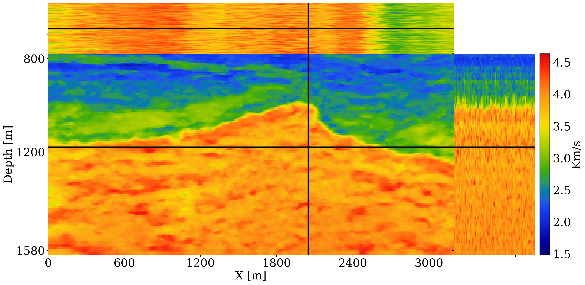{width="95%"}
:::
::: {.column width="50%"}
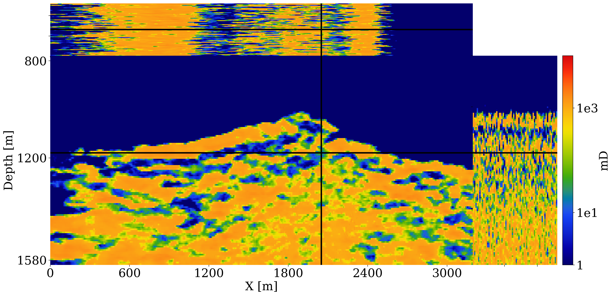{width="95%"}
:::
:::

- Baseline seismic data (SNR $12$ dB) processed with **WISE** [@yin2024wise]
- Posterior velocity samples $\mathbf{v}_0 \sim p(\mathbf{v}_0 \mid \mathbf{y}_0^{\text{obs}})$ converted to permeability $\boldsymbol{\kappa} \sim p(\boldsymbol{\kappa})$
- High variability reflects **epistemic uncertainty** in reservoir properties
- Study area: South-Western North Sea, Compass model [@BG]

## Ground-Truth Simulations {.smaller}

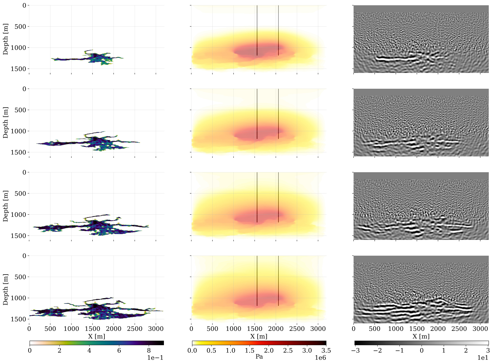{width="80%"}

::: {.columns}
::: {.column width="50%"}
**Simulation parameters:**

- Grid: $512 \times 256$, spacing $6.25$ m
- 24 timesteps of 80 days each
- 4 seismic surveys at 480-day intervals
- Injection: $0.05\,\text{m}^3/\text{s}$ at $1200$ m depth
- Total: $5.8$ Mt CO~2~ ($1.1$ Mt/year)
:::
::: {.column width="50%"}
**Software stack:**

- Flow: [JutulDarcy.jl](https://github.com/sintefmath/JutulDarcy.jl) [@jutul]
- Seismic: [JUDI.jl](https://github.com/slimgroup/JUDI.jl) [@witte2018alf]
- Networks: [InvertibleNetworks.jl](https://github.com/slimgroup/InvertibleNetworks.jl) [@Orozco2024]
:::
:::

## Forecast Ensemble Variability {.smaller}

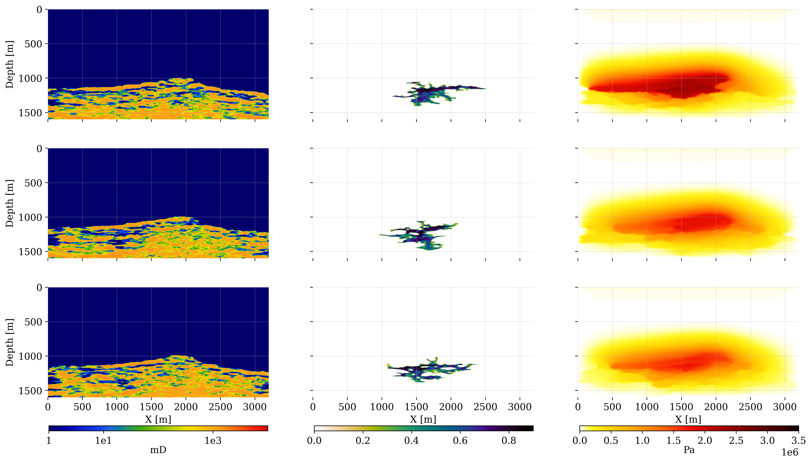{width="75%"}

- Different permeability realizations $\rightarrow$ vastly different CO~2~ plume shapes
- Both saturation and pressure perturbations vary significantly
- This **variability** is essential for training the CNFs

## Impact of the Analysis Step {.smaller}

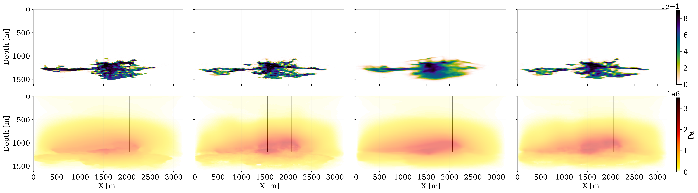{width="80%"}

- **Top row:** CO~2~ saturation corrections
- **Bottom row:** Pressure perturbation corrections
- Conditioning on observed data **reduces sample variation** and produces more resolved estimates

## Impact on Errors and Uncertainty {.smaller}

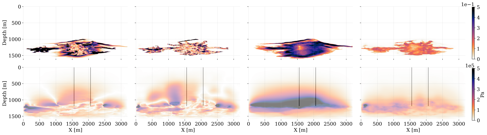{width="80%"}

- Errors relative to ground truth are **significantly reduced** after correction
- Uncertainty (conditional standard deviation) **tightens** during the Analysis step
- This validates the prior-to-posterior mapping

# Part VI: Multimodal Case Study {background-color="#2c3e50"}

## Experimental Setup 

**Three conditioning scenarios compared:**

| Modality | Data used |
|----------|-----------|
| **Wells only** | Saturation + pressure at well locations |
| **Seismic only** | Time-lapse migrated seismic images |
| **Wells + Seismic** | Both modalities combined |

. . .

**Ensemble parameters:**

- $M = 128$ ensemble members
- 120 training / 8 validation / 1 test (ground-truth)
- 120 training epochs, Adam optimizer, LR $= 5 \times 10^{-4}$
- Noise magnitude schedule: $0.1 \rightarrow 0.005$

## Saturation Results: Timestep $k=1$ {.smaller transition="none"}

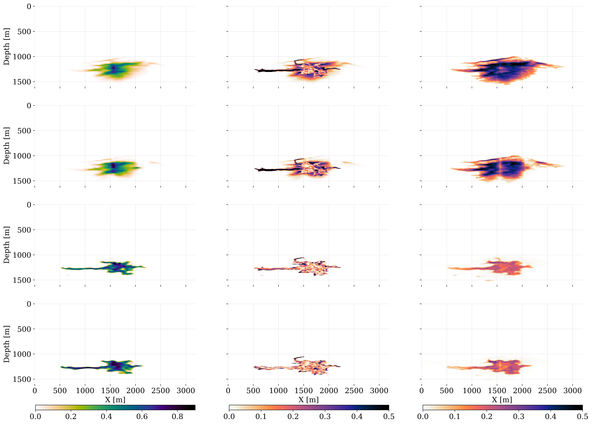{width="80%"}

## Saturation Results: Timestep $k=2$ {.smaller transition="none"}

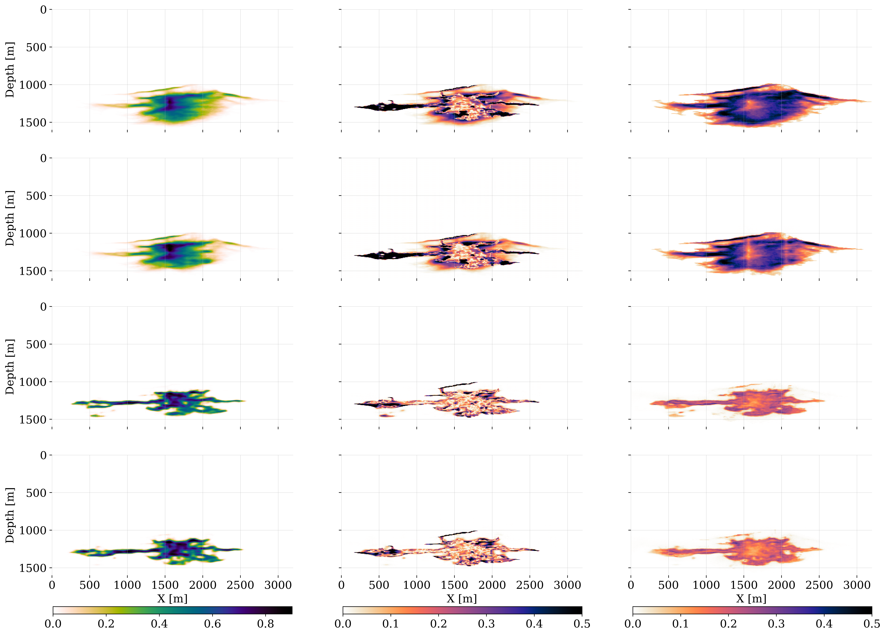{width="80%"}

## Saturation Results: Timestep $k=3$ {.smaller transition="none"}

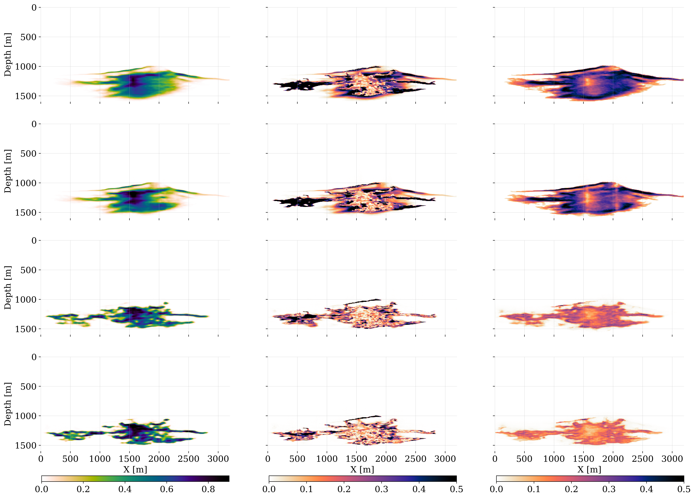{width="80%"}

## Saturation Results: Timestep $k=4$ {.smaller transition="none"}

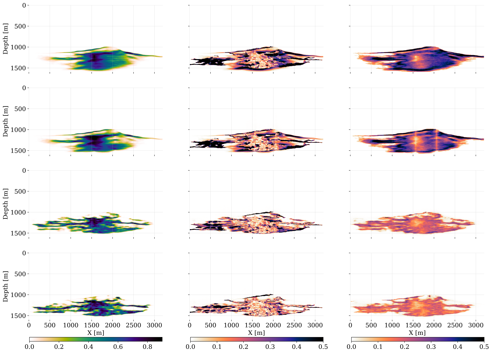{width="80%"}

##

::: {.callout-warning}
Well-only data **fails to capture** the critical leftward protruding plume feature that breaches containment!
:::

## Saturation Evolution: Unconditioned {.smaller}

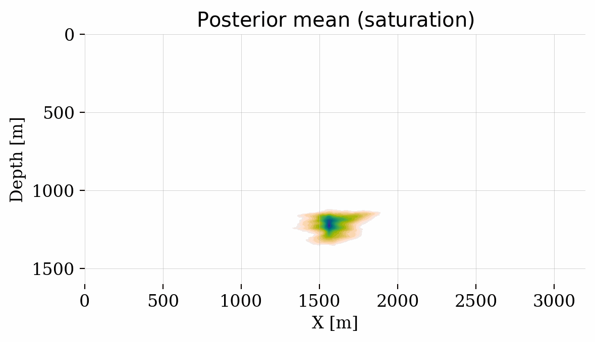{width="80%"}

## Saturation Evolution: Wells vs. Seismic {.smaller}

::: {.columns}
::: {.column width="50%"}
### Wells Conditioned
{width="100%"}
:::
::: {.column width="50%"}
### Seismic Conditioned
{width="100%"}
:::
:::

## Saturation Evolution: Combined Conditioning {.smaller}

{width="80%"}

## Pressure Evolution: Unconditioned {.smaller}

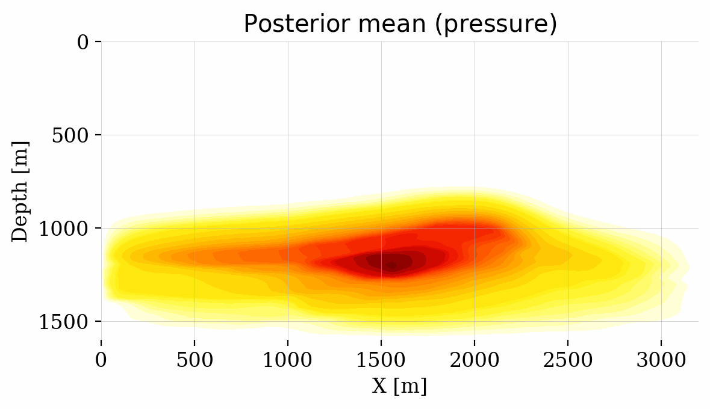{width="80%"}

## Pressure Evolution: Wells vs. Seismic {.smaller}

::: {.columns}
::: {.column width="50%"}
### Wells Conditioned
{width="100%"}
:::
::: {.column width="50%"}
### Seismic Conditioned
{width="100%"}
:::
:::

## Pressure Evolution: Combined Conditioning {.smaller}

{width="80%"}

# Part VII: Quantitative Results {background-color="#2c3e50"}

## Performance Metrics {.smaller}

::: {.columns}
::: {.column width="33%"}
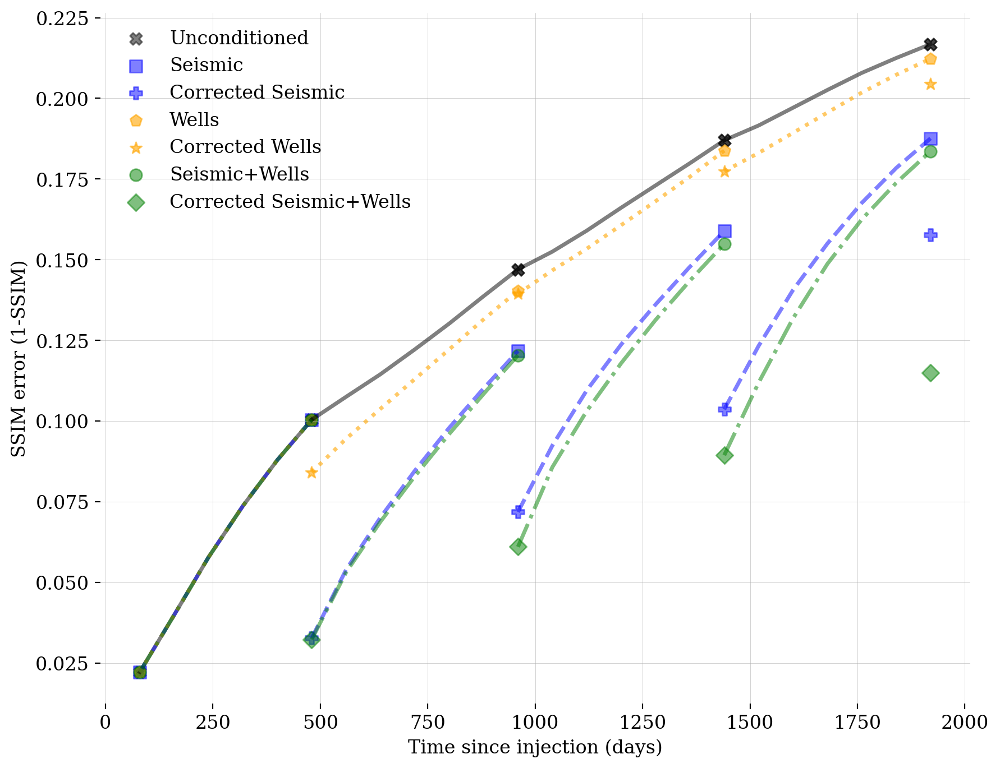{width="100%"}
:::
::: {.column width="33%"}
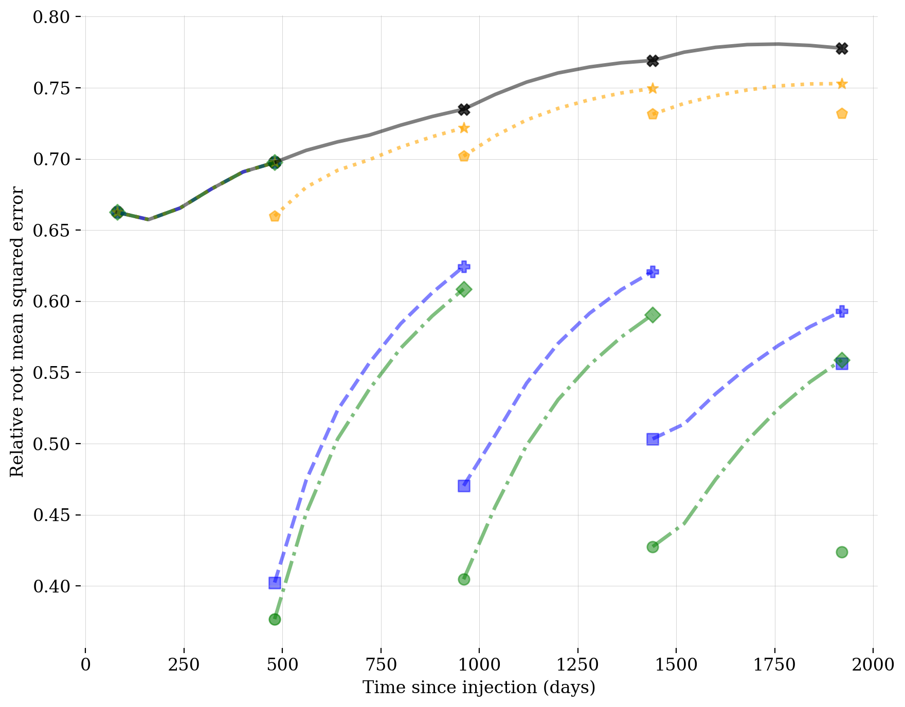{width="100%"}
:::
::: {.column width="33%"}
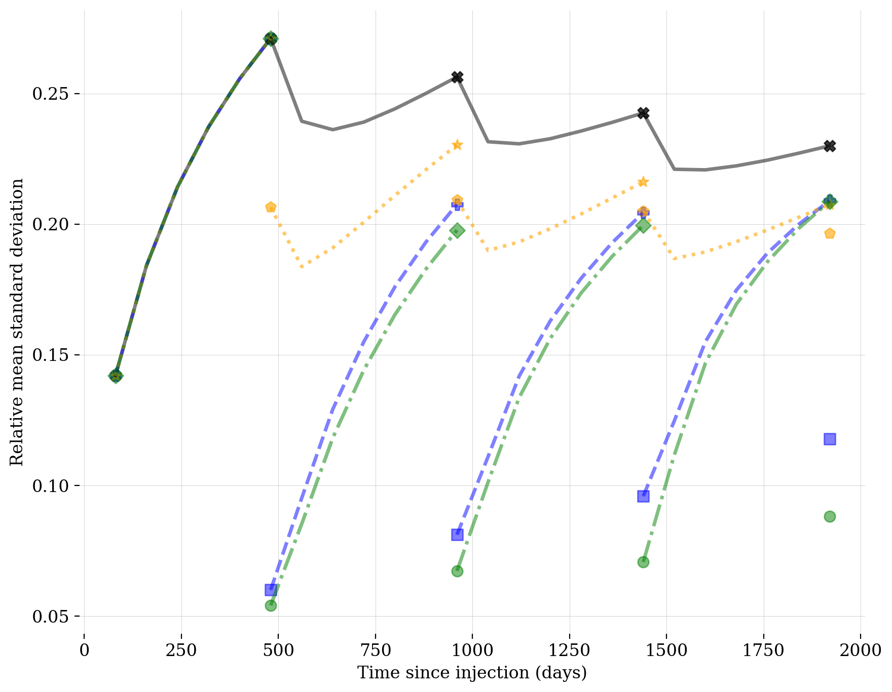{width="100%"}
:::
:::

**Key observations:**

- Conditioning on time-lapse data **improves all metrics**
- Well-only corrections are **minor** (orange)
- Seismic (blue) and combined (green) yield **substantial improvements**
- Quality deteriorates between surveys but recovers after Analysis
- Relative errors remain **flat or decrease** with multimodal conditioning

## Metric Definitions {.smaller}

::: {.columns}
::: {.column width="50%"}

**SSIM-Error:** $1 - \text{SSIM}(\mathbf{x}^\ast_k, \bar{\widehat{\mathbf{x}}}_k)$

**RMSE:**
$$
\text{RMSE} = \sqrt{\frac{1}{N}\sum_{i=1}^N\bigl(\mathbf{x}^\ast[i] - \bar{\widehat{\mathbf{x}}}[i]\bigr)^2}
$$

**Relative RMSE:**
$$
\Delta\text{RMSE}_k = \frac{\text{RMS}(\mathbf{e}_k)}{\text{RMS}(\mathbf{x}^\ast_k)}
$$

:::
::: {.column width="50%"}

**Mean Standard Deviation:**
$$
\bar{\sigma} = \frac{1}{N}\sum_{i=1}^N \bar{\widehat{\boldsymbol{\sigma}}}[i]
$$

**Relative STD:**
$$
\Delta\text{STD}_k = \frac{\text{mean}(\bar{\widehat{\boldsymbol{\sigma}}}_k)}{\text{RMS}(\bar{\widehat{\mathbf{x}}}_k)}
$$

These normalizations account for biases from plume growth over time.

:::
:::

## Training Diagnostics {.smaller}

::: {.columns}
::: {.column width="50%"}
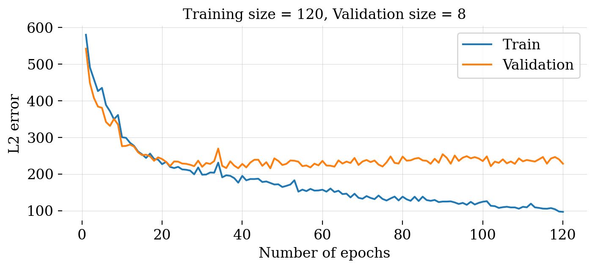{width="90%"}
:::
::: {.column width="50%"}
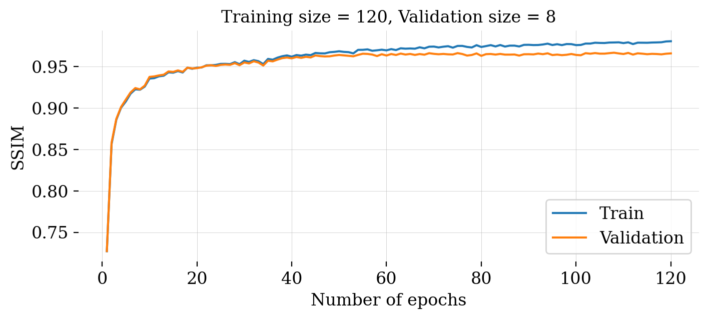{width="90%"}
:::
:::

- Loss decreases smoothly for both training and validation
- SSIM improves steadily
- **No sign of overfitting**

## Uncertainty Calibration {.smaller}

::: {.columns}
::: {.column width="50%"}

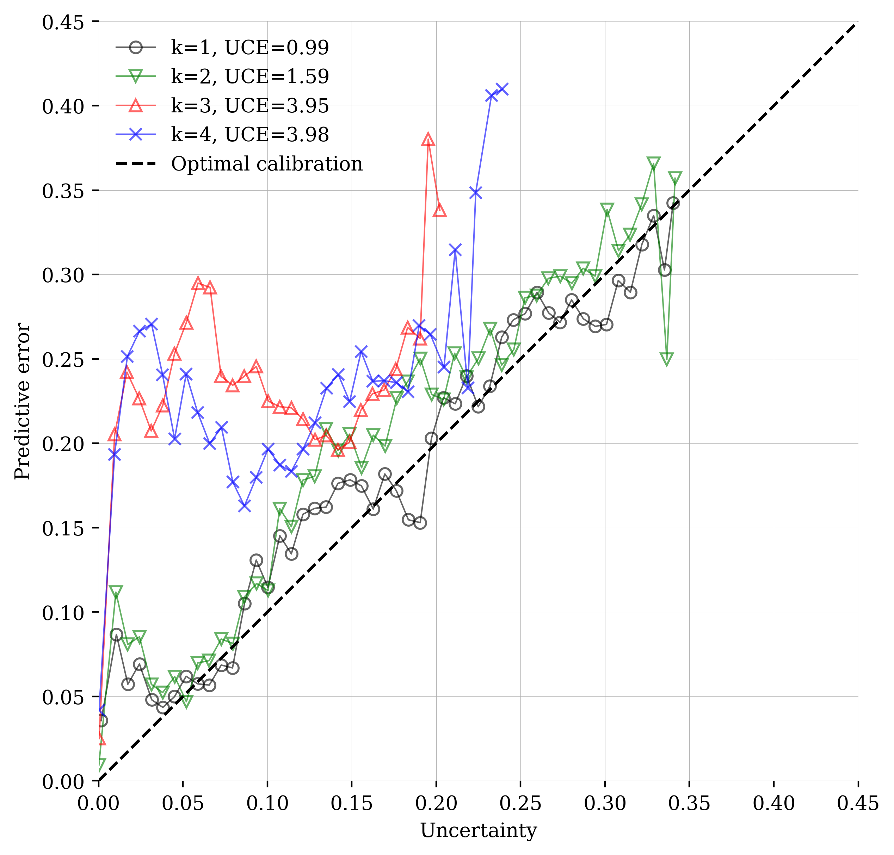{width="85%"}

:::
::: {.column width="50%"}

**Calibration test** [@guo2017calibration]:

- Group deviations into $L$ bins $B_l$
- For each bin compute:

$$
\text{UQ}(B_l) = \frac{1}{|B_l|}\sum_{i \in B_l} \bar{\widehat{\boldsymbol{\sigma}}}[i]
$$

$$
\text{MSE}(B_l) = \frac{1}{|B_l|}\sum_{i \in B_l} (\mathbf{x}^\ast[i] - \widehat{\mathbf{x}}[i])^2
$$

- Good calibration $\rightarrow$ points along $y = x$
- Calibration degrades at later timesteps as plume grows

:::
:::

# Part VIII: 3D Extension & Discussion {background-color="#2c3e50"}

## Scaling to 3D: Ground Truth & Seismic {.smaller}

::: {.columns}
::: {.column width="50%"}
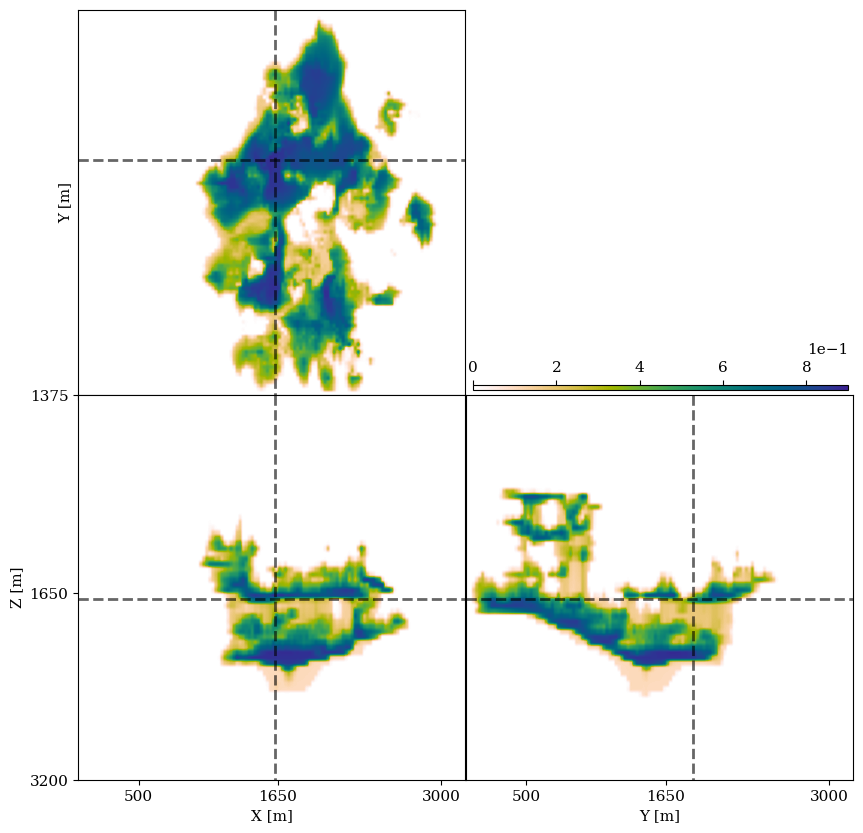{width="100%"}
:::
::: {.column width="50%"}
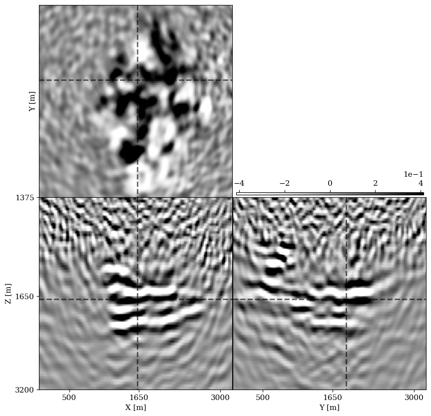{width="100%"}
:::
:::

$3.2 \times 3.2 \times 3.2$ km$^3$ volume, $128^3$ grid, 16000 receivers, 16 sources [@gahlot2025EAGEagc]

## Scaling to 3D: Forecast vs. Posterior {.smaller}

::: {.columns}
::: {.column width="50%"}
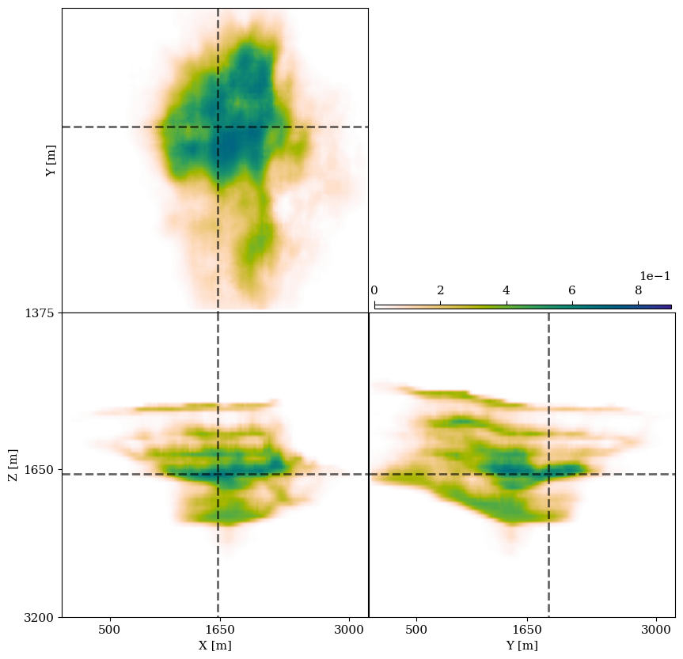{width="100%"}
:::
::: {.column width="50%"}
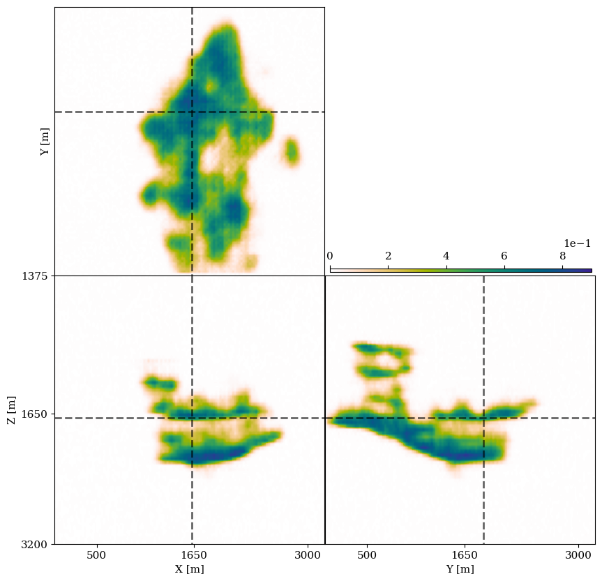{width="100%"}
:::
:::

## Scaling to 3D: Error & Uncertainty {.smaller}

::: {.columns}
::: {.column width="50%"}
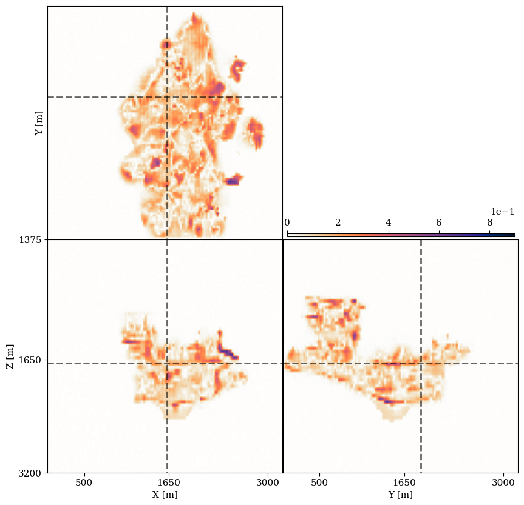{width="100%"}
:::
::: {.column width="50%"}
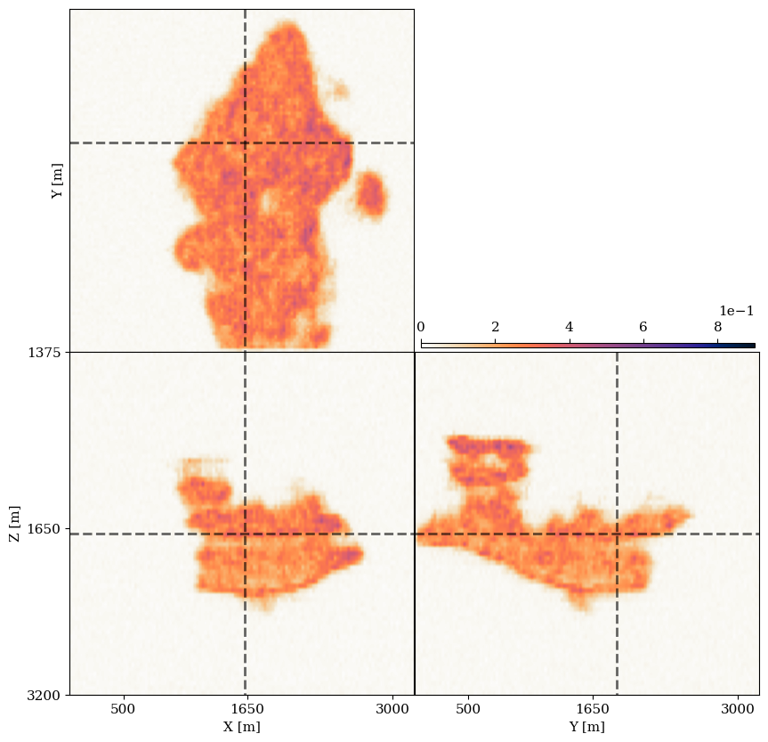{width="100%"}
:::
:::

## Key Findings 

::: {.incremental}
1. **Unknown high-permeability streak** undetected by well-only data, but **captured by seismic** -- critical for containment monitoring

2. **Multimodal data** (seismic + wells) produces the **best estimates** across all metrics and timesteps

3. **Uncertainty calibration**: pointwise standard deviation **correlates** with errors relative to ground truth

4. **Nonlinear mapping** via CNFs handles complex non-Gaussian posterior distributions that EnKF cannot capture

5. **Small ensemble size** ($M=128$) sufficient thanks to joint-to-conditional mapping

6. **Scalable** to 3D via physics-based summary statistics (RTM) and memory-efficient invertible networks
:::

## Open-Source Software Stack

All results are fully reproducible:

| Component | Package | Purpose |
|-----------|---------|---------|
| Reservoir simulation | [JutulDarcy.jl](https://github.com/sintefmath/JutulDarcy.jl) | Multiphase flow |
| Seismic modeling | [JUDI.jl](https://github.com/slimgroup/JUDI.jl) | Wave simulations & RTM |
| Neural networks | [InvertibleNetworks.jl](https://github.com/slimgroup/InvertibleNetworks.jl) | Conditional normalizing flows |
| Full pipeline | [Twin4GCS.jl](https://github.com/slimgroup/Twin4GCS.jl) | Digital Shadow implementation |

::: {.fragment}
Data available at: [doi.org/10.5281/zenodo.15204624](https://doi.org/10.5281/zenodo.15204624) [@gahlot_2025_15204624]
:::

# Conclusions & Future Work {background-color="#2c3e50"}

## Conclusions 

::: {.incremental}
- Introduced an **uncertainty-aware Digital Shadow** for underground CO~2~ storage monitoring

- Combines high-fidelity simulations with **neural data assimilation** via Simulation-Based Inference

- **Nonlinear prior-to-posterior mapping** via CNFs extends Ensemble Kalman Filtering to handle:
  - Non-Gaussian statistics
  - Stochastic nuisance parameters (permeability)
  - Nonlinear dynamics and observations

- **Multimodal conditioning** (seismic + wells) produces the most accurate state estimates

- Seismic data is **essential** for detecting critical flow pathways that wells alone miss

- First **proof-of-concept** for an uncertainty-aware, scalable Digital Shadow for GCS

- Lays the foundation for a **Digital Twin** to optimize underground storage operations
:::

## Future Work {.smaller}

::: {.columns}
::: {.column width="50%"}

**Methodological extensions:**

- Data augmentation with alternative rock-physics models [@gahlot2025EAGEerd]
- Sensitivity-aware amortized inference [@elsemuller2024sensitivityaware]
- Fusion of continuous well data with sparse seismic [@schmitt2023fuse]
- Neural surrogates (FNOs) for flow simulations [@grady2023model]
- Non-replicated sparse seismic surveys [@deng2025EAGEpjrm]

:::
::: {.column width="50%"}

**Towards a Digital Twin:**

- **Optimized operations**: maximize injectivity while avoiding fracture pressure [@gahlot2024digital]
- **Adaptive surveys**: trigger follow-up when injection deviates from expectations
- **Optimal monitoring**: select well locations to reduce uncertainty most [@orozco2024beacon]
- Include geomechanical, chemical & elastic effects
- Permeability inference from time-lapse data

:::
:::

## From Digital Shadow to Digital Twin 

The Digital Shadow provides **state estimation**. A full **Digital Twin** adds **control and decision-making** [@gahlot2024digital]:

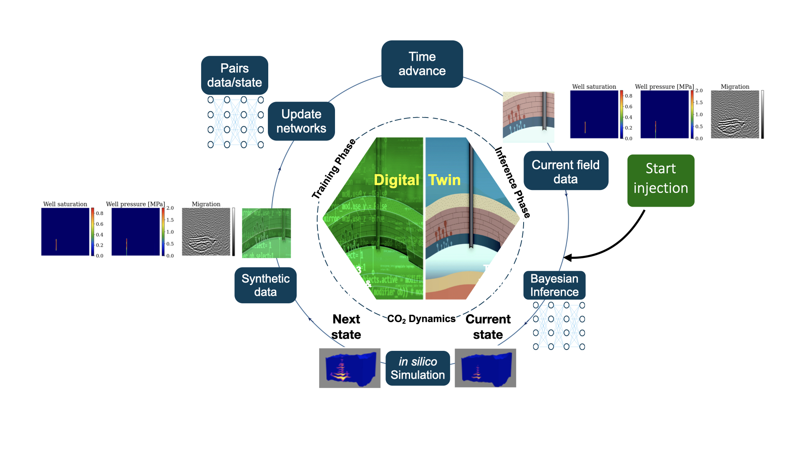{width="70%"}

::: {.fragment}
**Key question:** How do we maximize CO~2~ injectivity while **avoiding fracture pressure**?
:::

## Digital Twin with Experimental Design {.smaller}

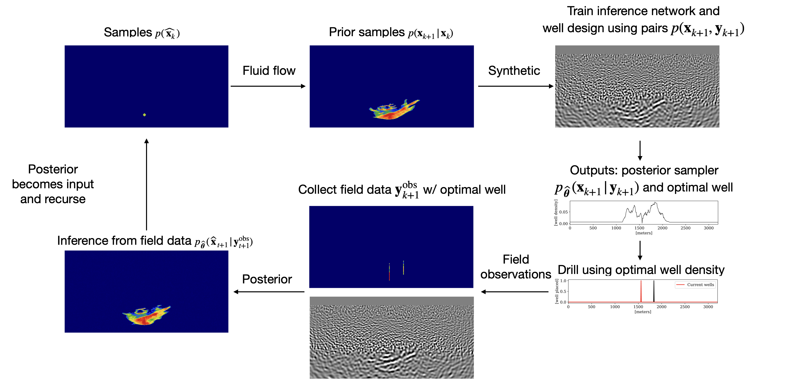{width="85%"}

## Bayesian Experimental Design

**Solution:** Choose monitoring well locations $\mathbf{d}^\ast$ that maximize the **Expected Information Gain (EIG)** [@orozco2024beacon]:

$$
\mathbf{d}^\ast = \arg\max_{\mathbf{d}} \;\mathbb{E}_{p(\mathbf{y} \mid \mathbf{d})}\bigl[\mathbb{KL}\bigl(p(\mathbf{x} \mid \mathbf{y}, \mathbf{d})\,\|\,p(\mathbf{x})\bigr)\bigr]
$$

::: {.fragment}
**Key insight:** Maximizing the expected posterior log-density (our CNF training objective) is **equivalent** to maximizing the EIG:

$$
\max_{\mathbf{d}}\;\mathbb{E}_{p(\mathbf{x},\mathbf{y} \mid \mathbf{d})}\bigl[\log p_{\boldsymbol{\phi}}(\mathbf{x} \mid \mathbf{y}, \mathbf{d})\bigr] \;\Longleftrightarrow\; \max_{\mathbf{d}}\;\text{EIG}(\mathbf{d})
$$
:::

::: {.fragment}
This means we can **jointly optimize** the CNF parameters $\boldsymbol{\phi}$ **and** the experimental design $\mathbf{d}$!
:::

## Optimal Well Placement: Results {.smaller}

::: {.columns}
::: {.column width="50%"}
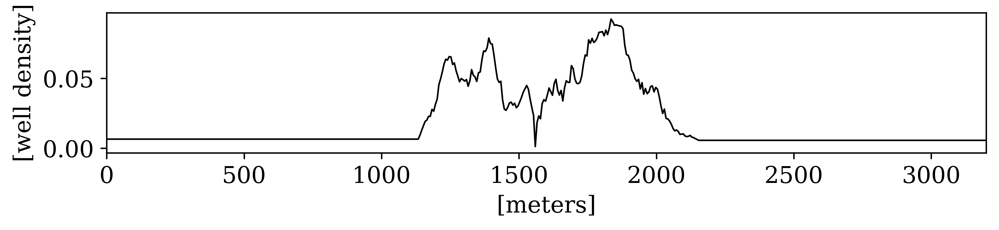{width="100%"}

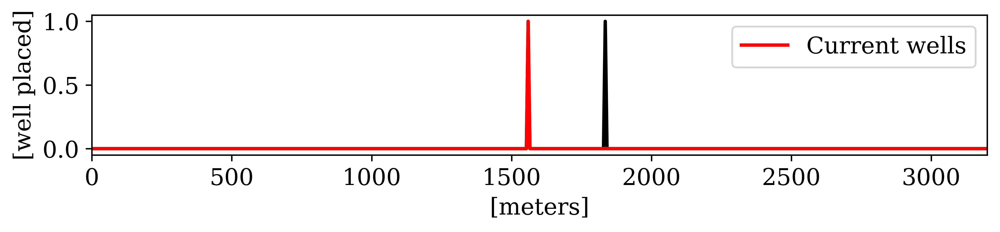{width="100%"}
:::
::: {.column width="50%"}
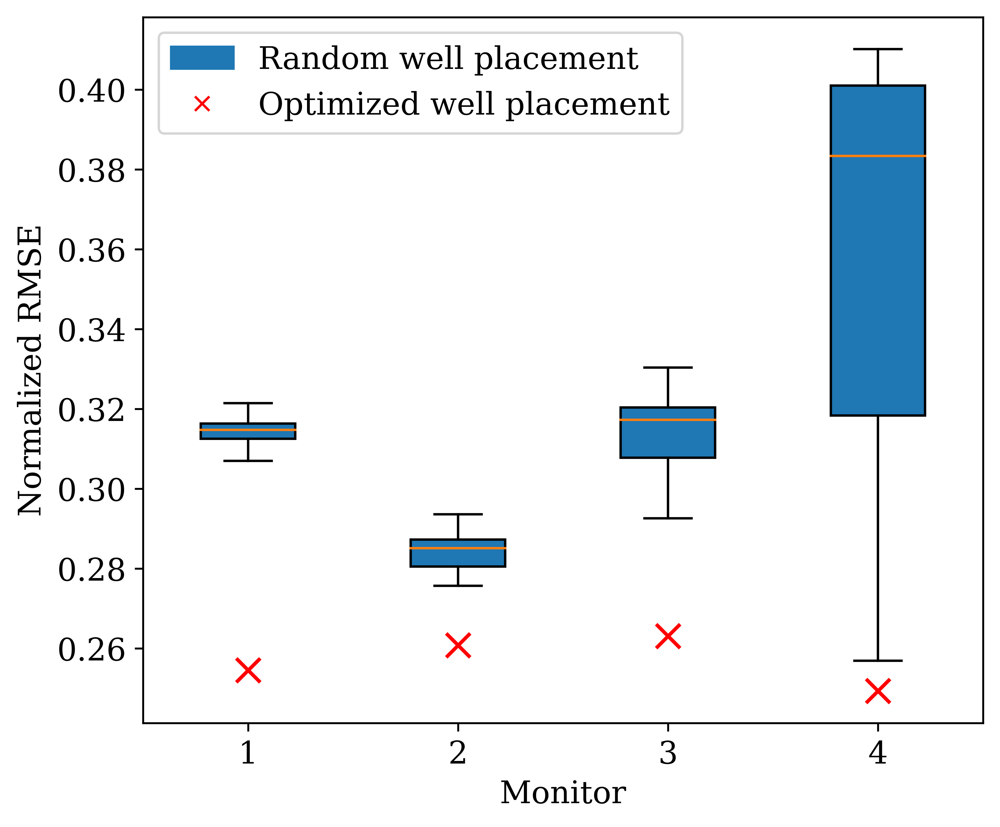{width="85%"}

- **Red crosses**: optimized placement consistently outperforms random (blue boxes)
- Improvement grows with number of monitoring timesteps
:::
:::

## The Control Problem --  Many thanks to Haoyun Li

**Goal:** Maximize cumulative CO~2~ injection while ensuring reservoir pressure does not exceed fracture pressure $p_{\text{frac}}$ [@gahlot2024digital].

$$
\begin{aligned}
\max_{q(t)} \quad & \int_{0}^{T} q(t)\,\mathrm{d}t \\
\text{subject to}\quad
& \widehat{\text{POF}}_{\tau}(q) \le \varepsilon \quad \text{or} \quad \widehat{\text{CVaR}}_{\alpha}(\boldsymbol{\mathcal{L}}(q)) \le \gamma,
\end{aligned}
$$

where either the POF or the CVaR constraint is active (not both simultaneously), $\varepsilon$ is the maximum allowable exceedance probability, and $\gamma$ is the maximum allowable tail severity.

::: {.fragment}
Because the subsurface parameters $\mathbf{Z}$ are **random**, the constraint $g(q, \mathbf{Z}) \leq 0$ cannot be enforced deterministically -- we need **risk measures**.
:::

## Controlled Injectivity: Comparison {.smaller}

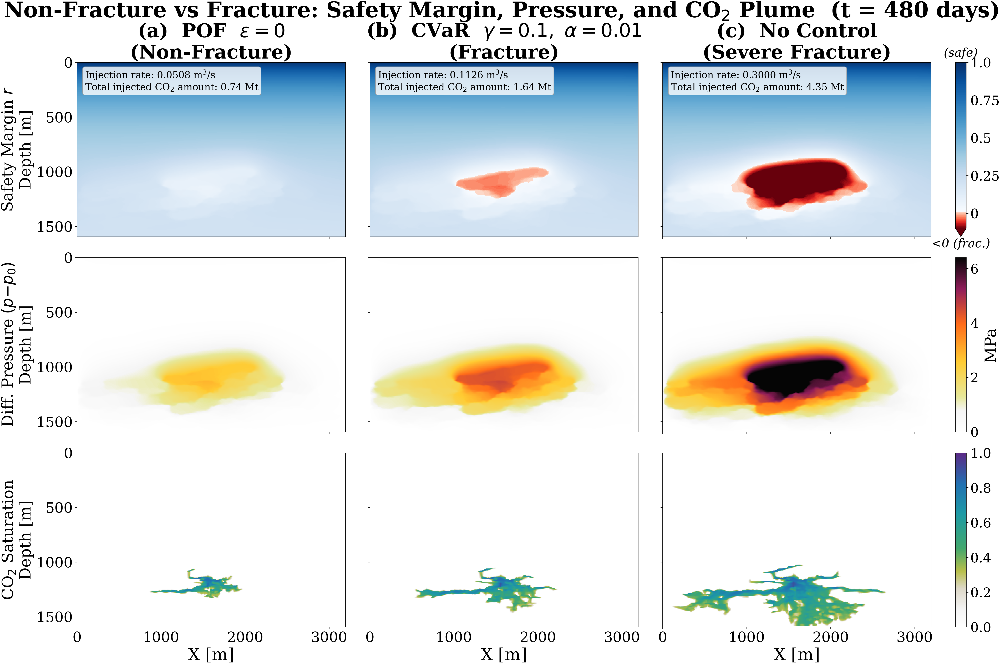{width="80%"}

## Risk Measures: POF, Quantile & CVaR {.smaller}

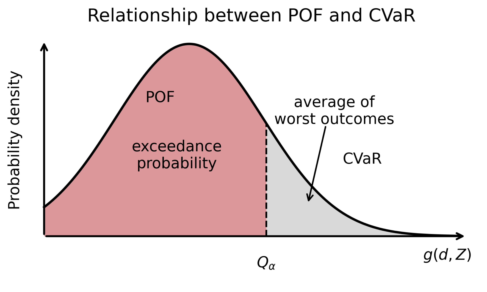{width="55%"}

## Probability of Failure (POF) 

The **Probability of Failure** quantifies the chance that the constraint is violated:

$$
\text{POF}_{\epsilon}(\mathbf{d}) = \mathbb{P}\bigl[g(\mathbf{d}, \mathbf{Z}) > 0\bigr] \leq \epsilon
$$

- One-line: the probability that pressure **exceeds** the fracture threshold
- Parameterized by tolerance $\epsilon$ (e.g., $\epsilon = 0.05$ means $\leq 5\%$ failure probability)

## Quantile (Value-at-Risk) 

The **Quantile** (or Value-at-Risk) at level $\alpha$ is the threshold below which a fraction $\alpha$ of outcomes fall:

$$
Q_{\alpha}(\mathbf{d}) = \inf\bigl\{t : \mathbb{P}\bigl[g(\mathbf{d}, \mathbf{Z}) \leq t\bigr] \geq \alpha\bigr\}
$$

- One-line: the **worst-case** constraint value at confidence level $\alpha$
- The POF constraint $\text{POF}_\epsilon \leq \epsilon$ is equivalent to requiring $Q_{1-\epsilon} \leq 0$

## Conditional Value-at-Risk (CVaR) {.smaller}

**CVaR** (also called Expected Shortfall) averages over the **worst outcomes** beyond the quantile:

$$
\text{CVaR}_{\gamma}(\mathbf{d}) = \mathbb{E}\bigl[g(\mathbf{d}, \mathbf{Z}) \mid g(\mathbf{d}, \mathbf{Z}) \geq Q_{\gamma}(\mathbf{d})\bigr]
$$

- One-line: the **expected severity** of constraint violations in the worst $(1-\gamma)$ fraction of scenarios
- Parameterized by $\gamma$ (e.g., $\gamma = 0.95$ averages over the worst $5\%$)
- **More conservative** than POF: penalizes not just the probability but also the **magnitude** of failure

## Fracture Probability vs. Injectivity {.smaller}

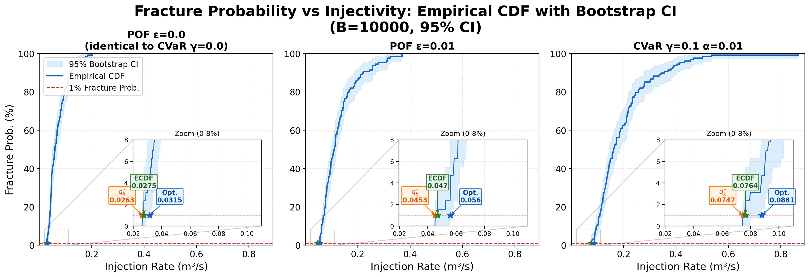{width="85%"}

- CVaR constraint yields **higher optimal injection rates** while maintaining safety
- All constrained approaches keep fracture probability **below the $1\%$ threshold**

## Controlled Injection: POF vs. CVaR {.smaller}

::: {.columns}
::: {.column width="50%"}


:::
::: {.column width="50%"}


:::
:::

## Controlled vs. Uncontrolled Injection {.smaller}

::: {.columns}
::: {.column width="50%"}

:::
::: {.column width="50%"}

:::
:::

## Thank You! {.smaller}

**Paper:** Gahlot, Orozco, Yin, Bruer & Herrmann (2025). "An uncertainty-aware Digital Shadow for underground multimodal CO~2~ storage monitoring." *Geophysical Journal International*, 242(1), ggaf176.

**Code:** [github.com/slimgroup/Twin4GCS.jl](https://github.com/slimgroup/Twin4GCS.jl)

**Data:** [doi.org/10.5281/zenodo.15204624](https://doi.org/10.5281/zenodo.15204624)

**Group website:** [slim.gatech.edu](https://slim.gatech.edu)

. . .

**Acknowledgements:**

- Georgia Research Alliance & ML4Seismic Center partners
- US National Science Foundation grant OAC 2203821

## References {.smaller}

::: {#refs}
:::
